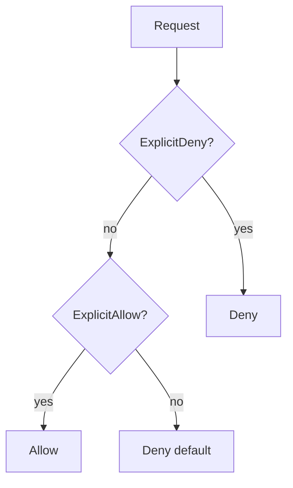
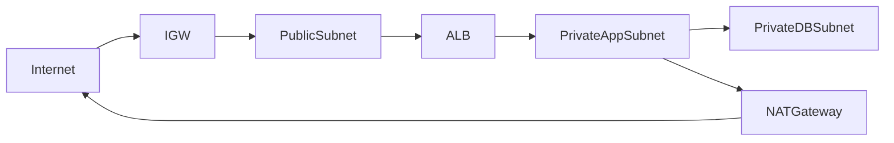
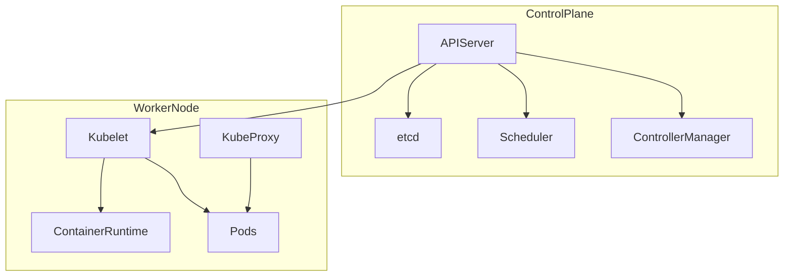
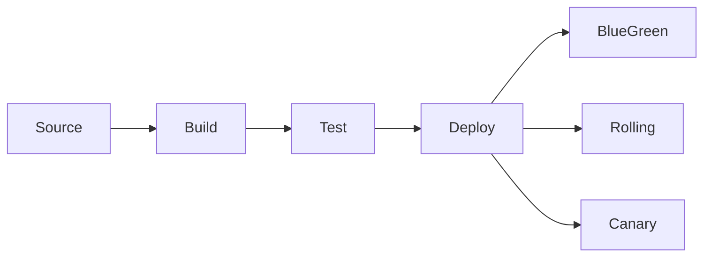

# Cloud Services and Platforms — Ultra Revision

## How to use this sheet

- Skim **(Wn)** tags to map topics to `week-n/` notes if something feels thin.
- For every **HOOK** in bold caps: say the expansion out loud once, then close the file and recall it.
- Tables = comparison traps (exams love NACL vs SG, pricing models, SQL vs NoSQL).
- Diagrams = redraw on paper from memory after first read.

**Bold caps** in sections = memory hook; the line under it is the expansion (do not skip on first read).

---

## Master acronym index (flash drill)

| Hook | Expansion (what to say in your head) |
|------|--------------------------------------|
| **SEO** | Scalability, Elasticity, On-demand self-service |
| **IPS** | IaaS, PaaS, SaaS (who manages what stack layers) |
| **PUPRHYMU** | PUblic, PRivate, HYbrid, MUlti-cloud |
| **OSRPCS** | Operational excellence, Security, Reliability, Performance, Cost, Sustainability |
| **UGRP** | Users, Groups, Roles, Policies (IAM actors + rules) |
| **DAD** | Deny beats Allow; else Default-deny |
| **RAE** | Region, AZ, Edge (AWS global footprint) |
| **AMIITKPSG** | AMI, Instance Type, Key Pair, Security Group (EC2 launch kit) |
| **GCMRSI** | General, Compute, Memory, Storage, Accelerated, IO-optimized (EC2 families) |
| **OSRISPDH** | On-demand, Reserved, Spot, Dedicated Host (EC2 pricing levers) |
| **GISS** | Gp3, Io1/Io2, St1, Sc1 (EBS volume families) |
| **MDM** | Min, Desired, Max (Auto Scaling Group) |
| **ANGC** | ALB, NLB, GWLB, Classic ELB |
| **IGWNAT** | Internet Gateway (inbound+return), NAT Gateway (private egress) |
| **NSSG** | NACL = Network subnet-level Stateless; SG = Stateful at ENI |
| **FRCE** | FROM, RUN, COPY, ENTRYPOINT/CMD (Dockerfile spine) |
| **AESCKKR** | API server, etcd, Scheduler, Controller-manager, Kubelet, Kube-proxy, Runtime |
| **ECR** | Elastic Container Registry (image store) |
| **OBF** | Object (S3), Block (EBS), File (EFS) |
| **ENC4** | SSE-S3, SSE-KMS, SSE-C, Client-side encryption |
| **PKSK** | Partition key, Sort key (DynamoDB) |
| **RCW** | Read/Write capacity units (DynamoDB throughput mental model) |
| **EDPL** | Event-driven, stateless, Pay per duration (Lambda) |
| **MAL** | Metrics, Alarms, Logs (CloudWatch) |
| **TRAIL** | CloudTrail = API audit trail (who did what, when) |
| **TRR** | Tagging, Rightsizing, Reserved (cost triad) |
| **CALMS** | Culture, Automation, Lean, Measurement, Sharing (DevOps) |
| **CBPM** | Clone, Branch, Push, Merge (Git loop) |
| **SBTD** | Source, Build, Test, Deploy (CI/CD spine) |
| **BRC** | Blue-Green, Rolling, Canary (release strategies) |
| **IPAD** | Init, Plan, Apply, Destroy (Terraform workflow) |
| **CSR** | Customer vs Shared vs cloud Responsibility (security model) |

---

## Cloud fundamentals (W1)

**What:** Internet-delivered compute/storage/etc., usage-based pricing, provider-managed scale.

- **SEO:** **S**cale up capacity for growth; **E**lastic = auto up/down with demand; **O**n-demand = self-serve provision in minutes (not weeks).
- **IPS:** **I**aaS = you manage OS/app (VM level); **P**aaS = you manage app/runtime; **S**aaS = you use the app (vendor runs everything). Responsibility shifts down the stack as you go I to S.
- **Shared model:** Provider secures cloud; customer secures **in** the cloud (config, data, IAM).
- **PUPRHYMU:** **Pu**blic multi-tenant cloud; **Pr**ivate (single org); **Hy**brid (split sensitive/on-prem + burst); **Mu**lti-cloud (avoid lock-in, DR, best-of-breed).
- **Cases:** Netflix = elastic streaming; Uber = geo-scale + real-time; Dropbox = durable object-ish storage story.

---

## Architecture principles (W2)

**What:** Design for trade-offs, not single-metric heroics.

- **Scalability vs elasticity:** scalability = *can* grow; elasticity = *does* grow/shrink automatically.
- **HA vs FT:** HA = tolerate failure with acceptable downtime; FT = continue with **no** perceived interruption (stricter, costlier).
- **Multi-tenancy:** shared physical pools, logical isolation; drives economies of scale.
- **OSRPCS (Well-Architected):** **O**perations runbooks & improvements; **S**ecurity identity + data protection; **R**eliability failure isolation & recovery; **P**erformance right resource types; **C**ost visibility & controls; **S**ustainability efficiency/waste reduction.
- **Cross-cloud:** same pillars; names differ, patterns (VPC, object store, managed DB) repeat.

---

## Multi-cloud landscape (W3)

**What:** Map services across AWS / Azure / GCP; pick by compliance, skills, regional footprint, integrations.

| Layer | AWS | Azure | GCP |
|-------|-----|-------|-----|
| Compute VM | EC2 | Virtual Machine | Compute Engine |
| Object storage | S3 | Blob Storage | Cloud Storage |
| Managed SQL | RDS | SQL Database | Cloud SQL |
| Private network | VPC | Virtual Network | VPC |

- **RAE:** **R**egion = geographic area; **A**Z = isolated fault domain inside region; **E**dge = CDN-ish close to users.
- **Certs/roles:** architect vs developer vs ops paths exist on each cloud; course maps learning ladders, not exam numbers.

---

## AWS global infra and accounts (W4)

**What:** Physical isolation (AZ), billing boundary (account), governance (Organizations).

- **RAE** again: deploy multi-AZ for fault isolation; replicate cross-region for DR/latency.
- **Account:** billing, default limits, blast-radius; use **AWS Organizations** + **SCPs** for policy guardrails across accounts.
- **Root user:** break-glass only; daily work = IAM users/roles with MFA.

---

## IAM (W4)

**What:** Every API call evaluated against policies attached to identities or resources.

- **UGRP:** **U**sers (human); **G**roups (bundle permissions); **R**oles (temporary creds, cross-service trust); **P**olicies (JSON Allow/Deny on actions/resources/conditions).
- **DAD evaluation:** 1) Any **D**eny? -> deny. 2) Else any **A**llow? -> allow. 3) Else **D**efault deny. **Explicit Deny always wins.**
- **Least privilege:** minimum actions/resources; use roles for apps, not long-lived keys on laptops.
- **MFA** on humans; **access keys** for programmatic (rotate, scope, never commit).

---

## EC2 and compute (W5)

**What:** Resizable VMs; pair with networking (SG), storage (EBS), and placement (VPC subnet/AZ).

- **AMIITKPSG:** **AMI** OS image; **I**nstance **T**ype (CPU/mem/network); **K**ey **P**air (SSH); **S**ecurity **G**roup (stateful firewall).
- **GCMRSI:** pick family matching bottleneck: **G**eneral, **C**ompute, **M**emory, **S**torage, **I**nf accelerators, **I**/O heavy.
- **OSRISPDH:** **O**n-demand flexible; **R**eserved steady discount; **S**pot interruptible cheap; **D**edicated **H**ost compliance/license sockets.
- **SSH** default port **22** (SG must allow source IP/bastion).

---

## EBS, snapshots, ASG, ELB (W5)

**What:** Persistent disk, horizontal scale, traffic distribution.

- **GISS:** **G**p3 default SSD; **I**o1/Io2 provisioned IOPS for latency DBs; **S**t1 throughput HDD sequential; **S**c1 cold HDD cheapest.
- **Snapshots:** incremental backups; use for DR/migration/AMI creation.
- **MDM:** **M**in / **D**esired / **M**ax instances in Auto Scaling Group (health + policies drive changes).
- **ANGC:** **A**LB HTTP layer 7 routing; **N**LB TCP/UDP ultra-low latency millions CPS; **G**WLB inline security appliances; **C**lassic legacy avoid new.

---

## VPC and networking (W6)

**What:** Private IP space, routing, controlled internet exposure.

- **CIDR cheat:** `/16` ~ 65k addresses (planning block); `/24` ~ 256 (common subnet); avoid overlapping ranges for peering/VPN.
- **Public subnet:** route `0.0.0.0/0` -> **IGW**; instances can get public IPs.
- **Private subnet:** no IGW route; outbound internet via **NAT** (one-way egress); DB tier stays private.
- **IGWNAT:** IGW bidirectional for public; NAT outbound-only for private initiators.
- **NSSG:**

| | NACL | Security Group |
|---|------|----------------|
| Scope | Subnet | ENI / instance |
| Model | Stateless (return path explicit) | Stateful |
| Rules | Numbered allow+deny | Allow-only effective deny |

- **Peering:** connect VPCs (non-transitive); watch CIDR overlap.
- **Two-tier:** public edge (LB) -> private app -> private DB.

---

## Containers and Kubernetes (W7)

**What:** Package deps + code; orchestrate many containers across nodes.

- **VM vs container:** VM = full OS per guest; container = shared kernel, isolated processes/cgroups -> faster start, denser packing.
- **FRCE:** **F**ROM base image; **R**UN build layers; **C**OPY (or ADD) artifacts; **E**NTRYPOINT/CMD define the process (know how ENTRYPOINT+CMD compose).
- **Registry:** **ECR** stores images; `docker push/pull` with auth.
- **K8s:** control plane holds desired state; worker nodes run pods. **AESCKKR:** **A**PI server; **E**tcd; **S**cheduler; **C**ontroller-manager; **K**ubelet; **K**ube-proxy; **R**untime (e.g. containerd).

---

## Storage and S3 (W8)

**What:** Match access pattern to durability, latency, and cost.

- **OBF:** **O**bject S3 API; **B**lock EBS attached disk; **F**ile EFS NFS shared.
- **S3 classes (pattern: hot to cold):** Standard frequent; Standard-IA / One Zone-IA infrequent; Glacier instant/flexible/deep archive for archive + restore SLA trade-offs (exam: colder = cheaper, slower retrieval).
- **Policies:** bucket policy (resource-based) + IAM (identity) + optional ACLs (legacy); prefer policy + IAM.
- **ENC4:** SSE-S3 (AWS-managed); SSE-KMS (keys + policies); SSE-C (you hold key); CSE (encrypt before upload).

---

## Databases (W9)

**What:** SQL for joins/ACID patterns; NoSQL for key-value, wide column, flexible scale.

- **RDS:** managed relational; engines **MySQL, PostgreSQL, MariaDB, Oracle, SQL Server, Aurora**.
- **Multi-AZ:** synchronous standby for failover (not a scaling read path).
- **Read replicas:** async copies for read scale + DR promotion story (lag aware).
- **DynamoDB:** **PKSK** partition + optional sort key; **RCW** capacity mental model + on-demand vs provisioned modes; streams for change capture.

---

## Serverless and Lambda (W10)

**What:** Run code on events without servers you patch.

- **EDPL:** **E**vents trigger functions; **D**esign stateless handlers (state in DB/S3); **P**ay per ms/GB-s; **L**imits drive design.
- **Triggers:** S3 events, API Gateway HTTP, EventBridge rules, SQS messages, DynamoDB Streams, schedules.
- **Config:** memory (also scales CPU), timeout, reserved concurrency, dead-letter queue for failures, IAM **execution role** (not user keys).
- **Limits (memorize order of magnitude):** timeout up to **15 min**; deployment package ~**250 MB** zipped / **10 GB** container image path; design idempotent handlers.

---

## Monitoring, logging, cost (W11)

**What:** Observe health, prove compliance, stop surprise bills.

- **MAL:** CloudWatch **M**etrics (default + custom); **A**larms (threshold + actions); **L**ogs (centralize, retention).
- **TRAIL:** CloudTrail logs **management API** activity across services (who changed IAM, VPC, etc.).
- **Cost:** Billing dashboard + **Cost Explorer** + **Budgets** alerts; **TRR:** **T**ags for allocation; **R**ightsize instances/storage; **R**eserved / savings plans for steady load.

---

## DevOps and CI/CD (W12)

**What:** Fast, safe delivery through automation and feedback.

- **CALMS:** culture collaboration; automate pipeline; lean small batches; measure DORA-style signals; share ownership (Dev+Ops).
- **CBPM:** clone repo, branch feature, commit, push, open PR, merge to main/trunk.
- **SBTD:** hook **S**ource webhook -> **B**uild -> **T**est -> **D**eploy to envs; fail fast on tests.
- **BRC:** **B**lue-green = two full envs swap instant rollback; **R**olling = wave replace instances; **C**anary = small % traffic on new version then promote.

---

## IaC and Terraform (W13)

**What:** Desired state in code; repeatability and reviewable infra changes.

- **Declarative vs imperative:** Terraform/HCL declares end state; imperative scripts issue ordered commands.
- **IPAD:** `terraform init` (providers/backends) -> `terraform plan` (diff) -> `terraform apply` (reconcile) -> `terraform destroy` (teardown).
- **State file:** maps real IDs to resources; team needs remote state + locking (S3+DynamoDB pattern).
- **Modules:** reuse patterns (VPC, eks); **providers** bind to AWS/Azure/GCP APIs.

---

## Cross-cutting cheats

- **CSR (shared responsibility):** customer responsible for data, IAM, OS patching on IaaS, network config; provider responsible for hypervisor, physical security, building blocks.
- **Ports:** 22 SSH; 80 HTTP; 443 HTTPS; 3306 MySQL; 5432 PostgreSQL; 6379 Redis; 3389 RDP.
- **Pick deployment model:** regulated static -> **Pr**ivate/on-prem; burst variable -> **Pu**blic + **Hy**brid; vendor lock fear -> **Mu**lti-cloud with discipline (cost/complexity tax).

---

## Final 60-second recap (say aloud)

**SEO IPS PUPRHYMU** then pillars **OSRPCS**. AWS map **RAE UGRP DAD**. Compute **AMIITKPSG GCMRSI OSRISPDH** disks **GISS** scale **MDM** balance **ANGC**. Network **IGWNAT NSSG** CIDR plan. Containers **FRCE ECR AESCKKR**. Apps **OBF ENC4**. Data **RDS PKSK RCW**. Events **EDPL**. Ops **MAL TRAIL TRR**. Delivery **CALMS CBPM SBTD BRC**. Infra **IPAD**. Responsibility **CSR**.

---

_End — align deep dives with `week-1` … `week-13` notes in this folder._
