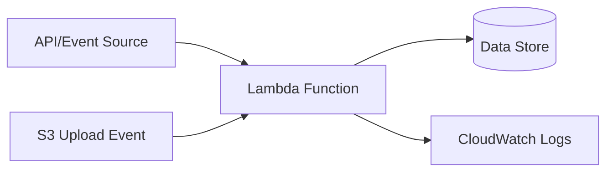

# Pricing model & cost advantages

## Why This Topic Matters

This note explains serverless architecture patterns for event-driven systems and their trade-offs in latency, observability, and operational simplicity.

## Learning Objectives

- Build first-principles understanding of `Pricing model & cost advantages`.
- Connect concepts to architecture decisions in real cloud systems.
- Evaluate security, reliability, performance, and cost trade-offs rigorously.
- Prepare for scenario-based exam and interview questions.

## Intuition Before Mechanics

- Cloud cost is an architectural variable, not merely a billing artifact.
- Optimization must preserve reliability while removing underutilized resources.
- Cost governance needs tagging discipline and accountability ownership.

## Architecture / Relationship View

## Comparison and Decision Framework

| Decision axis | Option A | Option B |
|---|---|---|
| Complexity | Lower with managed defaults | Higher with custom control |
| Flexibility | Moderate | High |
| Risk profile | Safer baseline | Higher misconfiguration risk |
| Typical fit | Fast delivery | Specialized constraints |

## How It Works in Practice

1. Define trigger contracts (API payloads, storage events, queue messages, schedules).
2. Implement stateless business logic with explicit external dependencies.
3. Apply least-privilege IAM permissions for execution identities.
4. Tune execution controls: memory, timeout, concurrency, and retry/DLQ behavior.
5. Instrument metrics/logs and configure alarms for latency, errors, and throttling.

## Real-World Example

File uploads trigger Lambda for processing; metadata is persisted and exposed through API endpoints without managing server fleets.

## Common Pitfalls / Exam Traps

- Non-idempotent handlers causing duplicate side effects.
- Overloaded Lambda functions with mixed concerns.
- Over-permissive execution roles.
- No alarms around error or throttle conditions.

## Quick Revision Summary

- Define the primary architecture problem solved by this topic.
- Explain one reliability and one security trade-off.
- State one cost optimization opportunity and one risk.
- Describe a production scenario where this design is appropriate.
- Identify a likely misconfiguration and its operational impact.
