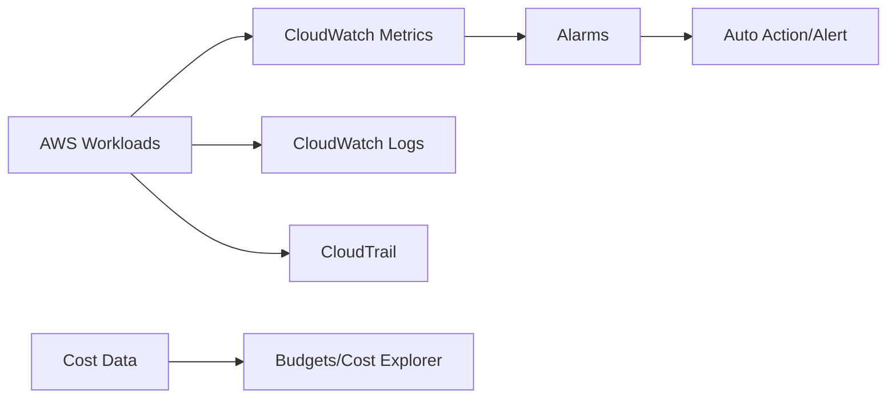

# What is CloudTrail

## Why This Topic Matters

This note connects monitoring, auditing, and cost governance, which together determine operational reliability and financial sustainability.

## Learning Objectives

- Build first-principles understanding of `What is CloudTrail`.
- Connect concepts to architecture decisions in real cloud systems.
- Evaluate security, reliability, performance, and cost trade-offs rigorously.
- Prepare for scenario-based exam and interview questions.

## Core Concepts and Definitions

- `CloudTrail`: an audit service that records API activity for governance and forensics.

## Intuition Before Mechanics

- Start from workload requirements before choosing services or architecture patterns.
- Prefer managed primitives for undifferentiated heavy lifting where practical.
- Evaluate every design through security, reliability, performance, and cost trade-offs.
- Key technologies here: `CloudTrail`.

## Architecture / Relationship View

## Comparison and Decision Framework

| Decision axis | Option A | Option B |
|---|---|---|
| Complexity | Lower with managed defaults | Higher with custom control |
| Flexibility | Moderate | High |
| Risk profile | Safer baseline | Higher misconfiguration risk |
| Typical fit | Fast delivery | Specialized constraints |

## How It Works in Practice

1. Capture workload requirements and constraints first.
2. Choose topology and services that match those requirements.
3. Apply security and policy controls before exposing traffic.
4. Validate behavior with realistic workload and failure tests.
5. Operate with observability and optimize iteratively from production signals.

## Real-World Example

CloudWatch alarms detect latency spikes, CloudTrail captures API-change provenance, and budget alerts prevent spend overruns.

## Common Pitfalls / Exam Traps

- Collecting telemetry with no owner/action mapping.
- Treating audit trails as optional.
- Lack of spend attribution due to poor tagging.
- Commitment discounts applied without usage baseline.

## Quick Revision Summary

- Define the primary architecture problem solved by this topic.
- Explain one reliability and one security trade-off.
- State one cost optimization opportunity and one risk.
- Describe a production scenario where this design is appropriate.
- Identify a likely misconfiguration and its operational impact.
- Recall precise definitions for: CloudTrail.
