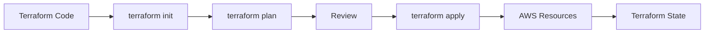

# Terraform + AWS Provider

## Why This Topic Matters

This note introduces infrastructure as code and Terraform workflows for reproducible, reviewable, and automatable cloud infrastructure.

## Learning Objectives

- Build first-principles understanding of `Terraform + AWS Provider`.
- Connect concepts to architecture decisions in real cloud systems.
- Evaluate security, reliability, performance, and cost trade-offs rigorously.
- Prepare for scenario-based exam and interview questions.

## Core Concepts and Definitions

- `Terraform`: an infrastructure-as-code tool that provisions resources from declarative configuration files.

## Intuition Before Mechanics

- Start from workload requirements before choosing services or architecture patterns.
- Prefer managed primitives for undifferentiated heavy lifting where practical.
- Evaluate every design through security, reliability, performance, and cost trade-offs.
- Key technologies here: `Terraform`.

## Architecture / Relationship View

## Comparison and Decision Framework

| Decision axis | Option A | Option B |
|---|---|---|
| Complexity | Lower with managed defaults | Higher with custom control |
| Flexibility | Moderate | High |
| Risk profile | Safer baseline | Higher misconfiguration risk |
| Typical fit | Fast delivery | Specialized constraints |

## How It Works in Practice

1. Model infrastructure declaratively in `.tf` files with variables and outputs.
2. Run `terraform init`, validation, and `terraform plan` before apply.
3. Review plan output as a formal change contract before execution.
4. Apply through controlled workflows with remote state and locking.
5. Continuously detect drift and reconcile through versioned IaC changes.

## Real-World Example

Terraform plans are reviewed in pull requests and applied through controlled pipelines, giving safe, reproducible environment provisioning.

## Common Pitfalls / Exam Traps

- Manual console changes creating IaC drift.
- Local state without locking in team workflows.
- Secrets leaking into code or state files.
- Applying large plans without review discipline.

## Quick Revision Summary

- Define the primary architecture problem solved by this topic.
- Explain one reliability and one security trade-off.
- State one cost optimization opportunity and one risk.
- Describe a production scenario where this design is appropriate.
- Identify a likely misconfiguration and its operational impact.
- Recall precise definitions for: Terraform.
