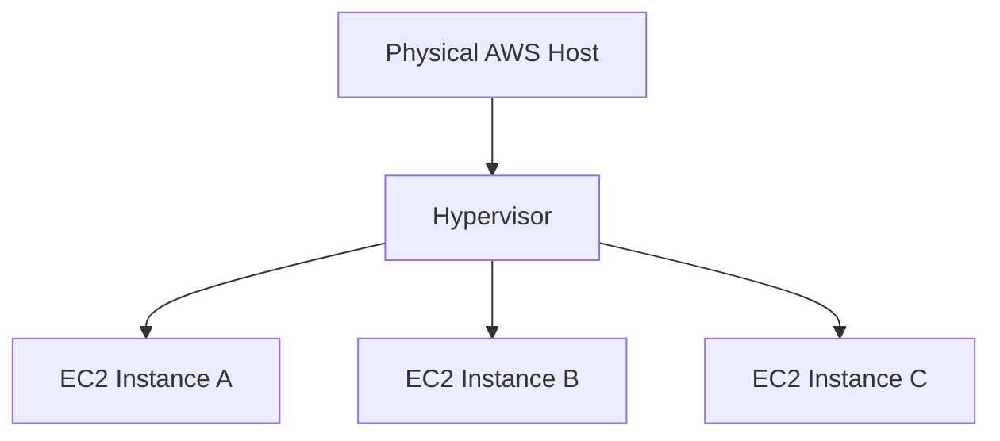

# Module Introduction - Compute Services (AWS EC2)

## Learning Objectives

- Understand why compute is central to cloud architecture.
- Explain EC2 as virtualized compute in AWS.
- Connect EC2 with security, storage, scaling, and traffic management.
- Frame week-5 as an end-to-end compute operations module.

---

## Why This Module Matters

Any real application needs execution infrastructure:

- Web apps need compute for request handling.
- APIs need runtime environments.
- Background jobs need workers.
- Databases need compute and memory resources.

AWS compute answers the practical question: **"Where does my code run?"**

---

## EC2 in Simple Terms

`EC2 (Elastic Compute Cloud)` is a virtual server service where AWS owns physical hardware and you rent isolated virtual machines.

| What you control | What AWS controls |
|---|---|
| OS selection, instance size, access, networking rules | Physical servers, datacenter power/cooling, hardware maintenance |

Think of EC2 as a configurable rented computer:

- Pick CPU/RAM power.
- Pick operating system.
- Define security boundaries.
- Start/stop based on need.
- Pay for usage duration.

---

## Virtualization: The Core Idea

Virtualization lets one physical host run multiple isolated virtual servers.

Each EC2 instance behaves like an independent machine with its own:

- OS
- CPU share
- Memory
- Network identity
- Security configuration

---

## What This Week Builds Toward

Week-5 topics form an operational sequence:

By combining these, you get a production-grade pattern: **secure, persistent, scalable compute**.

---

## Real-World Mental Model

- EC2 = rented server
- EBS = attached persistent disk
- Security Group = server-level firewall allowlist
- Auto Scaling Group = automatic server count manager
- Load Balancer = smart traffic distributor

Together they power most AWS-hosted applications.

---

## Quick Revision Checklist

- [ ] Define EC2 and why it exists.
- [ ] Explain virtualization and isolation.
- [ ] Describe pay-for-use compute economics.
- [ ] Map security, storage, scaling, and load balancing to EC2 operations.
