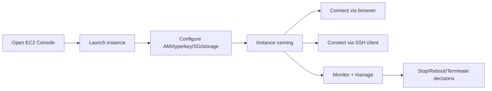

# Practical Lab Notes - Launching and Managing EC2

## Lab Goals

- Launch an EC2 instance from console.
- Configure AMI, instance type, key pair, security group, and storage.
- Connect via browser-based EC2 Instance Connect and via SSH client.
- Inspect metrics, networking, and lifecycle actions.
- Terminate instance to avoid unnecessary cost.

---

## Lab Flow Overview

---

## Configuration Steps Observed

| Step | Practical detail from lab | Why it matters |
|---|---|---|
| Naming | created a demo instance name | easy identification in console |
| AMI selection | Linux free-tier image | low-cost learning setup |
| Instance type | micro/free-tier class | enough for basic practice |
| Key pair | created and downloaded key | required for secure SSH access |
| Networking | SG rules set during launch | controls reachability |
| Storage | default EBS root attached | persistent baseline disk |

---

## Important Console-Level Concepts

- Region/AZ context affects resource visibility and attachment compatibility.
- Every instance has unique `instance ID`.
- Public/private IPs serve different network scopes.
- AMI IDs are important for Infrastructure as Code reproducibility.

---

## Connection Methods Compared

| Method | Pros | Cons |
|---|---|---|
| EC2 Instance Connect (browser) | quick and simple for demos | requires console login workflow each time |
| SSH client from local terminal | fast repeat access and automation-friendly | needs local key handling and CLI familiarity |

---

## SSH Workflow from Lab (Conceptual)

1. Move terminal to location of downloaded key.
2. Restrict key permissions.
3. Run SSH command with key + username + target host.
4. Confirm fingerprint once, then interact with remote shell.

This transitions command prompt from local machine context to remote EC2 context.

---

## Monitoring and Security Operations Highlighted

- View CPU/network utilization and utilization trends.
- Update security group inbound/outbound rules dynamically.
- Rule changes apply without instance restart.
- Use metrics to right-size instance and optimize spend.

---

## Billing-Safe Lab Closure

Transcript strongly emphasizes cleanup:

- `Stop` may not eliminate all charges.
- `Terminate` removes compute resource permanently.
- Verify state in billing/cost management dashboards.

For student labs, termination discipline prevents surprise bills.

---

## Quick Revision Checklist

- [ ] Reproduce full launch workflow from memory.
- [ ] Explain when browser connect vs SSH is preferable.
- [ ] Identify where to inspect metrics and security rules.
- [ ] State why post-lab termination is recommended.
