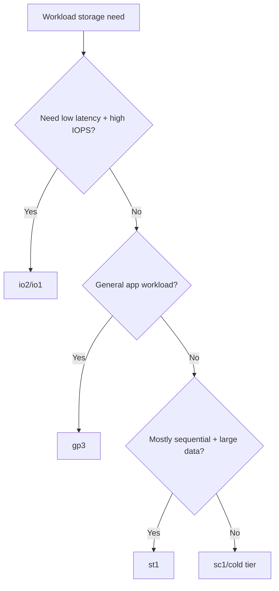

# What is EBS? Volume Types

## Learning Objectives

- Define Amazon EBS and its role with EC2.
- Compare EBS volume types by performance and cost.
- Choose suitable volume classes by workload pattern.
- Avoid overpaying or underperforming through mismatched storage.

---

## EBS Fundamentals

`Amazon EBS (Elastic Block Store)` provides persistent block storage for EC2.

Transcript mental model:

- EC2 = computer
- EBS = attached hard disk

Key property: data on EBS survives instance reboot and many operational events.

---

## Why EBS is Critical

Without persistent storage:

- OS/data changes are not durable.
- Application state is at risk.
- Recovery operations become difficult.

EBS is therefore foundational for most production EC2 deployments.

---

## Volume Types Mentioned

| Type | Profile | Best for | Trade-off |
|---|---|---|---|
| `gp3` | General-purpose SSD | web servers, dev/test, broad workloads | balanced default |
| `io1/io2` | Provisioned high IOPS SSD | latency-sensitive databases | higher cost, predictable performance |
| `st1` | Throughput-focused HDD | large sequential read/write (logs/analytics) | not for boot/high-random I/O |
| `sc1` (transcript wrote "SE1") | Cold HDD | infrequent access/archive | lowest cost, lowest performance |

---

## Selection Framework

---

## Practical Guidance

- Start with `gp3` for unknown/general cases.
- Move to provisioned IOPS only when metrics justify.
- Keep archival data on cheaper throughput/cold classes.
- Align storage class with access pattern, not only size.

---

## Quick Revision Checklist

- [ ] Define EBS in one sentence.
- [ ] Differentiate gp3, io1/io2, st1, sc1.
- [ ] Explain why gp3 is a default starter choice.
- [ ] Give one use case where io2 is justified.
