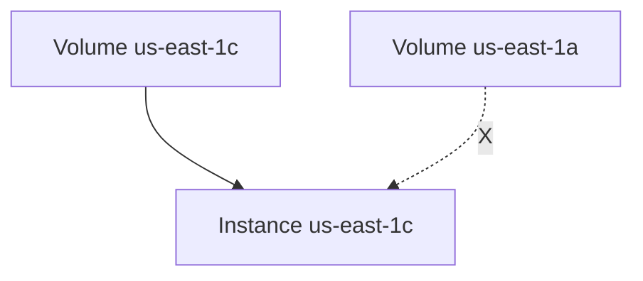

# Attaching and Detaching EBS Volumes

## Learning Objectives

- Understand independent lifecycle of EC2 and EBS.
- Create, attach, detach, and delete EBS volumes correctly.
- Apply Availability Zone (AZ) attachment constraints.
- Avoid storage billing leakage and accidental deletion.

---

## Core Concepts

- EC2 provides compute.
- EBS provides persistent block storage.
- EBS can exist without EC2, but delivers practical value when attached.

This separation enables flexible storage management.

---

## AZ Constraint (Most Important Rule)

An EBS volume can only be attached to an EC2 instance in the **same Availability Zone**.

Cross-AZ direct attachment is not allowed.

---

## Workflow Demonstrated in Transcript

1. Create volume (type, size, AZ).
2. Confirm instance AZ.
3. Attach created volume to instance.
4. Verify additional volume visible under instance storage.
5. Detach volume when no longer needed.
6. Delete detached volume to stop storage charges.

---

## Existing Root Volume vs Additional Data Volumes

| Volume role | Typical behavior |
|---|---|
| Root volume | attached by default at launch, boots OS |
| Additional volumes | optional capacity expansion or data segregation |

Adding extra volume helps separate application data from system disk.

---

## Detach vs Delete

- **Detach**: removes mapping from instance, volume still exists and is billable.
- **Delete**: permanently removes volume and data (after confirmation).

Operationally safe sequence: `detach -> verify unused -> delete`.

---

## Common Mistakes

1. Creating volume in wrong AZ, then failing to attach.
2. Detaching but forgetting to delete idle test volumes.
3. Deleting wrong volume due to poor naming/tagging.

---

## Best Practices

- Use consistent volume naming and tags.
- Snapshot before deleting important data volumes.
- Monitor unattached volume inventory regularly.

---

## Quick Revision Checklist

- [ ] Explain EC2/EBS independent lifecycle.
- [ ] State the same-AZ attachment rule.
- [ ] Differentiate detach and delete.
- [ ] Describe safe operational cleanup sequence.
