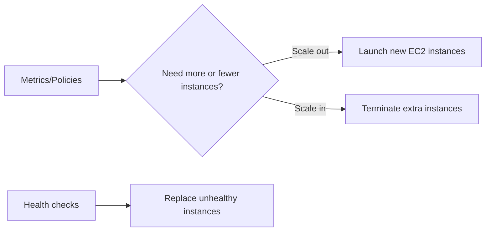

# Using Auto Scaling Groups (ASG)

## Learning Objectives

- Understand why autoscaling is essential for variable demand.
- Explain ASG building blocks: launch template, desired/min/max.
- Describe ASG + ELB combined architecture.
- Recognize limitations and non-goals of autoscaling.

---

## What ASG Solves

Traffic is dynamic. Manual scaling is too slow and error-prone.

ASG automatically adjusts EC2 instance count based on demand and health.

Benefits:

- better availability
- controlled cost
- reduced operational overhead

---

## ASG Core Parameters

| Parameter | Meaning |
|---|---|
| Launch template | blueprint for new instances (AMI, type, SG, key, etc.) |
| Desired capacity | target count ASG tries to maintain |
| Minimum capacity | lower bound to preserve baseline availability |
| Maximum capacity | upper bound to cap scale and cost |

---

## ASG Behavior Model

ASG also self-heals by replacing failed instances.

---

## Why ASG + ELB is Standard

- ELB distributes incoming traffic.
- ASG adjusts backend fleet size.
- Together they provide scalable high-availability compute.

This is a default pattern for modern cloud-native web/API systems.

---

## Limits of Autoscaling

ASG is not a universal fix:

- does not repair poor application code
- does not optimize bad query patterns
- does not reduce cost if min capacity is overprovisioned

Autoscaling works best with performance-aware architecture and sane thresholds.

---

## Quick Example

E-commerce app:

- Normal traffic: desired `2`, min `2`
- Festival spike: scale to `10` based on CPU/request rate
- Post-spike: scale back toward baseline

Result: stable UX during spikes without paying peak capacity all day.

---

## Quick Revision Checklist

- [ ] Define ASG in one line.
- [ ] Explain desired/min/max interaction.
- [ ] Describe self-healing behavior.
- [ ] State one limitation of autoscaling.
