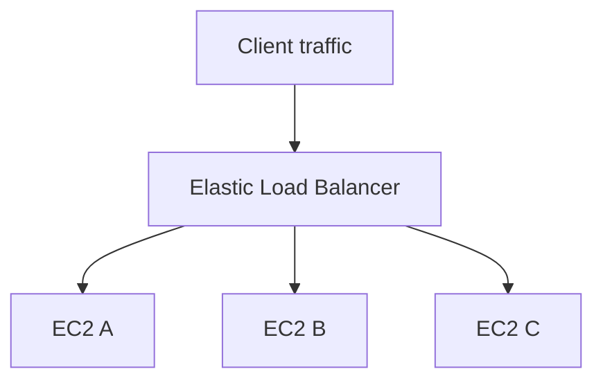
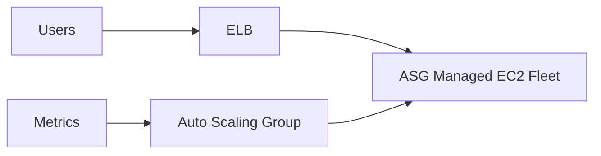

# Elastic Load Balancer (ELB)

## Learning Objectives

- Define load balancing in AWS context.
- Explain ELB role in availability and fault tolerance.
- Compare ALB, NLB, and Classic LB at high level.
- Understand ELB health checks and ASG integration.

---

## Core Purpose

An Elastic Load Balancer distributes incoming requests across multiple backend instances so no single server becomes a single point of overload/failure.

---

## Traffic Distribution Model

If one instance fails health checks, ELB stops routing traffic to it.

---

## What ELB Solves

- Avoids hot-spot load on one instance
- Improves availability during instance failure
- Enables horizontal scaling architectures
- Works with ASG so backend membership updates automatically

---

## What ELB Does *Not* Solve

- It does not increase CPU/RAM of an individual server.
- It does not fix inefficient code or slow database design.
- It is not a replacement for capacity planning.

ELB is a traffic routing and availability component.

---

## ELB Types Mentioned

| Type | Best fit |
|---|---|
| Application Load Balancer (ALB) | HTTP/HTTPS web apps, APIs, L7 routing needs |
| Network Load Balancer (NLB) | ultra-high throughput, low latency, L4 workloads |
| Classic Load Balancer (CLB) | legacy setups (older generation) |

---

## Health Check Concept

ELB continuously probes targets:

- healthy -> keep routing
- unhealthy -> remove from active rotation

This automatic target filtering is central to resilient service delivery.

---

## ELB + ASG Reference Pattern

ASG scales instance count; ELB routes traffic to whichever instances are healthy and active.

---

## Quick Revision Checklist

- [ ] Define ELB role in one sentence.
- [ ] Explain why ELB improves availability.
- [ ] Compare ALB/NLB/CLB at high level.
- [ ] Describe how health checks influence routing.
