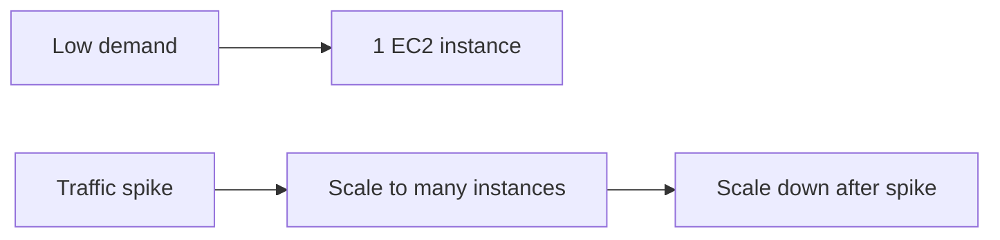

# EC2 Basics - Elastic Compute Cloud

## Learning Objectives

- Define EC2 and elastic compute.
- Compare EC2 with traditional on-prem server procurement.
- Identify common EC2 use cases.
- Explain why EC2 is foundational in AWS architectures.

---

## What is EC2?

`EC2` is AWS's Infrastructure-as-a-Service compute offering for running virtual machines on demand.

An EC2 instance provides:

- Virtual CPU
- Memory (RAM)
- Storage attachment capability
- Network interfaces and IPs
- OS-level control

This makes it operationally similar to a physical server, but with cloud speed and flexibility.

---

## Why "Elastic"?

Elasticity means server capacity can adjust to workload.

With EC2:

- Launch in minutes.
- Scale up when demand rises.
- Scale down when demand drops.
- Pay only while resources are running.

---

## Traditional vs EC2 Model

| Aspect | Traditional datacenter | EC2 model |
|---|---|---|
| Capacity planning | Forecast months/years ahead | Provision on demand |
| Lead time | Purchase + setup delays | Minutes |
| Cost pattern | High upfront capex | Usage-based opex |
| Scale response | Slow/manual | Fast/automated |

This removes the "guess future traffic" problem.

---

## Common Use Cases

- Development and testing environments
- Web/API backend hosting
- Batch/cron workloads
- Temporary data processing workloads
- Proof-of-concept deployments

---

## Apartment Analogy (from transcript)

- Apartment = EC2 rental model
- House purchase = physical server ownership
- Maintenance handled by owner (AWS)
- Tenant (you) focuses on usage, not hardware upkeep

---

## Practical Design Insight

EC2 is often step-1, not step-final. Production stacks combine EC2 with:

- `EBS` for persistence
- `Security Groups` for controlled access
- `ASG` for scaling
- `ELB` for availability and traffic spread

---

## Quick Revision Checklist

- [ ] Expand EC2 as Elastic Compute Cloud.
- [ ] Explain why elasticity is operationally valuable.
- [ ] Compare EC2 to traditional infrastructure planning.
- [ ] List at least three common EC2 workloads.
