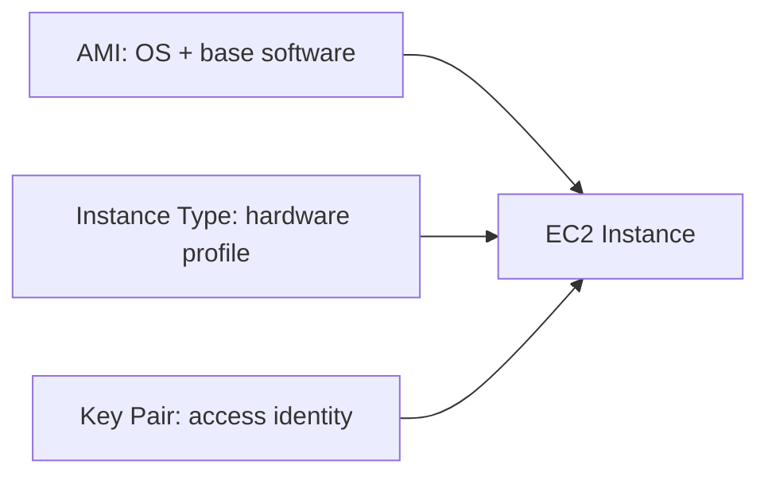

# Key EC2 Components - AMI, Instance Type, Key Pair

## Learning Objectives

- Understand the three mandatory EC2 design choices.
- Select suitable AMIs and instance types by workload.
- Explain SSH key-based authentication fundamentals.
- Recognize how these three choices jointly determine instance utility.

---

## The Three Building Blocks

Every EC2 launch is defined by:

1. **AMI** - software image blueprint
2. **Instance Type** - compute/memory/network capacity profile
3. **Key Pair** - secure access mechanism

---

## 1) AMI (Amazon Machine Image)

AMI defines launch-time software state:

- OS family (Linux/Windows/etc.)
- Pre-installed tools/packages
- Baseline configuration

### AMI Sources

| Source | Typical use |
|---|---|
| AWS managed AMIs | Standard secure base images |
| Marketplace AMIs | Pre-packaged third-party software |
| Custom AMIs | Org-standard hardened images with internal apps |

Custom AMIs reduce drift and accelerate consistent deployments.

---

## 2) Instance Type

Instance type determines hardware characteristics:

- vCPU count
- RAM size
- Network throughput class
- Local storage/GPU availability (family dependent)

### Workload Matching Examples

| Workload | Better fit |
|---|---|
| Small web app | General purpose |
| In-memory DB | Memory optimized |
| ML training/inference | GPU family |
| High compute jobs | Compute optimized |

Wrong type choice leads to performance bottlenecks or unnecessary cost.

---

## 3) Key Pair (for SSH access)

AWS default Linux access uses asymmetric cryptography:

- Public key stored on instance
- Private key held by operator

At login, SSH proves private-key ownership without password sharing.

### Security Practices

- Never commit `.pem` keys to repositories
- Restrict key file permissions
- Rotate keys for teams/critical systems
- Use distinct keys per environment where possible

---

## Component Interdependency

- Correct AMI + wrong instance size -> app underperforms
- Correct size + no key management -> operations blocked
- Correct access + wrong AMI -> deployment mismatch

Reliable EC2 operations require all three aligned with use case.

---

## Quick Revision Checklist

- [ ] Define AMI and list image source types.
- [ ] Explain how instance type impacts cost/performance.
- [ ] Describe key pair authentication flow.
- [ ] Give one failure scenario when one component is mischosen.
