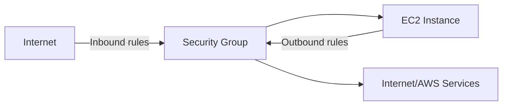

# Security Groups - Inbound and Outbound Traffic Basics

## Learning Objectives

- Define Security Groups as instance-level virtual firewalls.
- Distinguish inbound and outbound rules.
- Explain stateful behavior and allow-only model.
- Diagnose common EC2 connectivity issues caused by SG misconfiguration.

---

## What is a Security Group?

A Security Group (SG) is a **stateful, allowlist-based firewall** attached to ENIs/instances.

If traffic is not explicitly allowed, it is denied.

---

## Inbound vs Outbound

| Direction | Meaning | Typical rule examples |
|---|---|---|
| Inbound | Traffic entering instance | SSH `22`, HTTP `80`, HTTPS `443` |
| Outbound | Traffic leaving instance | package updates, API calls, DB connectivity |

From transcript context:

- Inbound controls who can reach the instance.
- Outbound controls where instance can send traffic.
- Default outbound is usually open in many setups (must be reviewed for production hardening).

---

## Stateful Behavior (Critical Concept)

Security Groups are **stateful**:

- If inbound request is allowed and reaches instance,
- Return traffic is automatically allowed,
- No separate explicit outbound response rule needed.

This simplifies rule design compared to stateless firewalls.

---

## Allow-Only Model

Security Groups support **allow rules only** (no explicit deny rules).

- Matching allow rule -> permitted
- No match -> implicit deny

Multiple SGs can be attached, and effective permissions are the union of all allow rules.

---

## Typical Misconfiguration Cases

1. SSH timeout because port `22` not allowed from your source IP.
2. App inaccessible because port `80/443` rule missing.
3. Overly broad source (`0.0.0.0/0`) used for admin ports.
4. Outbound restrictions blocking update/package installs.

---

## Security Best Practices

- Keep admin ports narrow (`/32` IP where possible).
- Separate SGs by role (web, app, db tiers).
- Periodically review stale rules.
- Prefer least privilege over convenience.

---

## Quick Revision Checklist

- [ ] Define SG in one line.
- [ ] Differentiate inbound and outbound traffic.
- [ ] Explain what "stateful" means for SGs.
- [ ] State why SGs are allowlist-driven.
- [ ] Identify one common beginner SG mistake.
