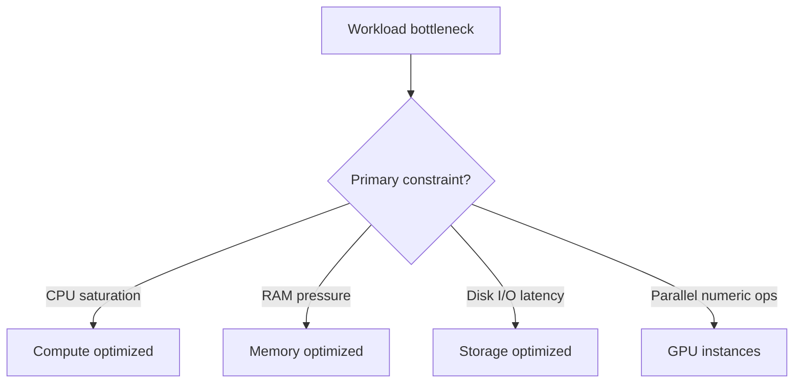

# EC2 Instance Families Overview

## Learning Objectives

- Understand why AWS offers multiple instance families.
- Match workload characteristics to family type.
- Avoid common cost/performance mismatch errors.
- Build a quick decision framework for instance selection.

---

## Why Instance Families Exist

Workloads stress different resources:

- CPU-heavy workloads
- Memory-heavy workloads
- Storage-I/O-heavy workloads
- Parallel-compute workloads (GPU)

One generic machine type is inefficient for all of the above.

---

## Major Families Covered

| Family type | Optimized for | Example workloads |
|---|---|---|
| Compute-optimized | High CPU throughput | batch compute, encoding, gaming servers, compute APIs |
| Memory-optimized | Large RAM usage | in-memory DBs, caching, real-time analytics |
| Storage-optimized | High IOPS / low-latency disk | log analytics, search engines, data pipelines |
| GPU instances | Massive parallel processing | ML/DL training, rendering, computer vision |

---

## CPU vs Memory vs Storage vs GPU Lens

---

## Transcript-Inspired Practical Guidance

- If response time degrades and CPU is maxed -> try compute optimized.
- If swapping/thrashing due to memory pressure -> move to memory optimized.
- If disk waits dominate -> use storage optimized profile.
- If ML pipeline is slow on CPU -> evaluate GPU-backed families.

---

## Common Selection Mistakes

1. Running DB on compute-focused family.
2. Running ML training on general-purpose CPU-only nodes.
3. Oversizing expensive families without utilization evidence.
4. Ignoring cost-per-performance and selecting by habit.

---

## Operational Rule of Thumb

1. Start with observed bottleneck metrics.
2. Pick family by bottleneck.
3. Right-size within family.
4. Revalidate with CloudWatch and load tests.

---

## Quick Revision Checklist

- [ ] Explain why one-size-fits-all instance design fails.
- [ ] Map each family to its dominant resource profile.
- [ ] Give one mismatch example and consequence.
- [ ] Describe a metric-driven family selection process.
