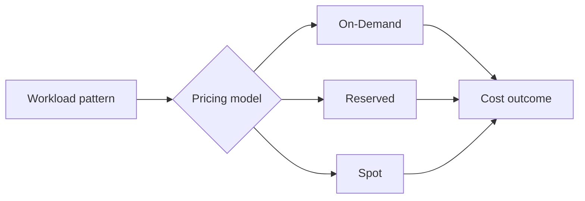

# EC2 Pricing Models

## Learning Objectives

- Compare On-Demand, Reserved, and Spot pricing.
- Understand flexibility vs commitment trade-offs.
- Design mixed pricing strategies for real workloads.
- Avoid common pricing model misuse.

---

## Why Pricing Model Matters

In EC2 design, architecture and billing are tightly linked. Same instance type can have very different cost based on purchase model.

---

## 1) On-Demand

- No long-term commitment
- Pay per running duration
- Maximum flexibility
- Highest baseline cost for continuous workloads

Best for:

- Experiments
- Learning labs
- Unpredictable short-lived tasks

---

## 2) Reserved Instances (RI)

- Commit to 1-year or 3-year usage profile
- Significant discount vs on-demand
- Best for steady, predictable, always-on workloads

Best for:

- Production app baselines
- Persistent services
- Long-running databases/app tiers

---

## 3) Spot Instances

- Use spare AWS capacity at deep discount
- Can be interrupted (capacity reclaimed by AWS)
- Not suitable for interruption-sensitive critical stateful components

Best for:

- Batch processing
- Fault-tolerant pipelines
- Distributed data/ML jobs with checkpointing

---

## Comparison Table

| Model | Cost | Reliability | Commitment | Ideal use |
|---|---|---|---|---|
| On-Demand | Highest | Stable | None | short-term or variable workloads |
| Reserved | Lower | Stable | 1/3 year | predictable baseline traffic |
| Spot | Lowest | Interruptible | None | resilient background compute |

---

## Practical Mixed Strategy

Common production pattern:

- Reserved for minimum guaranteed baseline
- On-Demand for sudden bursts
- Spot for asynchronous workers

This provides **cost efficiency + operational resilience**.

---

## Quick Revision Checklist

- [ ] Explain trade-off triangle: flexibility, commitment, cost.
- [ ] Identify when on-demand is best despite higher price.
- [ ] Explain why spot needs interruption-tolerant design.
- [ ] Propose a hybrid model for a real app.
