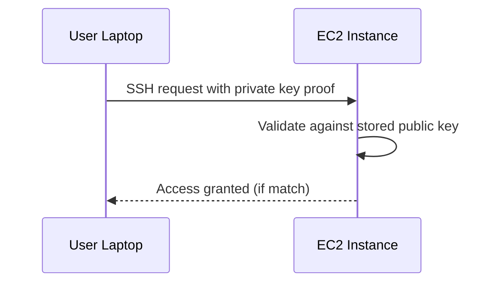

# SSH Access to EC2

## Learning Objectives

- Explain secure shell (SSH) and key-based authentication.
- Understand username, private key, and network prerequisites.
- Use secure operational practices for EC2 access.
- Troubleshoot common SSH login failures.

---

## Why SSH for EC2?

SSH provides encrypted remote command-line access to Linux instances.

Typical operations over SSH:

- Install software
- Configure services
- Debug incidents
- Manage files and runtime behavior

---

## Key Pair Authentication Flow

No password exchange is required when key pair auth is used.

---

## Required Components

| Component | Purpose |
|---|---|
| Private key (`.pem`) | Secret credential used by operator |
| Public key (on EC2) | Verification target |
| Correct username | OS-specific login identity |
| Network path | SG/NACL/routing must allow SSH |

From transcript examples:

- Amazon Linux user: `ec2-user`
- Ubuntu user: `ubuntu`

Wrong username is a common access error.

---

## Security Rules for Private Keys

- Never upload private keys to Git repositories.
- Restrict file permissions to owner-read.
- Avoid sharing by email/chat.
- Rotate compromised keys immediately.

Treat private key like physical master key to production infrastructure.

---

## SSH Failure Troubleshooting

1. **Timeout** -> likely SG/routing issue (port `22` blocked).
2. **Permission denied (publickey)** -> wrong key or wrong username.
3. **Unprotected private key warning** -> file permissions too open.
4. **Host unreachable** -> wrong IP/DNS or instance not running.

---

## Practical Note

Even if future managed services reduce direct SSH dependence, understanding SSH remains essential for incident response and low-level debugging.

---

## Quick Revision Checklist

- [ ] Expand SSH and explain its role in cloud ops.
- [ ] Describe public/private key responsibilities.
- [ ] State OS-specific username importance.
- [ ] List top SSH login failure causes.
