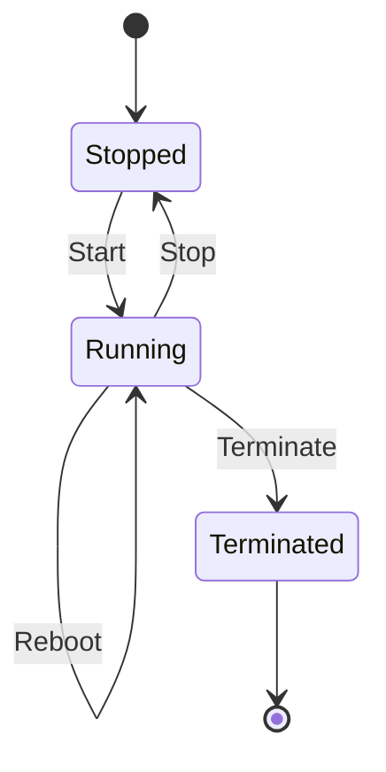

# Basic EC2 Instance Management

## Learning Objectives

- Understand EC2 lifecycle control actions.
- Compare start, stop, reboot, and terminate behavior.
- Explain billing and data implications for each action.
- Prevent accidental data loss in operations.

---

## EC2 Lifecycle Actions

AWS provides four core operational actions:

1. Start
2. Stop
3. Reboot
4. Terminate

---

## Action-by-Action Comparison

| Action | Compute billing | EBS data | Recoverability | Typical use |
|---|---|---|---|---|
| Start | resumes | preserved | yes | resume stopped workload |
| Stop | compute stops, storage continues | preserved | yes | cost saving when idle |
| Reboot | continues | preserved | yes | restart OS/services |
| Terminate | stops | root usually deleted (default) | no | permanent decommission |

---

## Key Operational Concepts

- **Stop != Delete**: instance still exists; attached persistent storage still billed.
- **Reboot != Recreate**: same instance identity, quick OS restart behavior.
- **Terminate is destructive**: should require deliberate confirmation and safeguards.

---

## Cost and Safety Best Practices

- Stop non-production instances outside active windows.
- Tag instances by environment/owner for lifecycle automation.
- Enable termination protection for critical systems.
- Take snapshots before risky operations.

---

## Laptop Analogy (from transcript)

- Start = power on
- Stop = shut down
- Reboot = restart
- Terminate = dispose permanently

Analogy helps remember irreversibility of terminate.

---

## Quick Revision Checklist

- [ ] Differentiate start, stop, reboot, terminate.
- [ ] Explain cost behavior for stopped instances.
- [ ] State why terminate is high-risk.
- [ ] Mention one safeguard against accidental deletion.
