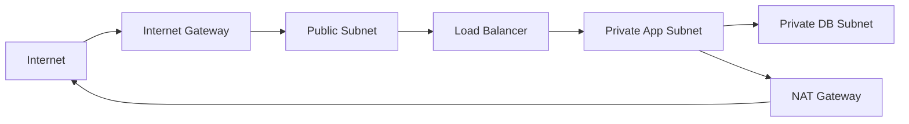

# VPC Basics

## Why This Topic Matters

This note builds networking intuition for secure and reachable cloud systems. Network decisions define exposure boundaries, routing behavior, and fault isolation.

## Learning Objectives

- Build first-principles understanding of `VPC Basics`.
- Connect concepts to architecture decisions in real cloud systems.
- Evaluate security, reliability, performance, and cost trade-offs rigorously.
- Prepare for scenario-based exam and interview questions.

## Core Concepts and Definitions

- `VPC`: an isolated virtual network in AWS where you control IP ranges, subnets, routes, and security boundaries.

## Intuition Before Mechanics

- Start from workload requirements before choosing services or architecture patterns.
- Prefer managed primitives for undifferentiated heavy lifting where practical.
- Evaluate every design through security, reliability, performance, and cost trade-offs.
- Key technologies here: `VPC`.

## Architecture / Relationship View

## Comparison and Decision Framework

| Decision axis | Option A | Option B |
|---|---|---|
| Complexity | Lower with managed defaults | Higher with custom control |
| Flexibility | Moderate | High |
| Risk profile | Safer baseline | Higher misconfiguration risk |
| Typical fit | Fast delivery | Specialized constraints |

## How It Works in Practice

1. Capture workload requirements and constraints first.
2. Choose topology and services that match those requirements.
3. Apply security and policy controls before exposing traffic.
4. Validate behavior with realistic workload and failure tests.
5. Operate with observability and optimize iteratively from production signals.

## Real-World Example

A production web platform keeps only load balancers in public subnets while app and database tiers remain private with controlled NAT egress.

## Common Pitfalls / Exam Traps

- Overlapping CIDR blocks that block peering/hybrid growth.
- Mixing up route-table and firewall issues while debugging connectivity.
- Exposing private tiers due to incorrect subnet placement.
- Overly broad network rules enabling lateral movement.

## Quick Revision Summary

- Define the primary architecture problem solved by this topic.
- Explain one reliability and one security trade-off.
- State one cost optimization opportunity and one risk.
- Describe a production scenario where this design is appropriate.
- Identify a likely misconfiguration and its operational impact.
- Recall precise definitions for: VPC.
