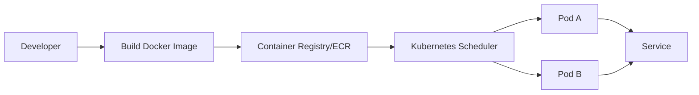

# Why Containers Matter

## Why This Topic Matters

This note explains containerized platforms used for reproducible deployment and scalable microservices. These ideas are essential for production ML serving.

## Learning Objectives

- Build first-principles understanding of `Why Containers Matter`.
- Connect concepts to architecture decisions in real cloud systems.
- Evaluate security, reliability, performance, and cost trade-offs rigorously.
- Prepare for scenario-based exam and interview questions.

## Core Concepts and Definitions

- `Container`: an isolated process environment sharing the host kernel but with its own filesystem and libraries.

## Intuition Before Mechanics

- Start from workload requirements before choosing services or architecture patterns.
- Prefer managed primitives for undifferentiated heavy lifting where practical.
- Evaluate every design through security, reliability, performance, and cost trade-offs.
- Key technologies here: `Container`.

## Architecture / Relationship View

## Comparison and Decision Framework

| Decision axis | Option A | Option B |
|---|---|---|
| Complexity | Lower with managed defaults | Higher with custom control |
| Flexibility | Moderate | High |
| Risk profile | Safer baseline | Higher misconfiguration risk |
| Typical fit | Fast delivery | Specialized constraints |

## How It Works in Practice

1. Capture workload requirements and constraints first.
2. Choose topology and services that match those requirements.
3. Apply security and policy controls before exposing traffic.
4. Validate behavior with realistic workload and failure tests.
5. Operate with observability and optimize iteratively from production signals.

## Real-World Example

An inference service ships Docker images to ECR and deploys replicas on Kubernetes, ensuring identical runtime behavior across environments.

## Common Pitfalls / Exam Traps

- Treating containers as persistent VMs and storing state locally.
- Using bloated images without security scanning.
- Running orchestration without resource limits/requests.
- Ignoring image provenance and rollout hygiene.

## Quick Revision Summary

- Define the primary architecture problem solved by this topic.
- Explain one reliability and one security trade-off.
- State one cost optimization opportunity and one risk.
- Describe a production scenario where this design is appropriate.
- Identify a likely misconfiguration and its operational impact.
- Recall precise definitions for: Container.
