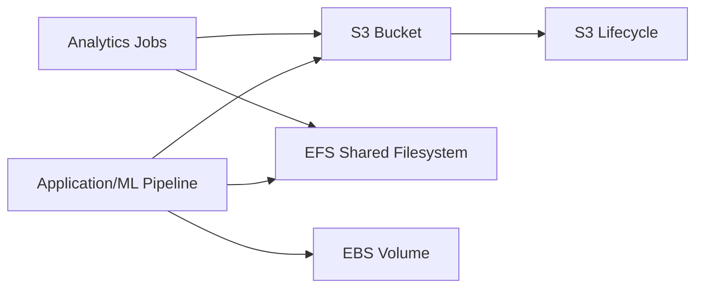

# Storage services overview

## Why This Topic Matters

This note covers storage architecture, where service choice strongly influences durability, performance, compliance, and cost in data-heavy workloads.

## Learning Objectives

- Build first-principles understanding of `Storage services overview`.
- Connect concepts to architecture decisions in real cloud systems.
- Evaluate security, reliability, performance, and cost trade-offs rigorously.
- Prepare for scenario-based exam and interview questions.

## Intuition Before Mechanics

- Start from workload requirements before choosing services or architecture patterns.
- Prefer managed primitives for undifferentiated heavy lifting where practical.
- Evaluate every design through security, reliability, performance, and cost trade-offs.

## Architecture / Relationship View

## Comparison and Decision Framework

| Decision axis | Option A | Option B |
|---|---|---|
| Complexity | Lower with managed defaults | Higher with custom control |
| Flexibility | Moderate | High |
| Risk profile | Safer baseline | Higher misconfiguration risk |
| Typical fit | Fast delivery | Specialized constraints |

## How It Works in Practice

1. Capture workload requirements and constraints first.
2. Choose topology and services that match those requirements.
3. Apply security and policy controls before exposing traffic.
4. Validate behavior with realistic workload and failure tests.
5. Operate with observability and optimize iteratively from production signals.

## Real-World Example

An ML pipeline stores raw data in S3, archives old artifacts with lifecycle rules, and uses EFS for shared model preprocessing outputs.

## Common Pitfalls / Exam Traps

- Choosing storage by familiarity instead of access pattern.
- Missing lifecycle policies and inflating storage cost.
- Weak bucket/IAM policy leading to accidental exposure.
- Assuming encryption posture without key-policy verification.

## Quick Revision Summary

- Define the primary architecture problem solved by this topic.
- Explain one reliability and one security trade-off.
- State one cost optimization opportunity and one risk.
- Describe a production scenario where this design is appropriate.
- Identify a likely misconfiguration and its operational impact.
