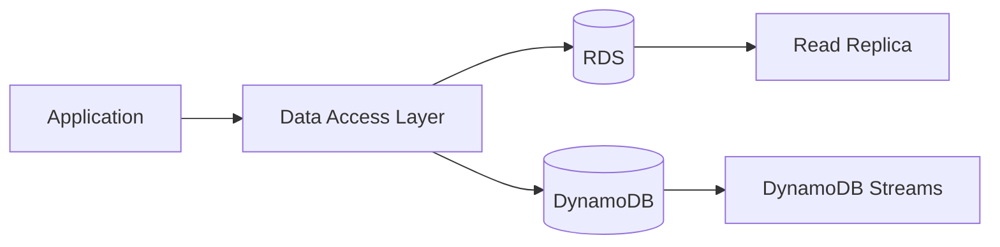

# dynamodb capacity & pricing

## Why This Topic Matters

This note focuses on managed database design where consistency model, schema strategy, and scaling pattern determine correctness and performance.

## Learning Objectives

- Build first-principles understanding of `dynamodb capacity & pricing`.
- Connect concepts to architecture decisions in real cloud systems.
- Evaluate security, reliability, performance, and cost trade-offs rigorously.
- Prepare for scenario-based exam and interview questions.

## Core Concepts and Definitions

- `DynamoDB`: a serverless NoSQL key-value/document database with predictable low-latency performance.

## Intuition Before Mechanics

- Cloud cost is an architectural variable, not merely a billing artifact.
- Optimization must preserve reliability while removing underutilized resources.
- Cost governance needs tagging discipline and accountability ownership.
- Key technologies here: `DynamoDB`.

## Architecture / Relationship View

## Comparison and Decision Framework

| Decision axis | Option A | Option B |
|---|---|---|
| Complexity | Lower with managed defaults | Higher with custom control |
| Flexibility | Moderate | High |
| Risk profile | Safer baseline | Higher misconfiguration risk |
| Typical fit | Fast delivery | Specialized constraints |

## How It Works in Practice

1. Capture workload requirements and constraints first.
2. Choose topology and services that match those requirements.
3. Apply security and policy controls before exposing traffic.
4. Validate behavior with realistic workload and failure tests.
5. Operate with observability and optimize iteratively from production signals.

## Real-World Example

A transaction-heavy service uses RDS for ACID integrity and DynamoDB for low-latency high-scale user session workloads.

## Common Pitfalls / Exam Traps

- Selecting DB type without query and consistency analysis.
- Ignoring partition-key behavior in DynamoDB.
- Relying on backups without restore drills.
- Underestimating failover and replica lag behavior.

## Quick Revision Summary

- Define the primary architecture problem solved by this topic.
- Explain one reliability and one security trade-off.
- State one cost optimization opportunity and one risk.
- Describe a production scenario where this design is appropriate.
- Identify a likely misconfiguration and its operational impact.
- Recall precise definitions for: DynamoDB.
