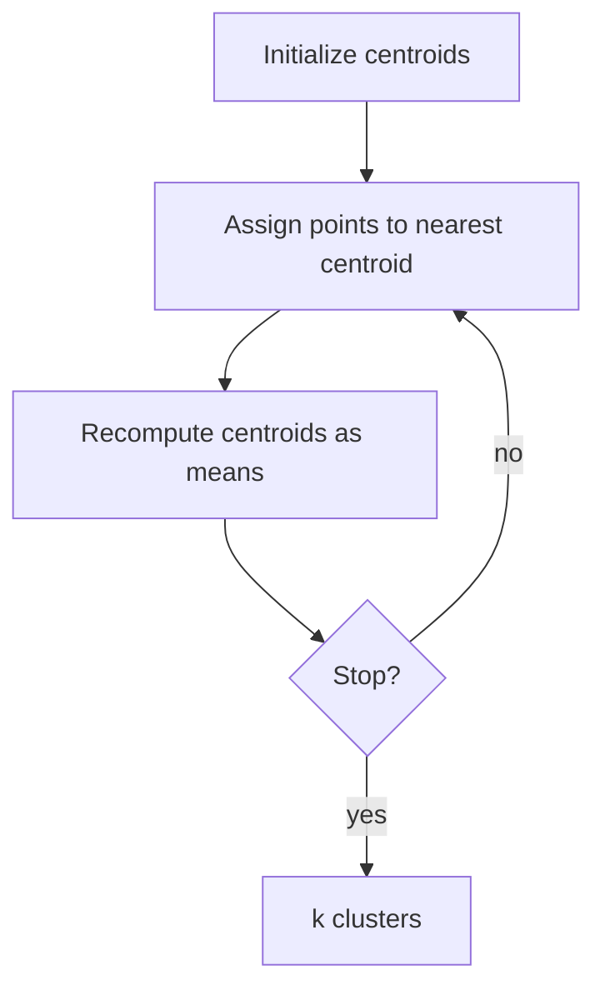

# k-Means Clustering Algorithm

## 1. Problem setting

**Input:** \(n\) unlabeled points in \(\mathbb{R}^d\), integer **k** (number of clusters).

**Output:** partition of points into **k** disjoint clusters \(C_1,\ldots,C_k\).

**Type:** **Flat**, **hard**, **distance-based**, **center-based**, **sequential** iteration.

**Assumption:** clusters are often **roughly spherical / compact** around centroids (method minimizes within-cluster dispersion, not arbitrary shapes).

---

## 2. Centroids (“means”)

Each cluster \(j\) has **centroid** \(\boldsymbol{\mu}_j\): mean of points assigned to cluster \(j\).

---

## 3. Four-step loop

1. **Initialize** \(k\) centroids (random points, random data points, or k-means++).
2. **Assignment:** assign each point to **nearest** centroid (Euclidean distance usual).
3. **Update:** recompute each centroid as **mean** of its assigned points.
4. **Repeat** 2–3 until **stopping** condition.

---

## 4. Stopping criteria

- **No change** in cluster **membership** between iterations.
- **Centroid movement** below a small threshold.
- **Maximum iterations** reached (safety cap).

---

## 5. Toy behavior

With **k = 2**, centroids **migrate** toward cluster means; boundaries are **Voronoi-like** between centroids for the assignment step.

---

## Common Pitfalls / Exam Traps

- **k** must be **specified**—wrong **k** yields meaningless partitions without error.
- **Random init** \(\Rightarrow\) different runs \(\Rightarrow\) different local minima.
- **Empty clusters** possible if no point is closest to a centroid (handle in implementation).

---

## Quick Revision Summary

- **k-means:** partition \(n\) points into **k** groups minimizing **within-cluster SSE** (next note).
- Steps: **init → assign → update → loop**.
- Centroid = **mean** of assigned points.
- Stop: **stable** membership / centroids / max iter.
- Needs **k**; assumes **compact** clusters; sensitive to **initialization**.
