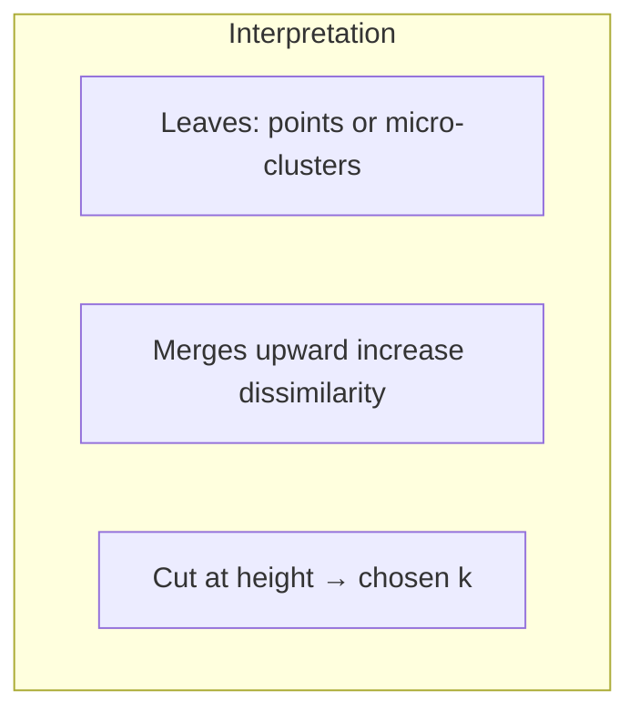

# Introduction to Hierarchical Clustering

## 1. Motivation: when fixed k is awkward

**k-means** requires **k** before running. In **low** dimensions you may guess **k** visually; in **high** dimensions you rely on **heuristics** (e.g. **elbow**: plot **total SSE** vs **k**; pick the “knee” where SSE reduction flattens) and **domain experts** who know how many segments are **actionable**.

**Hierarchical clustering** instead builds a **full nested hierarchy**; you choose **k** **after** the fact by **cutting** the tree at a chosen **height**—aligned with questions like “continent vs country vs district” granularity.

---

## 2. Nested clusters

A point may belong to a **fine** cluster (district) and simultaneously to **coarser** ancestors (state, country) in a **tree** of merges or splits.

---

## 3. Dendrogram

A **dendrogram** is a tree diagram recording **merge** (agglomerative) or **split** (divisive) **order** and often **height** = dissimilarity at which events occur.

- **X-axis:** leaves are typically **objects** (or clusters at a fine level).
- **Y-axis:** **distance**, **SSE**, or **dissimilarity** when clusters merge.

**Cutting** horizontally at height \(h\) yields a partition into some number of clusters—**k** is **implicit**, not an upfront input.

---

## 4. Two construction strategies (preview)

| Direction | Starts | Moves toward |
|-----------|--------|--------------|
| **Agglomerative** | Each point a cluster | **Merge** until one cluster |
| **Divisive** | One cluster with all points | **Split** until singletons |

---

## 5. Strengths and costs

**Strengths:** no **a priori** **k**; rich structure for exploration; matches **taxonomic** domains.

**Costs:** naive agglomerative methods can be **slow** (\(O(n^3)\) worst-case style); memory for full pairwise proximity is **\(O(n^2)\)**.

---

## Common Pitfalls / Exam Traps

- **Elbow** for k-means does **not** guarantee optimal **k**—subjective knee.
- **Dendrogram cut** still requires **judgment**—which height matches the **question**?
- Confusing **hierarchical** with **soft** clustering—hierarchy is about **nested** structure, not necessarily fuzzy membership.

---

## Quick Revision Summary

- **k-means** needs **k**; use **elbow**, metrics, **experts** when visualization fails.
- **Hierarchical** builds a **tree**; **k** chosen by **cut** height.
- **Dendrogram** records merges/splits and **dissimilarity** levels.
- **Agglomerative** = bottom-up merge; **divisive** = top-down split.
- **Trade-off:** interpretable hierarchy vs **compute/memory** cost at large **n**.
