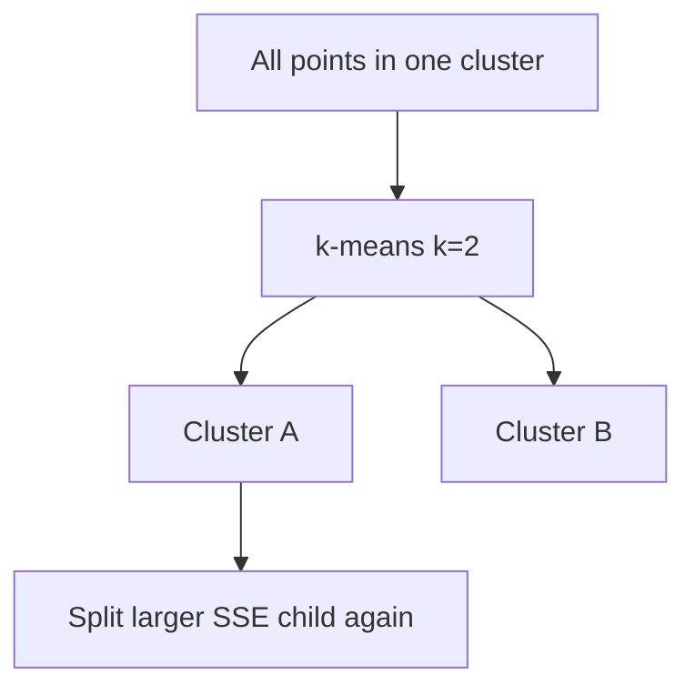

# Divisive and Agglomerative Clustering (Focus: Divisive / Bisecting k-Means)

## 0. Two hierarchical directions

| Direction | Start | Moves |
|-----------|-------|-------|
| **Agglomerative** | \(n\) singleton clusters | Repeatedly **merge** closest pair \(\rightarrow\) one root |
| **Divisive** | One cluster with all points | Repeatedly **split** a cluster \(\rightarrow\) leaves are singletons |

This note emphasizes **divisive** construction via **bisecting k-means**. **Agglomerative** merges and **linkage** are covered in the companion note on agglomerative clustering.

---

## 1. Top-down hierarchy

**Divisive** clustering begins with **one** cluster containing **all** points and **recursively splits** clusters until stopping (often singleton leaves).

**Contrast:** **agglomerative** merges from singletons upward.

---

## 2. Bisecting k-means (common divisive algorithm)

**Idea:** repeatedly run **k-means with k = 2** on **one** chosen cluster to split it into two children.

**Typical split policy:** split the cluster with **largest SSE** (most internal variance).

**Stopping:** user depth, minimum cluster size, or when each leaf is a **single** point (theoretical end).

---

## 3. Strengths

- Produces a **full tree**; cut anywhere for a partition.
- Uses fast **k-means** as engine—conceptually simple.

---

## 4. Weaknesses

- **Greedy:** once a split separates points, **no merge** step fixes a mistake \(\Rightarrow\) **local** optima.
- **Computational cost:** many **k-means** runs on subsets—roughly **O** (iterations \(\times\) cost of 2-means per split \(\times\) tree depth).
- Example failure mode: a **natural** cluster split early can **never** be reunited—two halves of one true cluster may sit in different branches.

---

## Common Pitfalls / Exam Traps

- Equating **bisecting k-means** with **standard k-means**—bisecting builds a **tree**, standard k-means returns **one** flat partition.
- Ignoring **greedy** risk—always validate cuts with domain or internal indices.

---

## Quick Revision Summary

- **Divisive:** split top-down.
- **Bisecting k-means:** repeated **2-means** on chosen cluster (often **highest SSE**).
- **Strength:** hierarchical output without upfront **k**.
- **Weakness:** **greedy**, no merge-back; **local** optima.
- **Cost:** many nested **k-means** fits.
