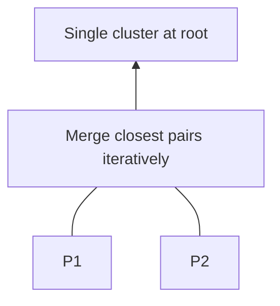

# Agglomerative Hierarchical Clustering

## 1. Bottom-up procedure

1. Start: **each** point is its own cluster.
2. Compute **pairwise** dissimilarities \(\Rightarrow\) **proximity matrix**.
3. **Merge** the **two closest** clusters.
4. **Update** distances between the new cluster and all others (per **linkage** rule).
5. Repeat until **one** cluster remains.

**Output:** merge history \(\Rightarrow\) **dendrogram**.

---

## 2. Proximity matrix

Symmetric matrix of pairwise distances \(d_{ij}\). After each merge, **rows/columns** collapse and **new** inter-cluster distances are computed from **linkage**.

---

## 3. Linkage = inter-cluster distance

Given clusters **A** and **B**, linkage defines \(D(A,B)\):

| Linkage | Definition | Tendency |
|---------|------------|----------|
| **Single** (min) | \(\min_{a\in A, b\in B} d(a,b)\) | Can follow **chains**; sensitive to **noise** |
| **Complete** (max) | \(\max_{a\in A, b\in B} d(a,b)\) | **Compact**, globular clusters; less chain |
| **Average (UPGMA)** | Mean of all cross-pair distances | Compromise |
| **Centroid** | Distance between **centroids** | Can invert order (watch implementations) |
| **Ward** | Increase in **total within-cluster SSE** if merged | Prefers **compact**, equal-variance merges |

**Merge rule:** always merge the **pair** of **current** clusters with **smallest** linkage distance (algorithm-specific tie-breaking).

---

## 4. Properties

- **Single linkage:** prone to **chaining** along bridges of noise points.
- **Complete linkage:** more **compact** clusters; less chaining.
- **Ward:** similar spirit to **k-means** objective (minimize within-cluster variance).

---

## 5. Complexity

- Initial matrix: **O(n²)** time and space.
- Naive repeated **linear scan** for minima: rough **O(n³)** total; optimized structures can reach **O(n² log n)** in some settings.

---

## Common Pitfalls / Exam Traps

- **Centroid** / **median** linkage can cause **inversions** in dendrogram height—implementation details matter.
- Confusing **definition** of linkage with **which** pair merges first—merges are always **smallest current** \(D(A,B)\) under that linkage.
- Using hierarchical clustering for **n** in the **millions** without approximation—**infeasible** with full matrix.

---

## Quick Revision Summary

- **Agglomerative:** merge closest clusters until one root.
- **Proximity matrix** updated after each merge.
- **Linkage** defines cluster-to-cluster distance: **single**, **complete**, **average**, **Ward**, …
- **Single** \(\Rightarrow\) chains; **complete/Ward** \(\Rightarrow\) tighter blobs.
- **Cost:** **O(n²)** memory; **O(n³)** naive time class—**large n** problematic.
