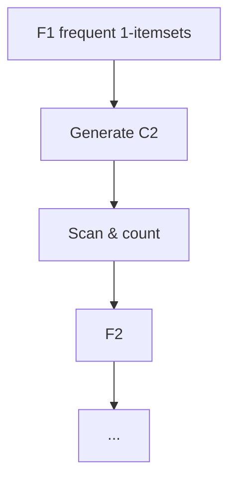

# The Apriori Algorithm

## 1. Idea

**Level-wise** generation of candidate **k**-itemsets from **frequent (k−1)**-itemsets, **pruning** using the **Apriori property**: if any subset of a candidate is infrequent, the candidate cannot be frequent.

**Notation (common):** \(C_k\) = **candidate** k-itemsets; \(F_k\) = **frequent** k-itemsets (post support test).

---

## 2. Core loop

1. **k = 1:** scan DB; count support of each item; \(F_1\) = items with **minSupp**.
2. **Generate** \(C_{k+1}\) from \(F_k\) (join + prune steps per implementation).
3. **Scan** DB to count support of \(C_{k+1}\); \(F_{k+1}\) = survivors.
4. Repeat until \(F_k\) is **empty** or no candidates.

---

## 3. Rule generation (after frequent itemsets)

For frequent itemset **Z**, consider rules splitting **Z** into **X** and **Y**. Compute **confidence** \(\text{supp}(Z)/\text{supp}(X)\); keep if \(\geq \text{minConf}\).

**Pruning:** confidence of rules obeys **anti-monotone** structure on consequents—low-confidence rules can **prune** extensions (advanced; same spirit as itemsets).

---

## 4. Worked micro-example (from structure)

Transactions:
T1: {a,c}, T2: {b,c}, T3: {a,d}, T4: {b,e,f} — **minSupp = 2** (count).

- Items: a:3, b:2, c:2, d:1, e:1, f:1 \(\Rightarrow\) \(F_1=\{a,b,c\}\).
- Pairs from \(F_1\): {a,b}:1, {a,c}:2, {b,c}:1 \(\Rightarrow\) \(F_2=\{a,c\}\) only.
- No size-3 frequent itemset.
- Rules from {a,c}:
  - \(a \Rightarrow c\): conf = 2/3
  - \(c \Rightarrow a\): conf = 2/2 = 1

If **minConf = 0.75**, both pass; **c \(\Rightarrow\) a** is stronger.

---

## 5. Bottlenecks and FP-growth (pointer)

- **Repeated DB scans** per level—expensive for **massive** data.
- **FP-growth** (prefix-tree) reduces scans—often preferred in practice.

---

## Common Pitfalls / Exam Traps

- Generating **candidates** without **joinability / pruning** rules—explodes combinatorially.
- Using **support** of **Y** alone in confidence—denominator is **antecedent X**.
- Ignoring that Apriori still **scans** data **multiple** times.

---

## Quick Revision Summary

- **Apriori:** iterate **k** = 1,2,…; **candidates** from \(F_{k-1}\); **count** support; **prune** by Apriori.
- **Apriori property** eliminates supersets of infrequent sets.
- **Rules** from frequent itemsets via **confidence** threshold.
- **Cost:** multiple passes; **FP-growth** mitigates in practice.
- **minSupp** and **minConf** are user **trade-offs** (recall vs noise).
