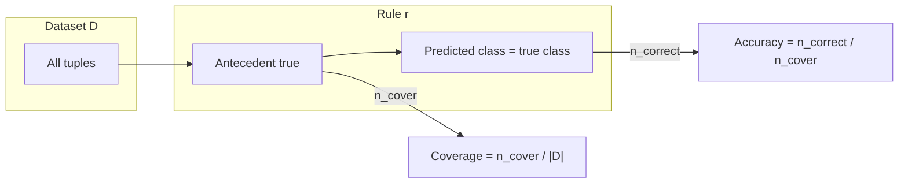

# Introduction to Rule-Based Classification

## 1. Classification in machine learning (first principles)

**What classification is.** In supervised learning, **classification** means learning a mapping from inputs (feature vectors) to a **finite set of discrete labels** called **classes**. The learner sees training examples where both inputs and the correct class are known; at deployment time, only inputs are given and the model must output a predicted class.

**Why discrete labels matter.** Many operational decisions are categorical: allow vs deny, benign vs malicious, approve vs reject. The model’s job is not to output a real number (that would be regression) but to **partition** the input space into regions, each associated with one class.

**Tabular formulation.** A common representation is a table: columns are **attributes** (features); one column is the **class label**. Each **row** (also called a **tuple** or **instance**) is one observation. A **test tuple** is a row where features are known but the label must be predicted.

**Examples (cloud / ML / systems).**

- **Email filtering:** features might include sender reputation, header patterns, and text statistics; labels are *spam* vs *not spam*. A cloud mail gateway applies the classifier to millions of messages per day.
- **Customer churn:** features might include usage, tenure, and support tickets; labels are *churn* vs *stay*. A SaaS platform uses predictions to target retention campaigns.
- **API abuse detection:** features might include request rate, error codes, and geo; labels are *normal* vs *abusive*. Edge proxies score traffic in real time.

Any classifier $F$ implements: given feature vector $\mathbf{x}$, output $\hat{y} = F(\mathbf{x})$ where $\hat{y}$ is one of the allowed class labels.

---

## 2. Rule-based classifiers: idea and motivation

**Definition.** A **rule-based classifier** is a model expressed as a **collection of rules**. Each rule has the form: $\text{IF } \text{(condition)} \text{ THEN } \text{(predicted class)}$

Equivalently: **IF antecedent THEN consequent**, or **condition $\Rightarrow$** **conclusion**.

**Why use rules at all.** Deep models and large ensembles can be accurate but opaque. Rule sets trade some flexibility for **transparency**: stakeholders can read conditions, audit them for bias or policy compliance, and embed domain constraints explicitly. In regulated or safety-sensitive settings, “why did we flag this transaction?” often requires **human-auditable logic**, which rules provide naturally.

**Relationship to other models.** The same prediction problem can be solved by decision trees, logistic regression, neural networks, etc. A rule-based classifier is simply another way to represent $F(\mathbf{x})$—one that prioritizes **interpretability** and often **fast evaluation** when rules are short and ordered.

---

## 3. Anatomy of a single rule

### 3.1 Left-hand side (LHS) and right-hand side (RHS)

Every rule splits into two parts:

| Part | Common names | Typical content |
|------|----------------|-----------------|
| **LHS** | Antecedent, precondition, “IF” part | One or more conditions on attributes |
| **RHS** | Consequent, conclusion, “THEN” part | A **single class label** to predict when the LHS is true |

**Triggering.** For a given tuple, if the LHS **evaluates to true**, the rule is said to **fire** or **trigger**. If the LHS is false, the rule does not apply to that tuple for prediction via that rule.

**Notation.** You may see `condition → class` or `IF … THEN …`. All denote the same structure.

### 3.2 Building blocks of the antecedent

- **Attributes** are named inputs (e.g. `age`, `student`).
- **Attribute values** are the allowed values for categorical attributes (e.g. `youth`, `middle_aged`, `senior`), or predicates for numeric attributes (e.g. `income < 50k`).
- **Compound antecedents** join several tests with logical **AND** (in the basic setting discussed here): e.g. `age = youth AND student = yes`.

**Simple vs complex rules (terminology in this module).**

- A **simple** rule (in the narrow sense used here) tests **one** attribute in the antecedent.
- A **complex** rule combines **multiple** attribute tests (typically with AND).

Example (illustrative):

- Simple: `IF age = youth THEN buys_computer = yes`
- Complex: `IF age = youth AND student = yes THEN buys_computer = yes`

### 3.3 Consequent

The consequent almost always names **one class label** from the problem’s label set. In **binary** classification, that might be `{yes, no}`; in multi-class problems, `{c₁, c₂, …, cₖ}`.

---

## 4. Coverage and accuracy of a rule

A full rule set can contain many rules. To compare or prune rules, we need **local** quality measures for **one rule $r$** on a dataset $D$ of size $|D|$ tuples.

### 4.1 Coverage

**Intuition.** Coverage answers: “**How often does this rule even apply?**” A rule with a very specific antecedent may rarely fire; a very general antecedent may fire often.

**Definition.** Let **n_cover** be the number of tuples in $D$ for which the **antecedent** of $r$ is true (the rule is triggered). Then: $\text{Coverage}(r) = \frac{\text{n\_cover}}{|D|}$

Coverage is a fraction in $[0, 1]$; often reported as a percentage.

**Why it matters.** High coverage means the rule is **broad**—it speaks to a large slice of the population. That can be good (wide applicability) or bad (if accuracy is poor, you are often wrong at scale).

### 4.2 Accuracy (of a rule, conditional on firing)

**Intuition.** Accuracy answers: “**When this rule fires, how often is its prediction correct?**” It is **not** the same as overall model accuracy unless the rule is the only rule.

**Definition.** Among tuples where the antecedent is true, compare the **consequent’s class** to the **true class** in $D$. Let **n_correct** be the count of tuples where they match. Then: $\text{Accuracy}(r) = \frac{\text{n\_correct}}{\text{n\_cover}} \quad (\text{defined only if n\_cover} > 0)$

Equivalently: among covered tuples, fraction where **predicted class = actual class**.

**Why it matters.** A rule can have high coverage but low accuracy (fires often but mislabels many covered points). Another rule might have low coverage but high accuracy (niche but trustworthy when it fires).

### 4.3 Coverage vs accuracy: comparison

| Measure | Numerator | Denominator | Question answered |
|---------|-----------|-------------|-------------------|
| **Coverage** | Tuples with LHS true | All tuples $|D|$ | How **broad** is the antecedent? |
| **Accuracy** | Covered tuples correctly classified | Tuples with LHS true | How **reliable** is the consequent when the rule applies? |

---

## 5. Worked example (conceptual structure)

Consider a small training set with attributes such as **age**, **income**, **student**, **credit_rating**, and label **buys_computer** $\in \{\text{yes}, \text{no}\}$. Take the rule:

**r:** `IF age = youth THEN buys_computer = yes`

**Step 1 — Count n_cover.** Scan all training rows; count rows where `age = youth`. Suppose there are 5 such rows out of 14 total.

- Coverage $= 5/14 \approx 35.7\%$.

**Step 2 — Count n_correct.** Among those 5 rows only, count how many have true label `buys_computer = yes`. Suppose 2 do.

- Accuracy $= 2/5 = 40\%$.

**Interpretation.** The antecedent applies to roughly one-third of the data, but when it fires, the consequent matches the true label only 40% of the time—so this rule is **not** a strong standalone predictor for `yes` unless the data or rule is revised.

---

## 6. How rule sets behave (preview)

This note defines **single-rule** metrics. Full **rule-based systems** must also specify:

- **Order** or **priority** when multiple rules could fire;
- **Default** behavior when no rule fires;
- **Conflict resolution** when simplified or overlapping rules disagree.

Those topics are developed in the notes on indirect and direct rule generation.

---

## Common Pitfalls / Exam Traps

- **Confusing coverage with accuracy.** Coverage uses $|D|$ in the denominator; accuracy uses **n_cover**. Missing this is a classic exam mistake.
- **Accuracy of a rule vs accuracy of the whole classifier.** Rule accuracy is **conditional** on the antecedent being true; global accuracy averages over the entire model and data distribution.
- **Zero coverage.** If n_cover $= 0$, accuracy is undefined; coverage is 0. Do not divide by zero.
- **Consequent ignored in coverage.** Coverage depends only on whether the **LHS** holds, not whether the prediction would be right.
- **“Simple” vs “complex” rules.** In this module, complexity refers to **how many attribute tests** are in the antecedent, not philosophical simplicity of the domain.

---

## Quick Revision Summary

- **Classification:** predict a **discrete class label** from features; labels are finite and categorical.
- **Rule-based classifier:** a collection of **IF–THEN** rules mapping conditions (antecedent) to a predicted class (consequent).
- **Antecedent (LHS):** attribute tests, often combined with **AND**; when true, the rule **triggers**.
- **Consequent (RHS):** typically the **predicted class label**.
- **Coverage** $=$ n_cover $/$ $|D|$: fraction of **all** tuples for which the antecedent is true.
- **Accuracy** $=$ n_correct $/$ n_cover: fraction of **covered** tuples where consequent matches the **true** label.
- **High coverage, low accuracy:** broad rule that is often wrong when it fires; **low coverage, high accuracy:** narrow but sharp rule.
- Rule quality is assessed **per rule** using these two metrics before discussing full rule lists, ordering, and defaults.
