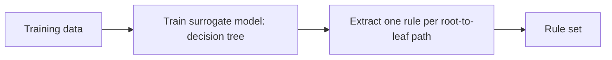
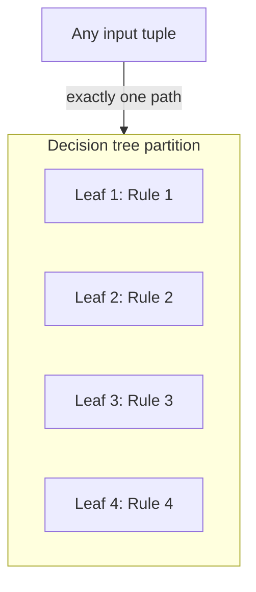
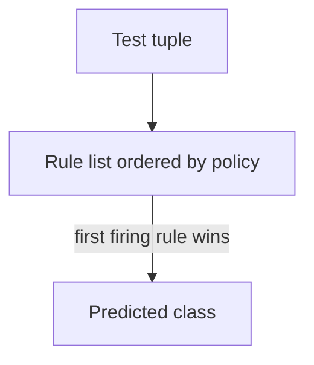
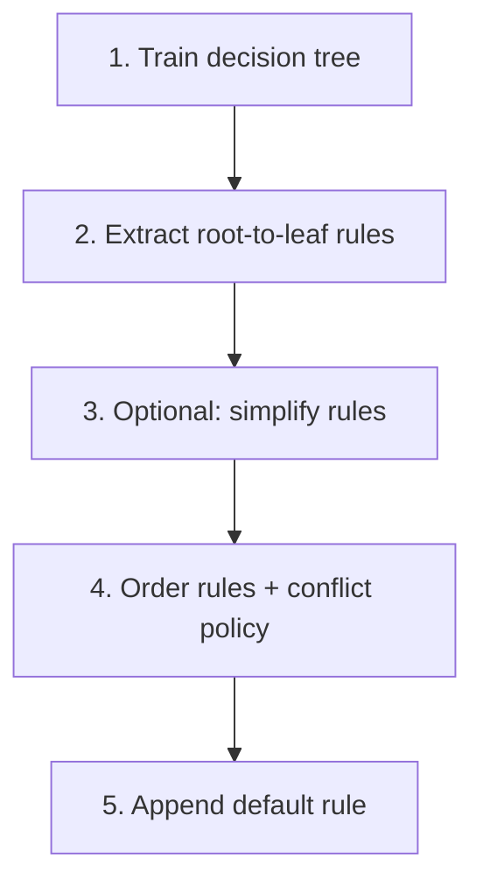

# Rule Generation: Indirect Method

## 1. The rule-generation problem

A **rule-based classifier** is a set of rules \(R = \{r_1, r_2, \ldots\}\), each of the form **IF antecedent THEN class**. The design question is: **where do the rules come from?** Two families of approaches exist:

| Approach | Idea | Typical algorithms (names you may see) |
|----------|------|----------------------------------------|
| **Indirect** | Fit a **surrogate** classifier on the data, then **read off** or **translate** rules from that model | Rules from a **decision tree** (this note); variants may use other surrogates |
| **Direct** | **Mine** rules straight from the data without first building a full surrogate structure | Sequential covering, **RIPPER**, **CN2** (covered in the direct-method note) |

**Why indirect methods exist.** Hand-writing rules for large, high-dimensional data is error-prone. A decision tree algorithm **automatically** finds splits that reduce impurity; translating those splits into rules yields a structured, repeatable pipeline from data to interpretable logic.

---

## 2. Indirect generation via a decision tree

### 2.1 Pipeline

**Steps.**

1. **Train** a decision tree on the labeled dataset using any standard algorithm (e.g. ID3, C4.5-style heuristics, CART—implementation-dependent).
2. **Extract** rules by walking the tree: **each path from root to leaf** becomes **one** rule.
3. **Antecedent:** conjoin the tests on internal nodes along the path (with AND).
4. **Consequent:** the **class label** stored at the **leaf**.

**Example (illustrative).** If the root splits on `age`, a child splits on `student`, and the leaf predicts `buys_computer = no`, one rule might be:

`IF age = youth AND student = no THEN buys_computer = no`

Another path might yield:

`IF age = youth AND student = yes THEN buys_computer = yes`

Further branches for `middle_aged`, `senior`, etc., produce additional rules.

### 2.2 How many rules?

**Rule count equals leaf count.** Each leaf corresponds to exactly one complete conjunction of tests from root to that leaf, so:

\[
|\text{rules extracted}| = |\text{leaves in the tree}|
\]

(Unless paths are merged later—a simplification topic below.)

### 2.3 Information preservation

If you extract rules **without** merging or dropping conditions, the rule set is **logically equivalent** to the tree along any path: **no information is lost** relative to that tree’s partition of the feature space. The tree and the full path rules describe the **same** decision boundaries (for the same feature discretization and split points).

---

## 3. Properties inherited from the tree: mutual exclusion and exhaustiveness

When rules are taken as **exactly one rule per leaf**, with **full** paths from root (no simplification yet), two structural properties hold on the **training space** as partitioned by the tree:

### 3.1 Mutual exclusion

**Meaning:** For any **single** tuple (fixed feature values), **at most one** rule’s antecedent is true—because in a tree, each instance follows **exactly one** path to **one** leaf.

- Equivalently: **no two** extracted full-path rules can fire on the **same** tuple.

So the rules **do not overlap** in coverage **at the tuple level** (for deterministic trees and crisp tests).

### 3.2 Exhaustiveness (within the domain of the tree)

**Meaning:** Every tuple that reaches a leaf is **covered** by **exactly** one rule—the rule for that leaf. So, over the support where the tree is defined, **every** tuple falls under some leaf (assuming no missing-branch issues).

Together: **each tuple is classified by exactly one rule**—clean semantics, no ambiguity.

---

## 4. Why simplify rules?

**Problem.** Full root-to-leaf rules can be **long**: many ANDed conditions. In production:

- **Intrusion detection / NIDS:** each packet may be checked against thousands of rules; long antecedents mean more comparisons per rule per packet.
- **API gateways / policy engines:** latency budgets are tight; shorter predicates reduce worst-case cost.
- **Edge ML / on-device:** branching depth matters for CPU and power.

**Rule simplification** means: **remove redundant or weakly necessary conditions** so that the antecedent is **shorter** while (ideally) preserving predictive behavior on relevant data.

**Example pattern.** A full path might be:

`IF refund = no AND marital_status = married THEN risk = low`

If, in the data, `marital_status = married` alone already implies the same prediction whenever the subtree would have fired, you might **drop** `refund = no` and use:

`IF marital_status = married THEN risk = low`

That cuts **one** test per evaluation—meaningful at scale.

**Important nuance.** Simplification often starts from a **non-root** internal node and walks to a leaf (not always from the global root). That **breaks** the one-to-one alignment with the original full tree paths.

---

## 5. What breaks after simplification?

### 5.1 Loss of mutual exclusion

**Symptom:** One tuple can satisfy **multiple** simplified rules’ antecedents.

**Toy example.**

- Rule A: `IF temperature > 80 THEN class = yes`
- Rule B: `IF wind = strong THEN class = no`

A tuple with `temperature = 85` and `wind = strong` may **trigger both**. If consequents differ, the model must **choose**—the simplified set is **ambiguous**.

### 5.2 Loss of exhaustiveness

**Symptom:** No rule’s antecedent is true for some tuple (a **coverage gap**).

Then the classifier must still output something: typically a **default rule** (see below).

---

## 6. Conflict resolution strategies

When **multiple** rules fire and disagree, you need a **policy**. Two broad families:

### 6.1 Size ordering

**Idea:** Sort rules by **complexity** of the antecedent—often **number of conditions** (or “difficulty” of matching). **Stricter** (more specific, larger antecedent) rules are tried **first**.

**Procedure:** Evaluate rules in order; use the **first** rule that fires; stop.

**Intuition:** More specific rules encode **exceptions**; they should override **broad** defaults.

### 6.2 Rule ordering (by quality or domain criteria)

**Idea:** Order rules by **estimated strength** or **business priority**, not only length:

- **Rule-based ordering:** Rank individual rules by metrics such as **accuracy**, **coverage**, or antecedent size; domain experts may override order (e.g. compliance rules first).
- **Class-based ordering:** Group rules by **predicted class**, then order **groups**. Which class group comes first is **problem-dependent**:
  - **Intrusion detection:** prefer ordering that prioritizes **malicious**-predicting rules if missing an attack is costlier than extra alerts.
  - **Medical screening:** prioritize rules associated with **high-risk** classes over low-risk when breaking ties.

**Exam-relevant distinction:** **Size ordering** is about **antecedent complexity**; **rule ordering** is broader and may use **accuracy**, **coverage**, **expert priority**, or **class-centric** grouping.

---

## 7. Default rule (handling non-exhaustiveness)

When **no** antecedent matches, define:

**Default rule:** e.g. `IF true THEN class = c_default`

Properties:

- Placed **last** in an ordered list (after all specific rules).
- **Always fires** if reached—so it must be the **fallback**.

**Choosing \(c_{\text{default}}\):** common choices:

- **Majority class** in remaining training data (baseline);
- **High-recall** class for the rare but critical positive (fraud, malware) when false negatives are unacceptable;
- **Abstain** or **escalate** in systems that support it (not always available in basic rule engines).

---

## 8. End-to-end picture: indirect method + engineering layers

**Summary.** Indirect extraction from a tree gives **clean** mutual exclusion and exhaustiveness **before** simplification. Real deployments often **simplify** and then **reintroduce** structure via **ordering**, **conflict resolution**, and a **default** rule.

---

## Common Pitfalls / Exam Traps

- **“Indirect” vs “direct.”** Indirect **always** builds an intermediate model (here, a tree) before rules; direct methods **grow** rules from data without that step.
- **Confusing leaf count with rule count** after **merging** or **pruning** paths—only the **full** one-rule-per-leaf extraction matches leaf count exactly.
- **Assuming** simplified rules remain **mutually exclusive** or **exhaustive**—they generally **do not**.
- **Forgetting the default rule** when gaps appear after simplification or aggressive pruning.
- **Size vs quality ordering:** size ordering is **not** the same as ordering by **accuracy**; know which policy the question assumes.

---

## Quick Revision Summary

- **Indirect rule generation:** train a **surrogate** model (typically a **decision tree**), then **one rule per root-to-leaf path** (antecedent = AND of splits; consequent = leaf class).
- **Number of rules (full extraction)** equals **number of leaves** (before merging).
- **Mutual exclusion:** with full paths, **one** rule fires per tuple; **exhaustiveness:** every tuple reaches **some** leaf (under standard tree assumptions).
- **Rule simplification** shortens antecedents for **speed** and **maintainability** but can break mutual exclusion and exhaustiveness.
- **Conflicts** (multiple firings, disagreeing consequents) need **ordering**: **size** (specificity first) or **rule/class-based** priority (accuracy, domain, recall-sensitive class).
- **Default rule** handles tuples **no** rule matches; placed **last**; often majority class or risk-sensitive class choice.
- **Use cases:** anywhere long boolean checks run at scale—**network security**, **policy engines**, **real-time scoring**—benefit from shorter ordered rules plus a default.
