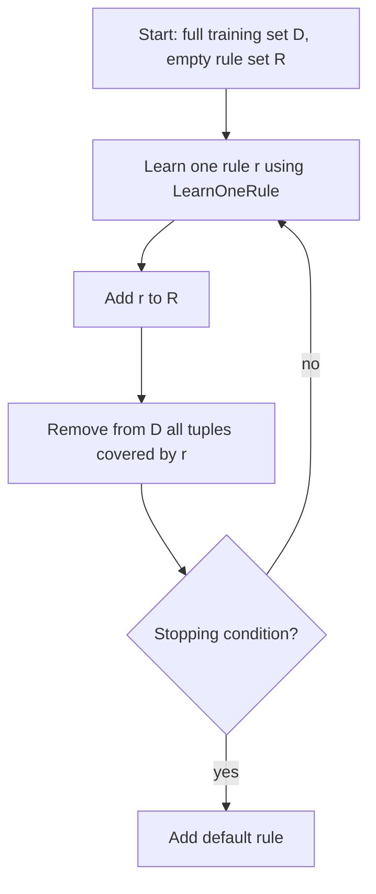
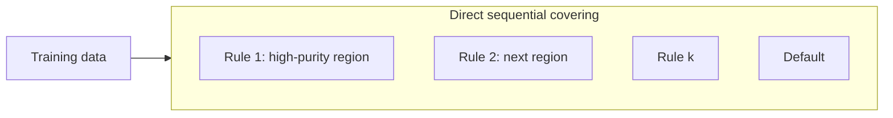

# Advanced Rule-Based Systems: Direct Rule Mining

## 1. Direct methods: definition and contrast

**Direct rule generation** means **learning rules straight from the dataset** without first materializing a full surrogate structure such as a decision tree. The algorithm **searches** the space of possible antecedents (conjunctions of tests on attributes) and builds a rule set guided by **coverage** of training examples and **quality** constraints.

| Aspect | Indirect (e.g. tree extraction) | Direct (e.g. sequential covering) |
|--------|----------------------------------|-----------------------------------|
| **Starting point** | Fit tree → read rules | Grow rules from data |
| **Primary artifact** | Tree paths become initial rules | Rule list built iteratively |
| **Typical algorithms** | Path extraction from DT | **Sequential covering**, **RIPPER**, **CN2** |

**When direct methods help.** They can produce **compact** rule sets that **generalize** well when combined with pruning and stopping criteria, and they are a natural fit when the goal is **explicit** control over how rules are added (e.g. one positive class at a time in binary settings).

---

## 2. Sequential covering algorithm

### 2.1 Name decomposition

- **Sequential:** rules are learned **one after another**, not all at once in a single global optimization.
- **Covering:** once a rule is accepted, training tuples it **covers** are **removed** (or de-weighted) so the next rule focuses on **remaining** data.

### 2.2 Core loop (conceptual five-step pattern)

**Typical stopping conditions** (any combination, depending on algorithm variant):

- **No** or **too few** tuples left to describe;
- New rules fall below an **accuracy** or **support** threshold;
- **Maximum** number of rules reached;
- **Diminishing returns** on a quality measure (e.g. information gain no longer improves).

**Default rule.** After specialized rules, append a **default** prediction (often **majority class** among **remaining** examples, or a domain-chosen fallback). This mirrors the indirect-method note: uncovered cases still need a decision.

### 2.3 What “learn one rule” aims for

**LearnOneRule** seeks a single rule whose antecedent:

- **Covers many** tuples of a **target** class (often the **positive** class in binary problems);
- Covers **few** tuples of the **other** class(s)—i.e. moves toward a **pure** or **near-pure** region.

Geometric intuition (2D): imagine positive and negative points; the first rule might carve a rectangle (axis-aligned tests) that **mostly** contains positives; those points are stripped away; the next rule targets another positive cluster.

**Tabular intuition.** Start with a **broad** condition on one attribute (e.g. `A₃ = v`). That may cover **both** classes → **low** rule accuracy. **Refine** by adding conjuncts (`A₃ = v AND A₁ = u`, then add more) until the covered set is **mostly** one class or accuracy crosses a threshold.

---

## 3. Refining a rule: general-to-specific search

**Pattern.**

1. Begin with a **candidate** antecedent (one literal or a small template).
2. **Evaluate** quality on covered tuples.
3. **Add** literals (tighten the rule) while **quality improves**.
4. **Stop** when gains flatten or purity is sufficient.

This is analogous in spirit to **greedy** feature addition: each step asks, “Does adding this test **help** separate the target class from others?”

**Quality tracking: FOIL information gain.** Algorithms such as **FOIL** and **RIPPER** use **FOIL information gain** (a variant of the idea of **information gain** used in trees) to score whether a refinement **improves** the rule.

Let \(P\) be the count of **positive** class tuples and \(N\) the count of **negative** (or non-target) tuples **in the region** currently covered by the candidate rule’s antecedent.

A common formulation compares the **proportion of positives** among covered examples **before** vs **after** adding a literal:

\[
\text{FOILGain} \approx \underbrace{\frac{P_{\text{after}}}{P_{\text{after}} + N_{\text{after}}}}_{\text{purity after}} - \underbrace{\frac{P_{\text{before}}}{P_{\text{before}} + N_{\text{before}}}}_{\text{purity before}}
\]

**Interpretation.**

- **Positive FOILGain:** the new literal **increases** the fraction of positives in the covered set—the rule is **better** at isolating the target class.
- **Near-zero or negative gain:** adding that literal does not help; stop or try another refinement.

(Exact implementations add smoothing or minimum-support constraints; the **exam idea** is: **track purity improvement** as literals are added.)

---

## 4. Representative algorithms

| Algorithm | Role |
|-----------|------|
| **RIPPER** | Widely used **direct** learner; builds rules sequentially with pruning; related to FOIL-style refinement |
| **CN2** | Another **direct** covering approach; historically important for rule learning from data |

Both share the **high-level** pattern: **empty rule set → repeat (learn one strong rule → remove covered examples) → default rule**. Details differ in **pruning**, **class ordering**, and **stopping rules**.

---

## 5. Why rule-based classifiers matter in practice

**Interpretability.** For a prediction, you can point to the **firing rule** and say which **attribute tests** caused it—critical for **audit**, **compliance**, and **operator trust** in cloud and enterprise ML.

**Expressiveness.** A sufficient rule set can match the **decision boundaries** achievable by a tree of similar complexity; expressiveness is **not** inherently weaker—representation differs.

**Speed.** Short rules and ordered evaluation enable **low-latency** decisions—relevant to **firewalls**, **API rate limiting**, **load-shedding rules**, and **streaming** classifiers at the edge.

**Comparable accuracy.** With good algorithms and tuning, rule learners often reach **strong** accuracy on structured/tabular tasks, though **deep models** may win on raw high-dimensional signals (images, text embeddings) where manual rule engineering is hard.

**Ubiquitous non-ML analogy.** Operating systems and networks already use **rule-like policies** (“allow SSH only from this subnet”). Rule-based ML **learns** such predicates from **data** rather than only hand-coding them.

---

## 6. Interaction with earlier concepts

- **Coverage and accuracy** (per rule, on training or validation data) remain the right **local** diagnostics when judging each learned rule.
- **Ordering and defaults** from the indirect-method note still apply if **multiple** rules can fire or **gaps** exist—direct methods often produce **ordered** lists plus a **default** explicitly.

---

## Common Pitfalls / Exam Traps

- **Sequential covering vs one-shot:** the algorithm is **not** “find all rules simultaneously”; it is **iterative** with **removal** of covered tuples.
- **FOIL gain vs tree information gain:** related **spirit** (measure improvement toward purity), but **applied** in **rule refinement**, not split selection at a node—don’t copy tree formulas blindly.
- **Ignoring the default rule** in written answers—sequential covering almost always ends with a **catch-all**.
- **Overfitting long rules:** tightening until 100% training purity can **hurt** generalization; real algorithms use **pruning** or **minimum support**.
- **Class imbalance:** “cover positives only” heuristics can fail if negatives dominate; **cost-sensitive** or **reweighted** variants may be needed (conceptual extension).

---

## Quick Revision Summary

- **Direct methods** learn rules **from the data** without first building a decision tree; **sequential covering** is the canonical pattern.
- **Sequential:** add **one rule at a time**; **covering:** **delete** tuples matched by the new rule from the training set for the next iteration.
- **LearnOneRule** grows antecedents **general → specific**, adding literals while **quality** (e.g. **FOIL information gain** on positive fraction) improves.
- **Stopping** when rules are weak, data exhausted, or limits hit; then add a **default rule**.
- **RIPPER** and **CN2** are classic **direct** algorithms sharing this skeleton with implementation-specific details.
- **Strengths:** **interpretability**, **fast inference** with short rules, **strong** tabular performance when tuned; **policies** in security and cloud map naturally to **rule evaluation**.
