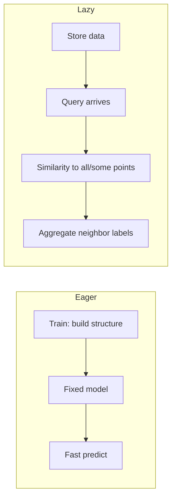

# Introduction to Lazy Learning and k-Nearest Neighbors (kNN)

## 1. Two paradigms: eager vs lazy learning

**Supervised classification** maps feature vectors to discrete class labels. Algorithms differ in **when** they compress training data into a compact decision mechanism.

| Paradigm | Training phase | Prediction phase | Knowledge representation |
|----------|----------------|------------------|-------------------------|
| **Eager learning** | Fit an explicit model (tree, rules, weights) | Often fast: evaluate the fixed structure | Parameters or structure summarizing data |
| **Lazy learning** | Store training examples (light preprocessing only) | Heavy: compare query to stored points | The dataset itself |

**Why this distinction matters for systems design.** A fraud-scoring service may pretrain an eager model for **low-latency** scoring on every API call. A research notebook exploring a small labeled set might use a lazy method for **quick prototyping** without a training loop.

**Eager examples (typical).** Decision trees and rule sets **generalize** training data into a hypothesis; at inference time you traverse the structure. Neural networks and SVMs (in standard form) also learn parameters up front.

**Lazy core idea.** The “model” is the **stored instances**. Prediction time computes **similarity or distance** between the query and (often) **all** training points, then aggregates labels of the most similar cases.

---

## 2. Instance-based learning: rote vs kNN

**Rote learning (exact match).** For a test example, search the training table for a row that **exactly matches** all attribute values; copy its class.

- **Strength:** trivially consistent on memorized rows.
- **Failure mode:** if no row matches exactly, **no prediction**—useless when attributes are continuous or high-dimensional.

**k-nearest neighbors (kNN).** Do **not** require identity. Find the **k** training points **closest** to the query in a feature space; predict by **aggregating** their labels (e.g. majority vote for classification).

**Smooth similarity intuition.** “Birds of a feather”: nearby points in feature space tend to share labels **if** the problem is locally smooth. Example: two users with similar subscription and usage features may share churn outcome.

**What *k* means.** **k** is the number of neighbors used—not an index of a single point. **1-NN** uses one neighbor; **5-NN** uses five.

---

## 3. Geometric picture (2D)

Training points appear in the plane with class colors. A new point is classified by measuring distance to training points, taking the **k** smallest distances, and voting. No explicit boundary is stored in memory during “training”; the boundary is **implicit** in the data and the metric.

---

## 4. Operational trade-offs

| Aspect | Eager (e.g. tree) | Lazy (kNN) |
|--------|-------------------|------------|
| Training cost | Higher (structure search) | Near zero (store + optional index) |
| Memory | Often smaller than full data | Must retain training set (or summaries) |
| Query cost | Low after training | Grows with training size and dimension |

**Cloud / ML angle.** kNN in production often needs **approximate nearest neighbor** search (FAISS, Annoy, vector DBs) when $N$ is huge; raw linear scan is the textbook baseline, not always the deployment pattern.

---

## Common Pitfalls / Exam Traps

- **Calling kNN “model-free.”** It is **non-parametric** in the classical sense, but it still has a **hypothesis**: same-label locality in feature space.
- **Confusing lazy with “no hyperparameters.”** **k**, distance metric, and feature scaling are all critical.
- **Rote vs kNN:** rote needs **exact** match; kNN needs **metric** and **k**.
- **Assuming kNN works in raw space** without scaling when features have different units.

---

## Quick Revision Summary

- **Eager learning:** builds a compact model during training; prediction is usually fast.
- **Lazy learning:** stores data; moves work to prediction time.
- **kNN:** classify/regress by **k** nearest training points using a distance or similarity.
- **Rote:** exact match only; fails when no exact row exists.
- **Trade-off:** cheap train vs expensive query; full-data retention vs tree footprint.
- **Design implication:** large $N$ and high dimension push kNN toward indexing and approximate search.
