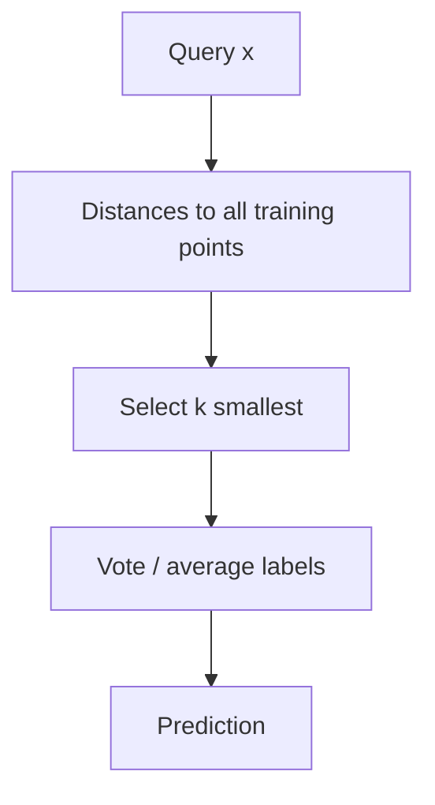

# k-Nearest Neighbors (kNN): Algorithm and Decision Geometry

## 1. Three-step prediction pipeline

For each new instance **x**:

1. **Store** (training): keep labeled examples \(\{(\mathbf{x}_i, y_i)\}\).
2. **Score neighbors:** compute **distance** \(d(\mathbf{x}, \mathbf{x}_i)\) or **similarity** to every training point (unless an index prunes the search).
3. **Decide:** among the **k** smallest distances, aggregate labels:
   - **Classification:** majority vote (optionally **weighted** by inverse distance).
   - **Regression:** average or weighted average of neighbor targets.

**Ties when k is even and two classes split 1–1.** Uniform voting is ambiguous; **distance-weighted** voting breaks ties by giving closer neighbors higher weight.

---

## 2. How k changes the decision surface

- **Small k (e.g. 1):** highly **flexible** boundary; can track fine structure.
- **Larger k:** smoother boundaries; more **voting** dilutes single noisy points.

**1-NN and Voronoi diagrams.** In 1-NN, each training point “owns” the region of space closer to it than to any other training point (**Voronoi cell**). The **Voronoi tessellation** partitions the space; the **classification boundary** lies on edges where adjacent cells have **different** class labels.

**Strength of 1-NN:** can realize **complex** nonlinear boundaries. **Weakness:** sensitive to **label noise** and isolated mislabeled points (**high variance**).

---

## 3. Weighted neighbors

Assign weight \(w_i\) to neighbor \(i\), often \(w_i \propto 1 / d(\mathbf{x}, \mathbf{x}_i)\) (with safeguards for \(d=0\)). **Uniform weights** treat all k neighbors equally; **distance weights** emphasize the nearest few.

| Setting | Effect |
|---------|--------|
| Uniform | Simple; ties possible when k is even |
| Distance-weighted | Resolves many ties; emphasizes local structure |

---

## 4. Asymptotic complexity (conceptual)

For **one** query, naive implementation:

- Distance to each of \(N\) points in \(d\) dimensions: **O(Nd)**.
- Selecting **k** smallest: **O(N)** with partial selection or **O(N log N)** if full sort.
- Often summarized as **O(Nd)** dominated term for large \(N\).

**Production note:** indexing (k-d trees, ball trees, hashing) or **approximate** NN search reduces amortized query cost for large \(N\).

---

## Common Pitfalls / Exam Traps

- **k vs N:** **k = N** makes every query vote over **all** data—typically predicts **global majority** class, not local structure.
- **Even k in binary classification:** can tie without weights.
- **1-NN Voronoi:** boundary is **piecewise linear** (Euclidean) between pairs of points—not “any” function, but very flexible in number of pieces.
- **Ignoring feature scale:** distances dominated by large-magnitude features (see week-6 note 3).

---

## Quick Revision Summary

- kNN: **distance → k nearest → vote / average**.
- **k** controls bias–variance: small **k** → flexible; large **k** → smoother.
- **1-NN:** Voronoi cells; label noise hurts.
- **Weighted** voting uses neighbor distances to break ties and sharpen decisions.
- Naive cost per query scales with **N** and **d**; indexing changes constants.
- Even **k** in two-class problems may need weighting or tie-break rules.
