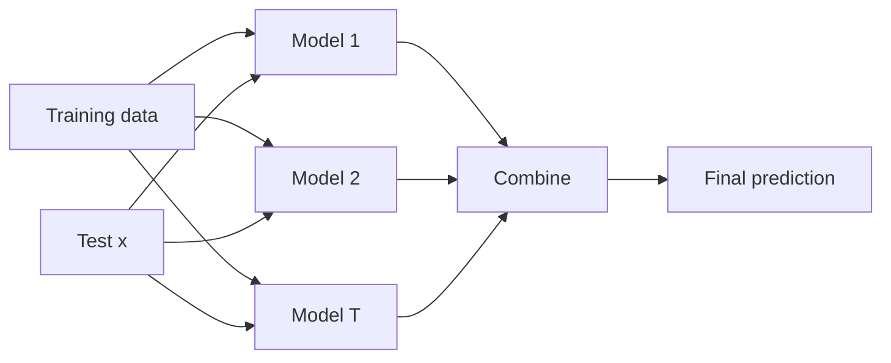

# Foundations of Ensemble Learning

## 1. Motivation: wisdom of crowds

**Ensemble learning** combines multiple trained models to produce a single prediction. The guiding analogy: several **independent** assessments (medical second opinions, committee votes) often **reduce** the risk of trusting one flawed expert.

**Formal goal:** given base learners \(C_1,\ldots,C_T\) trained from data, build a **combined** predictor \(C^*\) with improved **generalization** (lower error on unseen data) compared to a typical single model.

---

## 2. Three design questions

| Question | Examples |
|----------|----------|
| **Base learner type** | Same algorithm (all trees) vs heterogeneous (tree + kNN + SVM) |
| **Combination rule** | Majority vote (classification), **average** (regression), stacking |
| **Architecture** | **Parallel** (bagging: independent models) vs **sequential** (boosting: chained corrections) |

---

## 3. Why ensembles help (statistical view)

- **Variance reduction:** averaging or voting **smooths** idiosyncratic errors of individual models.
- **Complementary errors:** models that err on different instances can **correct** each other when aggregated.
- **Model selection relief:** instead of betting on one algorithm, ensembles can **blend** several.

---

## 4. Bias–variance recap (supervised learning)

For increasing **model complexity**:

- **Train error** decreases (more flexible fit).
- **Test error** often **U-shaped**: first drops (better fit), then rises (**overfitting**: fits noise).

| Region | Train & test error | Phenomenon |
|--------|-------------------|-------------|
| Low complexity | Both high | **Underfitting** (high **bias**) |
| Sweet spot | Test low | Balanced |
| High complexity | Train very low, test high | **Overfitting** (high **variance**) |

**Ensemble strategies (preview):** **Bagging** primarily **reduces variance** (stabilizes unstable high-variance base learners). **Boosting** focuses on **sequentially reducing bias** using **weak** learners.

---

## 5. Combining votes (classification)

**Majority voting:** predicted class is the mode of base classifiers’ outputs. Ties need a policy (weighted vote, prior class order).

**Regression ensembles:** often **mean** of base predictions (or weighted mean).

---

## Common Pitfalls / Exam Traps

- **Assuming** ensembles always beat the best single model—poorly diverse or correlated bases may not help.
- **Confusing** parallel vs sequential: bagging trains **independently**; boosting is **dependent** stages.
- **Bias vs variance:** bagging vs boosting address different error sources; not interchangeable slogans without context.

---

## Quick Revision Summary

- **Ensemble:** multiple models + **combination** rule \(\Rightarrow\) \(C^*\).
- Design axes: **base type**, **how to combine**, **parallel vs sequential** layout.
- **Statistical motivation:** variance smoothing, error diversity, robustness.
- **Bias–variance:** underfitting vs overfitting vs sweet spot.
- **Voting / averaging** are standard combiners for classification / regression.
- **Bagging** targets **variance**; **boosting** targets **weak learners** and **bias** (detailed in later notes).
