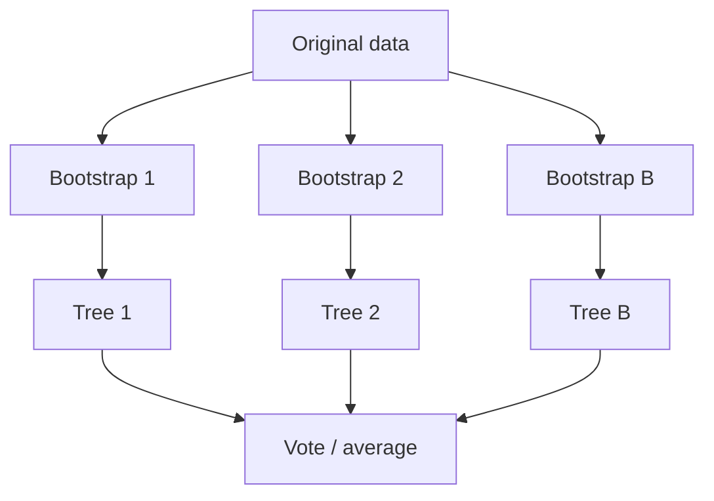

# Bagging and the Need for Random Forests

## 1. Overfitting in deep decision trees

An **unpruned**, deep decision tree can achieve **near-zero training error** by memorizing noise. On **new** data, error rises: **high variance**—small data perturbations change the tree structure.

**Goal of bagging:** reduce **variance** by **averaging** or **voting** over multiple models trained on **different views** of the data.

---

## 2. Bootstrap aggregation (bagging)

**Bootstrap sample:** draw \(n\) points **with replacement** from a dataset of size \(n\). Some points repeat; some are **out-of-bag (OOB)**.

**Bagging procedure:**

1. Create **B** bootstrap samples \(D_1,\ldots,D_B\).
2. Train a base learner on **each** \(D_b\) (often an **unpruned** decision tree).
3. **Aggregate:**
   - **Classification:** **majority vote** across trees.
   - **Regression:** **mean** of tree predictions.

**Why variance drops:** individual trees are **high-variance**; averaging **decorrelates** some errors (especially if trees differ).

---

## 3. Why decision trees as base learners?

- **Fast** to train.
- **Interpretable** individually—but an ensemble of hundreds is less so.
- **Unstable:** small data change \(\Rightarrow\) different split sequence \(\Rightarrow\) good **diversity** for bagging (when diversity is actually achieved).

---

## 4. Parallelism

Bootstrap creation and tree training are **independent** \(\Rightarrow\) **embarrassingly parallel**—important for **distributed** training on large tabular data in cloud pipelines.

---

## 5. Limitation of bagged trees: correlation

Bootstrap sets **overlap heavily**; greedy tree induction often picks the **same** near-optimal root split. **Correlated** trees **average** to a weaker reduction in variance than **diverse** trees.

**Random Forests** (next note) inject **random feature subsets** at splits to **decorrelate** trees.

---

## Common Pitfalls / Exam Traps

- **Bagging vs boosting:** bagging **parallel**, **variance**-focused; boosting **sequential**, different objective.
- **Bootstrap “with replacement”** is essential—without it, subsampling differs.
- **Regression:** use **mean**, not majority vote.
- Expecting bagging to fix **severe underfitting**—bagging mainly helps **unstable / high-variance** bases.

---

## Quick Revision Summary

- **Bagging** = **bootstrap** samples + train models + **vote/mean**.
- Targets **variance** of **unstable** learners (deep trees).
- **Classification:** majority vote; **regression:** average.
- Trees are common bases: fast, unstable, good diversity potential.
- **Highly parallel** training.
- **Correlated** bagged trees gain less; **Random Forest** reduces correlation via **random splits**.
