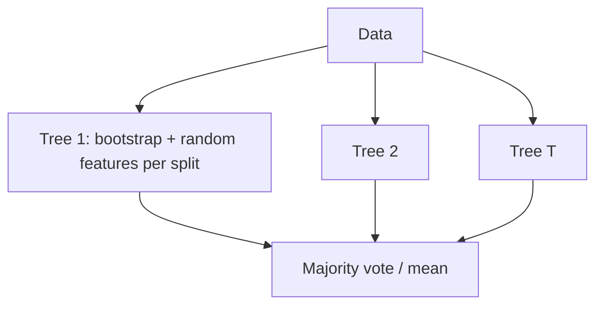

# Random Forest: Building an Ensemble of Diverse Trees

## 1. Problem bagging leaves partly unsolved

**Bagged decision trees** still tend to **correlate**: every tree considers **all** features at each node, so the **same** strong feature often wins the root across bootstraps. Averaging **similar** trees yields limited variance reduction.

**Random Forest (RF)** combines:

- **Bagging** (bootstrap samples per tree), with
- **Random subspace** at each split: choose a **random subset** of **m** features (often \(\sqrt{p}\) for classification, \(p/3\) for regression in common defaults) and **only** compute impurity over that subset.

---

## 2. Mechanism

| Component | Role |
|-----------|------|
| Bootstrap sample | Tree sees perturbed data \(\Rightarrow\) diversity |
| Random feature subset at **each** split | Prevents one dominant feature from structuring **all** trees |
| Many trees (e.g. 100–500) | Stable vote / average |

**Effect:** trees **decorrelate** \(\Rightarrow\) ensemble variance drops further than bagging alone.

---

## 3. Strengths

- **Accuracy:** strong default for many tabular tasks.
- **Robustness:** noise and irrelevant features **less likely** to dominate every tree.
- **Arbitrary-shaped regions** in feature space (piecewise axis splits).
- **Parallel** training like bagging.

---

## 4. Weaknesses

- **Memory:** storing hundreds of full trees is heavy.
- **Latency:** prediction queries **all** trees unless optimized.
- **Interpretability:** worse than a **single** tree; tools (feature importance, SHAP) summarize behavior.
- Still biased toward **axis-aligned** partitions—not density-based clusters.

**Typical implementations:** many trees (e.g. 100), unbounded depth unless limited, bootstrap + feature randomness (e.g. **sklearn** defaults as reference points, not universal law).

---

## Common Pitfalls / Exam Traps

- **RF vs bagging:** RF adds **per-split feature randomness**; bagging alone does not.
- **mtry too large** \(\Rightarrow\) near bagging; **too small** \(\Rightarrow\) weak individual trees.
- Calling RF “non-parametric and simple”—it has **many** hyperparameters (tree count, depth, \(m\), min samples per leaf).

---

## Quick Revision Summary

- **Random Forest** = **bagging** + **random feature subsets** at each split.
- Reduces **tree correlation** \(\Rightarrow\) better ensemble than bagging alone.
- Strong **tabular** performance; **parallel** training.
- Costs: **memory**, **prediction** time, **interpretability**.
- Hyperparameters: **number of trees**, **features per split**, depth/leaf controls.
