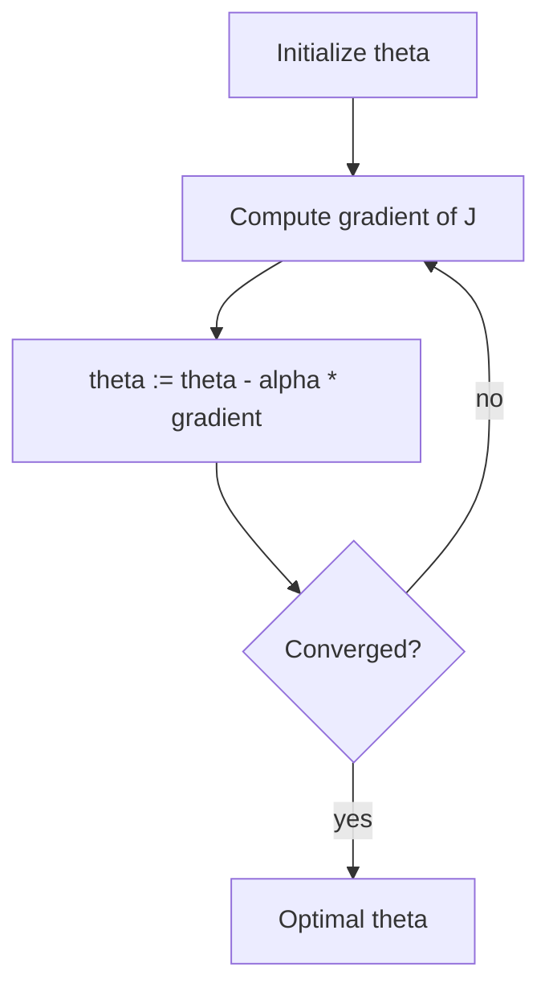

# Optimization with Gradient Descent (Linear Regression)

## 1. Idea: walk downhill on the cost surface

**Gradient descent** minimizes a smooth function \(J(\boldsymbol{\theta})\) by repeatedly stepping in the direction of **steepest decrease**: the **negative gradient** \(-\nabla J\).

**Analogy:** descending a bowl-shaped **MSE** surface toward the **minimum**.

---

## 2. Learning rate \(\alpha\)

**\(\alpha\)** (step size) controls update magnitude.

| \(\alpha\) too small | \(\alpha\) too large |
|---------------------|---------------------|
| Slow convergence | Oscillation / divergence |

Tuning uses **line search**, **schedules**, or **cross-validation**; no universal constant.

---

## 3. Simultaneous updates (multivariate)

For vector \(\boldsymbol{\theta} = (\theta_0,\ldots,\theta_n)\), compute **all** partial derivatives at the **current** \(\boldsymbol{\theta}\), then update **all** components **together**. Do **not** update \(\theta_0\) and then reuse it while computing the partial for \(\theta_1\) in the **same** iteration (unless algorithm specifies sequential coordinate descent—which is different).

---

## 4. Gradients for linear regression (conceptual)

With \(J(\theta) = \frac{1}{2m}\sum_i (h_\theta(x^{(i)}) - y^{(i)})^2\) and \(h_\theta(x) = \theta_0 + \theta_1 x\):

- \(\partial J/\partial \theta_0\) involves sum of residuals.
- \(\partial J/\partial \theta_1\) involves sum of residuals \(\times\) \(x^{(i)}\).

Each iteration subtracts \(\alpha\) times these partials.

**Vectorized form** (with bias folded into \(\mathbf{x}\)): \(\boldsymbol{\theta} := \boldsymbol{\theta} - \alpha \frac{1}{m} \mathbf{X}^T(\mathbf{X}\boldsymbol{\theta} - \mathbf{y})\) (shape conventions as in implementation).

---

## 5. Gradient descent vs closed form

| Method | Pros | Cons |
|--------|------|------|
| **Normal equations** | One-shot if \(d\) moderate | \(O(d^3)\) for matrix inverse; bad if \(d\) huge |
| **Gradient descent** | Scales to large \(d\) with sparse methods | Needs \(\alpha\), iteration count |

---

## Common Pitfalls / Exam Traps

- Forgetting **negative** gradient direction (minimization).
- **Non-simultaneous** updates in vector GD.
- Applying GD to **non-convex** losses without safeguards (neural nets)—linear regression is convex; deep learning is not.

---

## Quick Revision Summary

- **Gradient descent:** iterate \(\boldsymbol{\theta} \leftarrow \boldsymbol{\theta} - \alpha \nabla J\).
- **\(\alpha\)** trades speed vs stability.
- Update all \(\theta_j\) **simultaneously** each step.
- Linear MSE is **convex**; GD finds global minimum (barring numerical issues).
- Alternative: **closed-form** normal equations when cheap enough.
