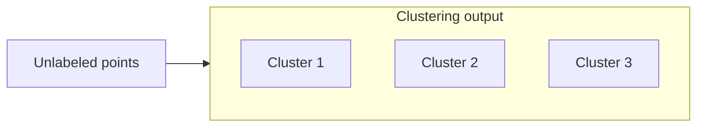

# Introduction to Clustering

## 1. Unsupervised structure discovery

**Clustering** partitions (or soft-assigns) data points into **groups** such that:

- **Intra-cluster similarity** is **high** (cohesive groups).
- **Inter-cluster similarity** is **low** (distinct groups).

**No class labels** are required: inputs are typically feature vectors only.

**Contrast with classification:** supervised methods **separate** known classes using labels. Clustering **discovers** groupings from geometry or similarity alone.

---

## 2. Supervised vs unsupervised (summary)

| | Supervised | Unsupervised (clustering) |
|---|------------|---------------------------|
| Labels | Required | Not used |
| Goal | Predict \(y\) | Find structure / groups |
| Example | Spam filter | **Customer segments** from behavior |

---

## 3. Subjectivity and multiple valid groupings

The **same** entities can cluster differently depending on **which features** define “similarity” (department vs gender vs geography). **Abstraction level** also matters: coarse vs fine partitions.

**Implication:** “ground truth clusters” may not exist; **domain goals** choose the right granularity.

---

## 4. Applications

- **Document clustering:** group news articles (e.g. topic pages); represent text as **term vectors** then cluster.
- **Market segmentation:** cluster users by spend, tenure, product affinity for **targeted** campaigns.
- **Inventory / ops:** group SKUs or regions by co-purchase or failure patterns.
- **Semi-supervised aid:** clusters can suggest **pseudo-labels** for downstream models.

---

## 5. Outliers

Points **far** from any dense group may be labeled **noise** / outliers by algorithms that support it (e.g. DBSCAN later).

---

## Common Pitfalls / Exam Traps

- Expecting one “correct” **k** without domain context.
- Using clustering for **prediction** of external targets without validation—cluster IDs are not inherently meaningful outcomes.
- Ignoring **feature scaling** when distances matter.

---

## Quick Revision Summary

- **Clustering:** group **similar** points; **maximize** intra-, **minimize** inter-cluster similarity.
- **Unsupervised:** no labels; pattern discovery.
- **Multiple valid** partitions depending on features and scale.
- **Use cases:** segmentation, document organization, exploratory analysis.
- **Outliers** may sit outside all clusters.
