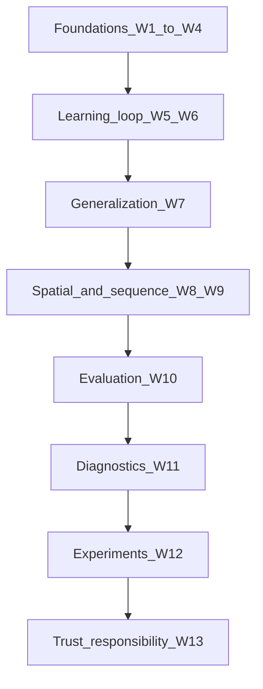
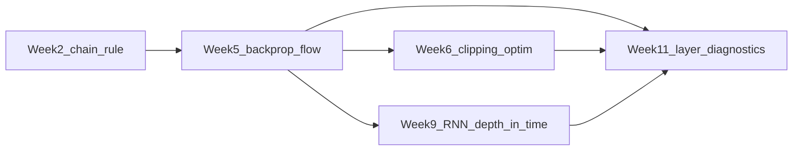

# Neural networks: connect the dots (Weeks 1–13)

This note is a **single spine** through the course. Your week folders stay the source of truth; use this when you want **one story** instead of thirteen modules.

---

## Thesis (what the whole course is about)

A neural network is **layered function approximation**: simple units, composed, with **nonlinearities** so depth means something. **Training** is **numerical optimization**: follow gradients of a **loss** to adjust weights. None of that guarantees a useful system. The real criterion is **generalization** (good on unseen data) and, in deployment, **trustworthy behavior**—honest uncertainty, stability under small changes, fair impact, and explanations where stakes are high. Low training loss is only the beginning.

---

## Chronological spine

### Week 1 — What is this object?

- **Answers:** What neural networks are in the AI/ML/DL stack; neurons, weights, bias, layers; feed-forward structure; why **depth** buys hierarchical features.
- **Carries forward:** Every later week assumes you see a network as stacked affine maps + nonlinearities.
- **Sets up:** Week 2 supplies the math to *train* what Week 1 describes.
- **Hub:** [week-1/8-Module Summary - Artificial Neural Networks.md](week-1/8-Module Summary - Artificial Neural Networks.md)

### Week 2 — Language of learning

- **Answers:** Vectors, matrices, tensors; gradients; **chain rule**; numerical stability (why training can silently break).
- **Carries forward:** Backprop *is* the chain rule on a graph; Week 5 makes that operational.
- **Sets up:** Week 3 attaches this toolkit to the first concrete models (perceptron, logistic).
- **Hub:** [week-2/8-Module Summary - Artificial Neural Networks.md](week-2/8-Module Summary - Artificial Neural Networks.md)

### Week 3 — First models, first limits

- **Answers:** Perceptron geometry; linear separability; **XOR** and the need for hidden layers; logistic neuron as smooth, probabilistic building block.
- **Carries forward:** “One neuron / one layer is limited” is the motivation for MLPs in Week 4.
- **Sets up:** Multi-layer networks and activations in depth.
- **Hub:** [week-3/9-Module Summary - Artificial Neural Networks.md](week-3/9-Module Summary - Artificial Neural Networks.md)

### Week 4 — The MLP blueprint

- **Answers:** MLP structure; **forward pass**; representation learning; depth vs width; activations (sigmoid/tanh/ReLU family, softmax); why linear stacking without nonlinearities collapses.
- **Carries forward:** The forward pass is half of training; Week 5 adds the backward half and loss.
- **Sets up:** How errors propagate and how initialization and loss shape learning.
- **Hub:** [week-4/11-Module Summary - Artificial Neural Networks.md](week-4/11-Module Summary - Artificial Neural Networks.md)

### Week 5 — How it learns

- **Answers:** **Backpropagation** (gradients w.r.t. all parameters); computational graphs; **gradient flow** (vanishing/exploding); **initialization** (Xavier/He); **losses** (MSE vs softmax + cross-entropy); mitigation preview (ReLU, clipping, normalization).
- **Carries forward:** Gradients are the *signal*; Week 6 is *how you move* along that signal.
- **Sets up:** Optimizers, schedules, and stability tools.
- **Hub:** [week-5/12-Module Summary - Artificial Neural Networks.md](week-5/12-Module Summary - Artificial Neural Networks.md)

### Week 6 — How you optimize

- **Answers:** GD, SGD, mini-batch; **adaptive methods** (RMSProp, Adam); when Adam vs SGD+momentum; **learning-rate schedules**; **gradient clipping**; convergence intuition (noise vs smooth descent).
- **Carries forward:** You can minimize training loss; Week 7 asks whether that implies a good *deployed* model.
- **Sets up:** Regularization and the bias–variance lens.
- **Hub:** [week-6/15-Module Summary - Artificial Neural Networks.md](week-6/15-Module Summary - Artificial Neural Networks.md)

### Week 7 — Does it work on new data?

- **Answers:** **Generalization**; under/overfitting; bias–variance; practical tools—weight decay, dropout, early stopping, augmentation, batch norm, training hygiene.
- **Carries forward:** Architecture choices (Weeks 8–9) change inductive bias; optimization choices (Weeks 5–6) interact with generalization.
- **Sets up:** Structured data (images, sequences) needs structured models—not only bigger MLPs.
- **Hub:** [week-7/1-Regularization and Generalization.md](week-7/1-Regularization and Generalization.md)

### Week 8 — Structure for images

- **Answers:** Why dense nets mismatch image statistics; **convolution** (locality + weight sharing); feature maps; stride, padding, **pooling**; stacked blocks; CNN as feature extractor + head; architectural evolution (early CNNs toward deeper, residual-style themes).
- **Carries forward:** Same training loop; different **prior** on what good features look like.
- **Sets up:** Not all inputs are fixed-size vectors; sequences come next.
- **Hub:** [week-8/17-Module Summary - Artificial Neural Networks.md](week-8/17-Module Summary - Artificial Neural Networks.md)

### Week 9 — Structure for order and time

- **Answers:** Why feedforward models ignore ordering; **RNNs** and hidden state; **vanishing gradients** in long sequences; **LSTM/GRU**; limits of recurrence; **attention** and **transformers** as the modern path.
- **Carries forward:** Same gradient-story as Week 5, replayed along time; gating as a designed fix.
- **Sets up:** You can build powerful models—Week 10 onward asks how to *judge* and *debug* them responsibly.
- **Hub:** [week-9/1-Module Introduction - Artificial Neural Networks.md](week-9/1-Module Introduction - Artificial Neural Networks.md)

### Week 10 — Beyond “accuracy”

- **Answers:** Metrics that don’t hide failure modes; train/val behavior; **calibration**; **robustness** to perturbations; **uncertainty** from outputs (and its limits).
- **Carries forward:** Evaluation assumptions must match deployment; Week 12 makes comparisons honest.
- **Sets up:** When metrics look wrong, look *inside* the network (Week 11).
- **Hub:** [week-10/12-Module Summary - Artificial Neural Networks.md](week-10/12-Module Summary - Artificial Neural Networks.md)

### Week 11 — Why is it failing inside?

- **Answers:** **Diagnostics** vs headline metrics; gradients, activations, weights/norms; dead ReLUs, saturation, frozen layers; structured debugging and tooling mindset.
- **Carries forward:** Connects straight back to Week 5–6 (flow, init, optimizer) and forward to disciplined experiments.
- **Sets up:** Random knob tweaks are replaced by **reproducible** tuning workflows.
- **Hub:** [week-11/16-Module Summary - Artificial Neural Networks.md](week-11/16-Module Summary - Artificial Neural Networks.md)

### Week 12 — Can you trust your comparison?

- **Answers:** High-impact **hyperparameters**; LR and batch size; systematic **search**; **reproducibility** (seeds, splits, logging, checkpoints); workflow: baseline → trials → validation selection → **one** final test.
- **Carries forward:** What you claim about a model is only as good as how you ran the experiment.
- **Sets up:** Production and society-scale concerns (Week 13).
- **Hub:** [week-12/8-Module Summary - Artificial Neural Networks.md](week-12/8-Module Summary - Artificial Neural Networks.md)

### Week 13 — Understand, govern, and look ahead

- **Answers:** **Explainability** vs interpretability; fairness and bias; mitigation across the lifecycle; trends (transformers, scaling, multimodality, efficiency).
- **Carries forward:** Closes the **trust** arc: evaluation (10) + debugging (11) + rigor (12) + responsibility (13).
- **Sets up:** Continued reading and practice on the job—this course gave the map.
- **Hub:** [week-13/14-Module Summary - Artificial Neural Networks.md](week-13/14-Module Summary - Artificial Neural Networks.md)

---

## Cross-cutting themes (one idea, many weeks)

### Gradient flow

Gradients are the nervous system of training. **Week 2** gives the chain rule; **Week 5** shows it as backprop and shows how depth and activation choices make signals **vanish** or **explode**. **Week 6** adds **clipping** and optimizer stability—managing magnitude, not inventing gradients. **Week 9** repeats the story along **time** in RNNs. **Week 11** is where you **measure** flow layer-wise when training looks “fine” on the surface but layers are dead or saturated.

### Generalization

**Week 7** names the goal: performance on **unseen** data. It connects backward to **capacity** and training dynamics (**Weeks 4–6**) and forward to whether your **metrics** actually reflect deployment (**Week 10**) and whether your “wins” are **replicable** (**Week 12**). Overfitting is not a footnote; it is the default risk for high-capacity models.

### Inductive bias and architecture

**Week 4:** depth encourages **hierarchical** features. **Week 8:** locality and translation-aware structure for **spatial** data. **Week 9:** **memory** and context for **ordered** data. Different structures embed different assumptions; the training loop is shared.

### Trust (evaluation, evidence, responsibility)

**Week 10:** correctness is not enough—calibration, robustness, uncertainty. **Week 11:** internal evidence when behavior is wrong. **Week 12:** fair comparisons and reproducibility. **Week 13:** explanations, fairness, and governance for real deployments. Read as one pipeline: **measure → inspect → experiment → account**.

---

## End-to-end mental models

### The training loop (minimal)

On a mini-batch: **forward** pass computes predictions; **loss** scores wrongness; **backward** pass assigns blame to each parameter (**Week 5**); the **optimizer** proposes an update (**Week 6**); **regularization** and data practice stop the loop from memorizing (**Week 7**). Repeat until validation says stop or schedules end.

### “Good model” checklist (exam- and practice-friendly)

1. **Generalizes:** train/val gap under control; bias–variance story makes sense (**Week 7**).
2. **Right objective:** loss matches task; probabilities mean what you think if you use them (**Weeks 5, 10**).
3. **Stable enough:** no chronic vanishing/exploding; activations alive (**Weeks 5, 11**).
4. **Evaluated properly:** metrics + calibration/robustness/uncertainty as needed (**Week 10**).
5. **Compared honestly:** tuned on validation; test used once; seeds and logs tracked (**Week 12**).
6. **Deployable ethically:** explainability/fairness/mitigation considered for the use case (**Week 13**).

### When things break

Default move: **Week 11** workflow—gradients, then activations, then weights/norms—before swapping optimizers at random. Tie symptoms back to **Week 5–6** levers (init, LR, clipping, architecture depth).

---

## One-line hinges (quick revision)

| Week | Hinge |
|------|--------|
| 1 | Depth stacks simple detectors into hierarchy. |
| 2 | The chain rule is backprop waiting to happen. |
| 3 | XOR forces hidden layers and non-linear boundaries. |
| 4 | No nonlinearities, no deep expressivity—just a linear map. |
| 5 | Backprop computes blame; loss shapes the blame. |
| 6 | Gradients point; the optimizer decides how to walk. |
| 7 | Low training error is cheap; generalization is the exam. |
| 8 | Convolutions bake in locality and sharing for vision. |
| 9 | Sequences need state; attention relaxes how state is read. |
| 10 | Accuracy lies; calibration and robustness narrow the truth. |
| 11 | The failure is often inside the layers, not in the metric code. |
| 12 | If you didn’t control randomness, you didn’t compare models. |
| 13 | Power without explainability and fairness is operational risk. |

---

## Glossary map (where ideas first bite, where they return)

| Term | First sharp use | Comes back in |
|------|-----------------|---------------|
| Chain rule | Week 2 | Week 5 (backprop), Week 9 (BPTT) |
| Nonlinearity / activation | Weeks 3–4 | Week 5 (saturation, vanishing), Week 11 (dead ReLU) |
| Gradient flow | Week 5 | Weeks 6, 9, 11 |
| Initialization | Week 5 | Weeks 6, 11 (health checks) |
| Cross-entropy / softmax | Week 5 | Week 10 (calibration) |
| Generalization | Week 7 | Weeks 10, 12, 13 |
| Inductive bias (structure) | Weeks 4, 8, 9 | Week 13 (trends, new architectures) |
| Calibration / robustness | Week 10 | Weeks 12–13 (deployment, fairness) |

---

*Read this once for orientation, then drill into the linked week summaries when a topic needs detail.*
