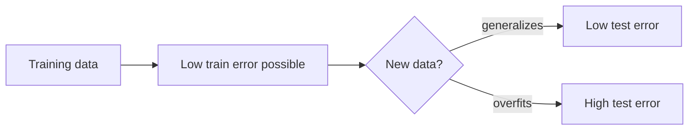

# Regularization and Generalization – Artificial Neural Networks (Module 7)

## Learning Objectives

By the end of this video you will:

1. **Explain** why **good training metrics** do not always mean a **good model**.
2. **Define** **generalization** and the **generalization problem** in deep learning.
3. **Outline** what this module covers: underfitting/overfitting, bias–variance, and practical techniques.
4. **Argue** why **generalization** is the real criterion for a useful deployed network.

---

## From Training to “Does It Actually Work?”

- Earlier modules covered **how** networks learn: **backpropagation**, **gradients**, and **optimization** updating **weights and biases**.
- A natural follow-up question: if **loss decreases** and **training accuracy** rises, is the model **actually** good?
- **Not always.** The real question is what it means for a network to “work”: high training accuracy alone is **not** the full answer.

---

## Training Data vs Unseen Data

- In practice, models are **not** judged on the data they were trained on.
- They are judged on **new, unseen** inputs (validation, test, production).
- A model that is strong on training data but **fails on new data** is **not useful**, however good the training numbers look.

---

## Generalization and the Generalization Problem

- **Generalization** = the ability to perform well on **data not seen during training** (and, in deployment, on **future** data drawn from the real process).
- Modern neural networks have **very high capacity**: they can fit complex patterns, **memorize** large sets, and even fit **noise**.
- **Good training performance is often easy** to obtain—and **misleading**.
- A model may seem to learn while **memorizing** training examples instead of **stable patterns**.
- The **gap** between training performance and performance on new/real data is the **generalization problem**—a **central challenge** in deep learning.

### Visual: train vs deploy

---

## What This Module Covers

1. **Concepts:** what generalization means; **underfitting** and **overfitting**; **bias–variance** trade-off.
2. **Techniques:** **regularization** (e.g. penalties on weights), **dropout**, **batch normalization**, **early stopping**, **data augmentation**.
3. **Practice:** **training setup** choices that support generalization.
4. **Goal:** not only to **train** networks, but to train **reliable** ones.

---

## Why Generalization Matters in the Real World

- Deployed models face **future** data they never saw in training.
- **Poor generalization** → unstable predictions, bad performance in production, models that look good in **experiments** but **fail** when used.
- **Generalization** largely determines whether a neural network is **actually useful**.

---

## Summary

- **Training success** (low loss, high training accuracy) **does not guarantee** a good model.
- **Generalization** = good performance on **unseen** / **future** data; the **generalization problem** is the train–real-world **gap**.
- This module connects **theory** (under/overfit, bias–variance) with **methods** (regularization, dropout, batch norm, early stopping, augmentation, training choices).
- **Next:** a formal view of **generalization** vs **training error** and why the latter alone is insufficient.

---

## Exam-style cues

- **Define** generalization; **contrast** training performance with deployment needs.
- **Explain** why high-capacity models make the generalization problem acute.
