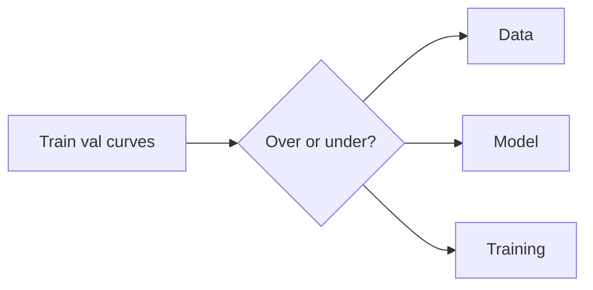

# Practical Checklist for Preventing Overfitting – Artificial Neural Networks (Module 7)

## Learning Objectives

By the end of this video you will:

1. **Diagnose** overfitting vs underfitting **before** changing hyperparameters blindly.
2. **Structure** fixes across **data**, **model**, and **training** levels.
3. **Avoid** ad hoc tweaks (random dropout bumps, etc.) without a **hypothesis**.
4. **Apply** a **systematic** mindset: **diagnosis → targeted intervention**.

---

## Why a Checklist?

- Overfitting usually has **multiple** contributing factors: **data** limits, **model** capacity, **training** configuration—or **combinations**.
- **Ad hoc** fixes (e.g. randomly cranking dropout or $\lambda$) often **fail** because the **root cause** was wrong.
- A checklist enforces: **observe** → **classify the failure mode** → **act**.

### Visual: diagnose then fix

---

## Step 1: Diagnosis (Always First)

- Compare **training** vs **validation** performance.
- **Signals** of overfitting: **large** train–val **gap**, **validation loss rising** while training loss falls, **unstable** validation metrics.
- Ask: **Underfitting** or **overfitting?**
  - Wrong diagnosis → wrong remedy (e.g. more regularization when the model is already **too simple**).

---

## Step 2: Data-Level Checks

- Is the dataset **large** and **diverse** enough for the task?
- Is the **validation** set **representative** of real deployment data?
- **Data leakage** between train and validation? (inflated val scores, surprise failure in production)
- If data are **limited**, can **augmentation** add **realistic** variability without breaking labels?

---

## Step 3: Model Complexity

- Is the network **too large** for the amount of data?
- If yes: **reduce** depth/width **or** add **explicit** regularization (**L2**, **dropout**, etc.).
- **Goal:** **simplest** model that **still** performs well—not maximal complexity by default.
- **Excess capacity** + **small** data is a **classic** overfitting recipe.

---

## Step 4: Training Configuration

- **Batch size** too **large**? (smoother updates; may hurt generalization in some regimes.)
- **Learning rate** too **small** with **too many** epochs? (risk of **memorizing** training detail.)
- **Early stopping** enabled? **Validation** metrics **logged** each epoch?
- Small **adjustments** to these knobs can **significantly** change generalization.

---

## Summary

- **Diagnose** (train vs val, stability, under vs over) **before** intervening.
- Good generalization is usually **many small correct choices** across **data**, **model**, and **training**—rarely one magic technique.
- The next item in the course flow (per lecture) is a **module/week summary** video—use these notes together with prior videos for revision.

---

## Exam-style cues

- **List** diagnostic signals of overfitting from curves and metrics.
- **Order** the steps: diagnosis → data → model → training.
- **Explain** why fixing data leakage matters more than tuning dropout when leakage exists.
