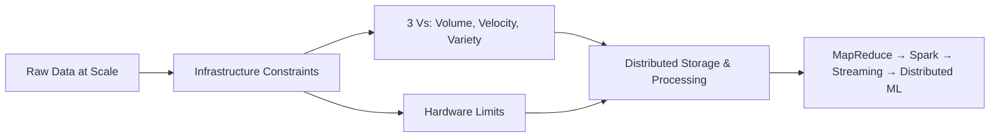
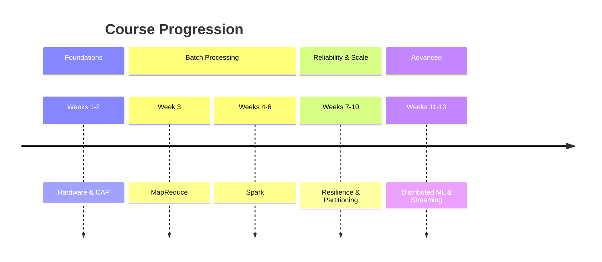

# Big Data Platforms and Analytics: Course Roadmap

## Why Big Data Is an Infrastructure Problem

Data volume today exceeds what any single machine can store, process, or serve reliably. The core challenge is not merely storing more bytes — it is designing **infrastructure** that scales cost-effectively, survives hardware failure, and delivers results at the speed the business demands.

Big data forces a shift from monolithic computing to **distributed systems**: clusters of commodity machines coordinated by specialized software.

---

## Module-by-Module Technical Roadmap

### Weeks 1–2: Foundations — Constraints and Distributed Systems Theory

| Topic | Core Question | Key Outcome |
|-------|---------------|-------------|
| Three Vs (Volume, Velocity, Variety) | What makes data "big"? | Architectural pressures that break single-node designs |
| Vertical vs horizontal scaling | How do we add capacity? | Scale-out with commodity hardware clusters |
| CAP theorem | What trade-offs are unavoidable in clusters? | Choose consistency vs availability under partition |
| ACID vs BASE | How do we guarantee data integrity at scale? | Strict transactions vs eventual consistency |

### Week 3: MapReduce — The Original Distributed Processing Model

MapReduce is the foundational programming model for batch analytics at petabyte scale:

- **Map**: Transform each record independently into key-value pairs
- **Shuffle & Sort**: Route all values for the same key to one reducer
- **Reduce**: Aggregate values per key into a final result

**Weakness**: Disk-based intermediate state makes iterative and multi-pass jobs slow.

### Weeks 4–6: Apache Spark — In-Memory Computing

Spark addresses MapReduce's disk bottleneck through:

- **In-memory computing** — up to ~100× faster for iterative workloads
- **RDDs (Resilient Distributed Datasets)** — fault-tolerant distributed collections
- **Lazy evaluation** — build a DAG of transformations; execute only on action
- **DAG execution engine** — optimizes stage boundaries and task scheduling

### Weeks 7–8: Resilience and Recovery

When nodes fail mid-job, systems must recover without restarting from scratch:

- **Lineage graphs** — recompute lost partitions from parent RDDs
- **Checkpointing** — truncate lineage by persisting to reliable storage
- **Narrow vs wide dependencies** — determine recomputation cost on failure

### Weeks 9–10: Data Partitioning and Performance Optimization

Scaling requires even work distribution across the cluster:

- **Partitioning strategies** — hash, range, custom
- **Data skew** — hot keys that overload individual tasks
- **Salting** — spread skewed keys across multiple partitions
- **Broadcast joins** — avoid shuffle by sending small tables to all workers

### Weeks 11–12: Distributed Machine Learning

Training models that exceed single-machine memory or compute:

- **Data parallelism** — shard the dataset across workers
- **Model parallelism** — split large neural networks across GPUs
- **TensorFlow distributed strategies** — parameter servers, mirrored strategy
- **Ring-allreduce** — efficient gradient synchronization without a central bottleneck

### Week 13: Real-Time Stream Processing

Moving beyond batch to sub-second decision systems:

- **Apache Kafka** — durable, high-throughput event backbone
- **Apache Storm** — real-time topology for continuous computation
- **Use cases** — fraud detection, dynamic pricing, personalization

---

## Architectural Themes Across the Course

1. **Constraints drive architecture** — the three Vs and hardware limits dictate design choices
2. **Design for failure** — assume nodes and networks will fail; build recovery into software
3. **Move computation to data** — minimize network transfer (data locality)
4. **Trade-offs are explicit** — consistency vs availability, resilience vs speed, simplicity vs scale
5. **Abstraction hides complexity** — developers write map/reduce or transformation logic; frameworks handle distribution

---

## Common Pitfalls / Exam Traps

- Treating big data as only a **size problem** — velocity and variety are equally architectural drivers
- Assuming MapReduce and Spark solve the same problems equally well — Spark wins on iterative/in-memory; MapReduce remains relevant for simple one-pass batch jobs
- Confusing **week order with dependency order** — CAP and scaling foundations (weeks 1–2) are prerequisites for understanding why MapReduce and Spark make specific design choices
- Believing distributed ML (weeks 11–12) is just "Spark but bigger" — gradient synchronization, stragglers, and convergence are distinct challenges
- Overlooking that **streaming** (week 13) requires different consistency models than batch — windowing and global state differ fundamentally

---

## Quick Revision Summary

- Big data is an **infrastructure problem**, not just a storage problem
- Course arc: **constraints → MapReduce → Spark → resilience → partitioning → distributed ML → streaming**
- Week 1–2: three Vs, scaling, CAP theorem, ACID vs BASE
- Week 3: MapReduce map/shuffle/reduce pipeline; disk-based, fault-tolerant
- Weeks 4–6: Spark in-memory RDDs, lazy evaluation, DAG execution
- Weeks 7–8: lineage, checkpointing, failure recovery
- Weeks 9–10: partitioning, skew, salting, broadcast joins
- Weeks 11–12: data/model parallelism, TensorFlow strategies, ring-allreduce
- Week 13: Kafka + Storm for real-time fraud detection and dynamic pricing
- Central theme: **trade-offs** at every layer — no free lunch in distributed systems
