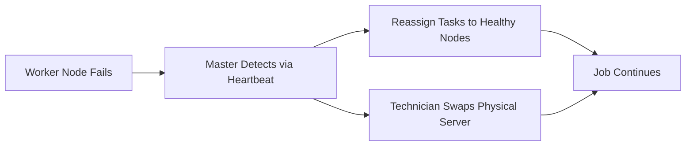

# Economics of Commodity Hardware

## Why the Industry Shifted to Standard Servers

Google and Amazon run thousands of standard PCs rather than a single supercomputer because **economics** — not just technology — dictates big data architecture. The key metric is not raw speed but **performance per dollar**.

---

## 1. Performance per Dollar

### The Cost Curves

| Hardware Type | Cost Behavior | Growth Strategy |
|---------------|---------------|-----------------|
| Specialized / high-end | Exponential — 2× power may cost 4× price | Buy bigger machine |
| Commodity / standard | Linear — 2× power costs ~2× price | Buy 2× more nodes |

$\text{Performance per dollar (commodity)} > \text{Performance per dollar (specialized)}$

### Startup Growth Path

A startup can:
1. Begin with 10 commodity nodes ($20,000)
2. Add nodes linearly as data grows
3. Avoid upfront supercomputer investment ($1M+)

Budget scales **with** data, not ahead of it.

---

## 2. Rapid Node Replacement

### Proprietary vs Commodity Maintenance

| Aspect | Proprietary Machine | Commodity Cluster |
|--------|--------------------|--------------------|
| Failed part | Custom repair, weeks of downtime | Pull unit, slide in identical server |
| Technician skill | Specialized engineers required | Standardized procedure |
| Downtime cost | Massive (unique hardware) | Minimal (interchangeable units) |
| Operational expense | High | Significantly lower |

**Treat hardware as disposable**: When a worker node fails, don't troubleshoot the motherboard for hours — replace the entire unit and continue.

---

## 3. Self-Healing Resilience Economics

### The Replication Math

| Scenario | Cost of 3× Replication |
|----------|------------------------|
| $1M supercomputer | $3M (prohibitive for most businesses) |
| 1,000 × $1,000 commodity nodes | $3,000 for 3× replication of one node's data |

Because commodity nodes are cheap, **affordable redundancy** becomes possible:
- Replicate data 3× across the cluster
- Lose any single node without data loss
- Smart software transforms unreliable cheap hardware into a highly reliable service

$\text{Reliability} = f(\text{software intelligence}, \text{commodity redundancy})$

Not: expensive unbreakable hardware.

---

## Economic Comparison Table

| Factor | Specialized Hardware | Commodity Hardware |
|--------|---------------------|-------------------|
| Unit cost | Very high | Low–moderate |
| Cost scaling | Exponential | Linear |
| Replacement time | Weeks (custom parts) | Hours (identical unit) |
| Replication affordability | Prohibitively expensive | Highly affordable |
| Performance per dollar | Poor at scale | Excellent at scale |
| Engineer specialization | Required | Reduced |

---

## The Strategic Insight

Big data economics invert traditional IT thinking:

- **Old model**: Buy the most reliable, expensive hardware to prevent failure
- **New model**: Buy cheap, standardized hardware; use **software** (replication, reassignment, lineage) to handle inevitable failure

This is why Hadoop's HDFS replicates blocks 3×, why MapReduce reruns pure tasks on failure, and why Spark uses lineage graphs for recovery — all economic consequences of commodity hardware.

---

## Common Pitfalls / Exam Traps

- Stating the key metric is **raw speed** — it is **performance per dollar**
- Believing 3× replication on commodity hardware is expensive — the point is it's **affordable** compared to specialized hardware
- Confusing "disposable hardware" with "don't care about failures" — failures are expected; **software** handles recovery
- Assuming linear cost means zero operational overhead — cluster management still requires engineering, just at lower hardware cost
- Missing the link between commodity economics and **3× replication** as a deliberate design choice, not waste

---

## Quick Revision Summary

- Key metric: performance per dollar, not raw speed
- Specialized hardware: exponential cost; commodity: linear cost
- Commodity nodes are interchangeable — rapid replacement, lower opex
- 3× replication affordable on $1,000 nodes, impossible on $1M supercomputer
- Strategy: cheap hardware + smart software = reliable service
- Economics explain why Google/Amazon use thousands of standard servers
