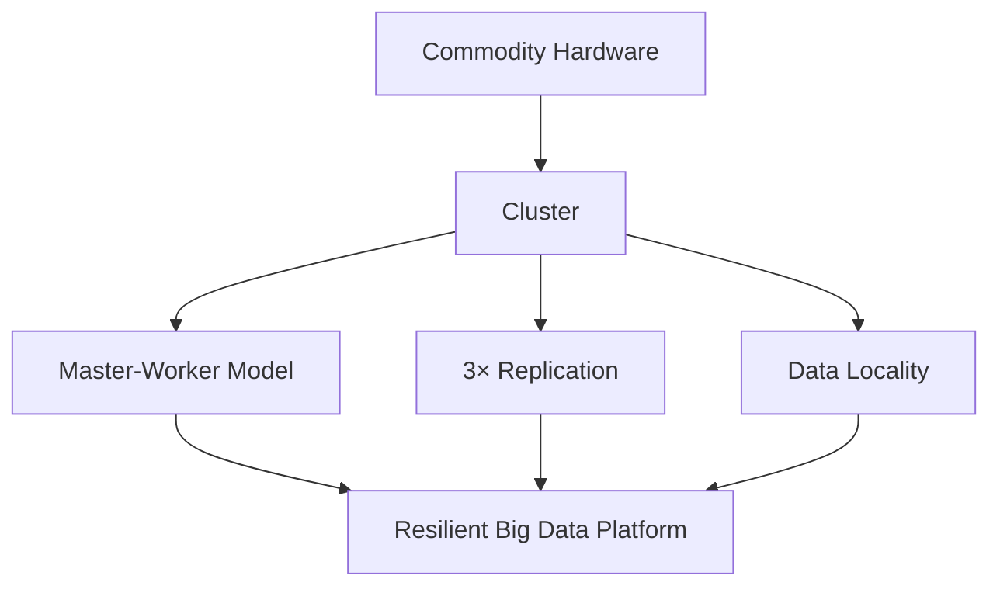
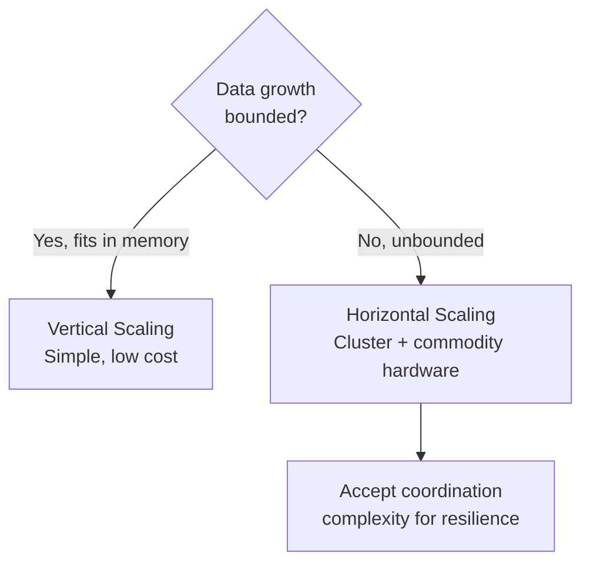

# Module 1 Summary: Big Data Constraints and Scaling

## The Paradigm Shift

Computing at global scale requires abandoning the assumption that a faster laptop solves every problem. Module 1 established the **constraints** that force architectural change and the **solutions** that sustain infinite growth.

---

## 1. Constraints Drive Architecture

Big data is defined by its constraints, not its tools.

| Constraint | Definition | Architectural Response |
|------------|------------|------------------------|
| **Volume** | Petabyte-scale data | Distributed storage (HDFS, S3) |
| **Velocity** | Fire-hose data arrival | Parallel / stream processing |
| **Variety** | Mixed structured/unstructured | Flexible schemas, schema-on-read |

The three Vs are **architectural pressures**, not marketing terms. Every platform choice traces to one or more of these pressures.

---

## 2. Hardware Walls

Single machines hit physical and economic ceilings:

- **CPU**: Heat density and speed-of-light limits (~2005 plateau)
- **RAM**: Exponential cost; memory bandwidth bottleneck
- **I/O**: Disk and network are the slowest subsystems

These walls are why "just buy a bigger machine" fails for big data.

---

## 3. Vertical Scaling (Scale Up)

**Strategy**: Upgrade the same machine — more RAM, faster CPU.

| Strength | Weakness |
|----------|----------|
| No code changes | Exponential cost (price wall) |
| Simple operations | Motherboard slot limits (hardware wall) |
| Good for small/bounded data | Single point of failure (risk wall) |

**Verdict**: Short-term fix and valid for small workloads. Cannot sustain infinite enterprise growth.

---

## 4. Horizontal Scaling (Scale Out)

**Strategy**: Add commodity hardware nodes to a cluster.

| Strength | Weakness |
|----------|----------|
| Linear cost | Higher software complexity |
| Fault tolerance (1 of 1000 fails → 999 continue) | Network coordination overhead |
| Effectively unlimited growth | CAP theorem trade-offs (Module 2) |

**Verdict**: The only sustainable path for Netflix/Uber/Google-scale analytics.

---

## 5. Commodity Hardware Clusters

| Principle | Implementation |
|-----------|----------------|
| Standardized nodes | Rapid replacement, linear cost |
| Master-worker | Coordinator + parallel workers |
| 3× replication | Affordable redundancy |
| Data locality | Move code to data, avoid network tax |

**Secret sauce**: Move computation to data rather than shipping petabytes across the network.

---

## 6. Scaling Strategy Decision

Always a balance between **software simplicity** (vertical) and **long-term resilience** (horizontal).

---

## Bridge to Module 2

When 1,000 computers work together:
- How do they stay in sync?
- How do they handle network partitions?
- What happens when two nodes disagree on data?

Module 2 addresses **distributed systems theory**: fallacies of distributed computing, CAP theorem, ACID vs BASE.

---

## Common Pitfalls / Exam Traps

- Summarizing Module 1 as "use clusters" without naming the **three Vs** and **three hardware walls**
- Forgetting that vertical scaling is valid for **bounded workloads** — not universally wrong
- Missing **data locality** as a key takeaway — frequently tested
- Confusing **commodity hardware** with low quality
- Stating clusters are "simple" — they trade hardware simplicity for **coordination complexity**

---

## Quick Revision Summary

- Big data constraints (3 Vs) drive architecture, not tool preferences
- Single machines hit CPU, RAM, and I/O walls
- Vertical scaling: easy but hits price, hardware, and risk walls
- Horizontal scaling: commodity clusters, linear cost, fault tolerance
- Master-worker model + 3× replication + data locality = cluster foundation
- Move code to data to avoid network tax
- Scaling choice = simplicity vs resilience trade-off
- Module 2 next: coordination, CAP theorem, consistency models
