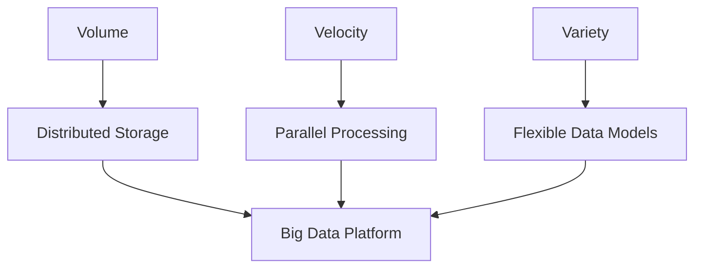
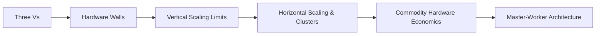

# Big Data Constraints and Scaling: Module Overview

## The Fundamental Question

Why can't a regular computer handle big data? The instinct to buy a faster CPU or add more RAM works for modest workloads, but big data is defined by growth rate, format diversity, and sheer volume that **outpaces** what a single machine can absorb — not just a large file on disk.

Understanding this distinction is the foundation for every platform covered in this course: Hadoop, Spark, Kafka, and beyond.

---

## 1. The Three Vs as Architectural Pressures

The three Vs are not marketing labels — they are **constraints** that force system redesign.

| V | Meaning | Analogy | Business Impact |
|---|---------|---------|-----------------|
| **Volume** | Sheer data size | Fitting an ocean into one bucket | Cannot store on one machine; need distributed storage |
| **Velocity** | Speed of data arrival | Fire hose vs drinking glass | Batch processing too slow; need parallel/real-time pipelines |
| **Variety** | Mixed data formats | Photos, text, sensors, video at once | Rigid schemas break; need flexible models |

---

## 2. Physical Limits of a Single Machine

Even the most expensive supercomputer hits hard ceilings:

- **CPU speed** — transistor density and heat limits (~2005); speed-of-light signal propagation across chips
- **RAM cost** — exponential pricing at high capacities; memory wall between CPU and RAM bandwidth
- **I/O throughput** — disk and network are orders of magnitude slower than CPU; the librarian bottleneck

These are not software bugs — they are **physics and economics**. No amount of optimization on one box overcomes them indefinitely.

---

## 3. Vertical Scaling (Scale Up)

**Definition**: Upgrade the existing machine — more RAM, faster CPU, larger disk.

**Advantages**:
- No code changes required
- Single OS, single security boundary — low operational complexity

**Why it fails for big data**:
- **Price wall** — cost grows exponentially, not linearly
- **Hardware wall** — motherboard slots for CPU/RAM are finite
- **Risk wall** — single point of failure; one power supply failure stops the business

Vertical scaling remains valid for small datasets, specialized single-node tasks, and short-term fixes — but not for Netflix-scale growth.

---

## 4. Horizontal Scaling (Scale Out)

**Definition**: Add more standard machines (nodes) that work together as a **cluster**.

**Analogy**: One giant person cannot lift a mountain; a million people each carrying one stone can.

| Aspect | Vertical (Scale Up) | Horizontal (Scale Out) |
|--------|---------------------|------------------------|
| Growth model | Bigger truck | More vans in a fleet |
| Cost curve | Exponential | Linear (commodity hardware) |
| Failure mode | Total outage | Partial degradation |
| Code complexity | Low | Higher (distributed coordination) |
| Growth ceiling | Physical slot limits | Effectively unbounded |

**Commodity hardware**: Standard, off-the-shelf servers — not "cheap junk," but **standardized** units that are interchangeable, rapidly replaceable, and priced linearly.

---

## 5. Module Learning Path

This module establishes the **why** behind every subsequent tool. When Spark schedules tasks with data locality or MapReduce replicates data three times, those choices trace directly to the constraints identified here.

---

## Common Pitfalls / Exam Traps

- Equating big data with **file size alone** — velocity and variety are independent architectural drivers
- Assuming vertical scaling is "wrong" — it is appropriate for bounded, small-scale workloads; the trap is using it as the long-term strategy for unbounded growth
- Confusing **commodity hardware** with low quality — it means standardized, interchangeable, cost-efficient infrastructure
- Ignoring the **I/O bottleneck** when reasoning about why distributed systems move computation to data rather than shipping petabytes over the network
- Treating horizontal scaling as free — it trades hardware simplicity for **software coordination complexity** (addressed in Module 2)

---

## Quick Revision Summary

- Big data = volume + velocity + variety, not just large files
- Single machines hit CPU, RAM, and I/O walls — physics and economics, not bad code
- Vertical scaling: easy but hits price, hardware, and single-point-of-failure walls
- Horizontal scaling: cluster of commodity nodes, linear cost, fault tolerance
- Three Vs map to three architectural shifts: distributed storage, parallel processing, flexible schemas
- This module answers **why** clusters exist before teaching **how** to program them
