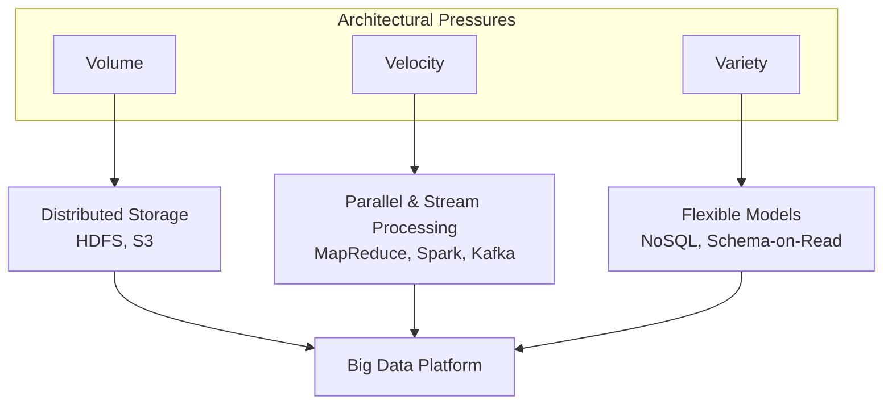

# The Three Vs of Big Data: Volume, Velocity, and Variety

## Why Three Dimensions Matter

Data becomes "big" when any single dimension — size, speed, or format diversity — overwhelms conventional systems. A terabyte of CSV files is a volume problem; a gigabyte-per-second sensor stream is a velocity problem; mixing images, JSON logs, and relational records is a variety problem. Real platforms face all three simultaneously.

---

## 1. Volume — The Sheer Amount of Data

**Intuition**: Volume measures how much data exists. The unit scale shifted from megabytes and gigabytes to **terabytes, petabytes, and exabytes** as digital activity exploded.

### Scale Reference

| Unit | Approximate Size | Context |
|------|------------------|---------|
| Gigabyte (GB) | $10^9$ bytes | A 16 GB phone (circa 2015) |
| Terabyte (TB) | $10^{12}$ bytes | Large enterprise data warehouse |
| Petabyte (PB) | $10^{15}$ bytes | Netflix video catalog, large e-commerce click logs |
| Exabyte (EB) | $10^{18}$ bytes | Global internet traffic (annual aggregates) |

### Real-World Example: E-Commerce Retail

Amazon or Walmart generates click streams, cart events, transactions, and search queries from millions of customers **every second**. Recording every interaction globally produces data that no single server can store. The solution is a platform that **spreads data across thousands of machines** — distributed file systems like HDFS or object stores like S3.

**Why it matters**: Volume drives the move from centralized storage to **distributed, replicated storage**.

---

## 2. Velocity — The Speed of Data Arrival

**Intuition**: Velocity is not about total size — it is about how fast data **arrives and must be processed**. Traditional data is a glass of water; big data velocity is a fire hose that never shuts off.

### Real-World Example: Financial Services / Fraud Detection

When a card is swiped at a coffee shop, the bank has roughly **20 milliseconds** — less than a blink — to decide if the transaction is legitimate. Data streams from millions of card readers simultaneously.

| Processing Mode | Latency | Outcome for Fraud Detection |
|-----------------|---------|----------------------------|
| Batch (hourly) | Hours | Thief long gone; losses realized |
| Real-time stream | Milliseconds | Block fraudulent charge instantly |

**Why it matters**: High velocity forces **parallel processing** and often **stream processing** architectures. A single processor analyzing one record at a time cannot keep pace.

---

## 3. Variety — The Diversity of Data Formats

**Intuition**: Traditional enterprise data lived in neat rows and columns (structured). Today, roughly **20%** of organizational data is structured; **80%** is unstructured or semi-structured.

### Data Type Spectrum

| Category | Examples | Schema |
|----------|----------|--------|
| **Structured** | SQL tables, billing records, age/name fields | Fixed, predefined |
| **Semi-structured** | JSON, XML, digital prescriptions, lab reports | Flexible, self-describing |
| **Unstructured** | Emails, PDFs, X-rays, MRI videos, voice notes, satellite images | No inherent schema |

### Real-World Example: Smart Hospital / Healthcare

For a single patient, a hospital simultaneously manages:

- Structured: demographics, billing, age
- Semi-structured: lab reports, digital prescriptions
- Unstructured: X-ray images, MRI scans, handwritten doctor notes

A platform that only handles SQL tables misses 80% of clinically relevant information. True patient understanding requires ingesting **all three varieties at once**.

**Why it matters**: Variety drives the rise of **NoSQL databases** and **schema-on-read** — store raw data, impose structure only when querying.

---

## How the Three Vs Interact

| V | Forces | Technology Response |
|---|--------|---------------------|
| Volume | Storage exceeds one disk | Distributed file systems (HDFS, S3) |
| Velocity | Sequential processing too slow | Parallel processing (MapReduce, Spark) |
| Variety | Fixed schemas reject mixed formats | NoSQL, data lakes, schema-on-read |

---

## Common Pitfalls / Exam Traps

- Defining big data as **volume only** — a high-velocity, low-volume stream (IoT alerts) is still a big data problem
- Confusing **velocity with volume** — a petabyte stored slowly is volume; a gigabyte arriving per second is velocity
- Assuming **80% unstructured** means structured data is irrelevant — transactional systems (payments, inventory) remain structured and critical
- Treating variety as "just use JSON" — semi-structured data still requires parsing, indexing, and query optimization
- Forgetting that the three Vs are **multiplicative pressures** — a platform must handle all three, not optimize for one

---

## Quick Revision Summary

- **Volume**: terabytes to exabytes; e-commerce click logs need distributed storage
- **Velocity**: data in motion; fraud detection needs ~20 ms response, not hourly batch
- **Variety**: ~20% structured, ~80% unstructured/semi-structured; healthcare mixes all three
- Volume → distributed storage; Velocity → parallel/stream processing; Variety → flexible schemas
- Real big data systems face all three Vs simultaneously
- The three Vs are architectural pressures, not buzzwords
