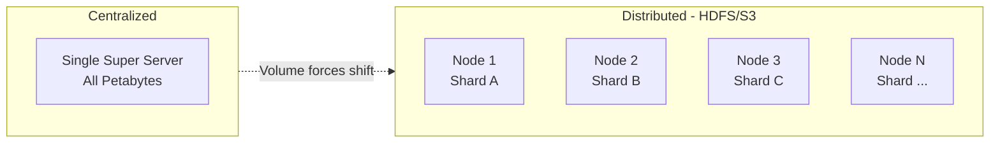
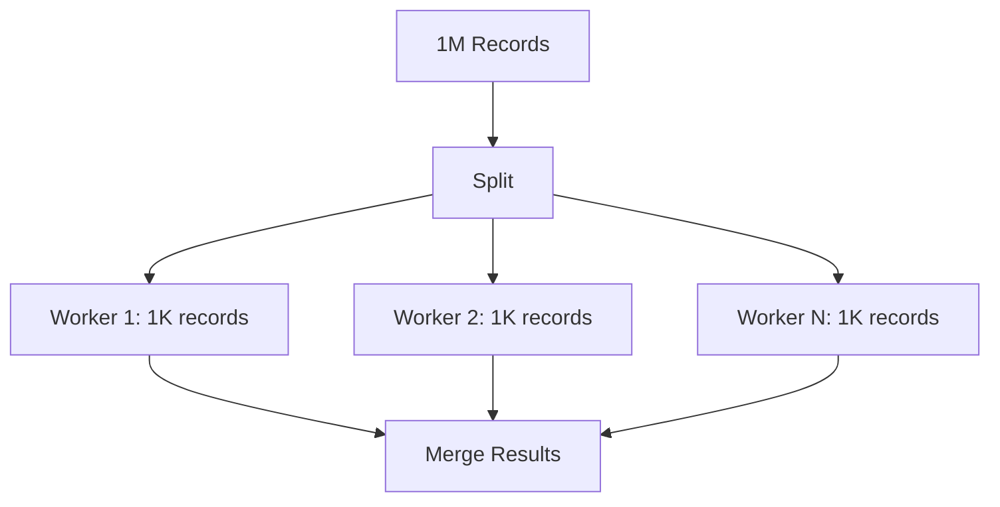
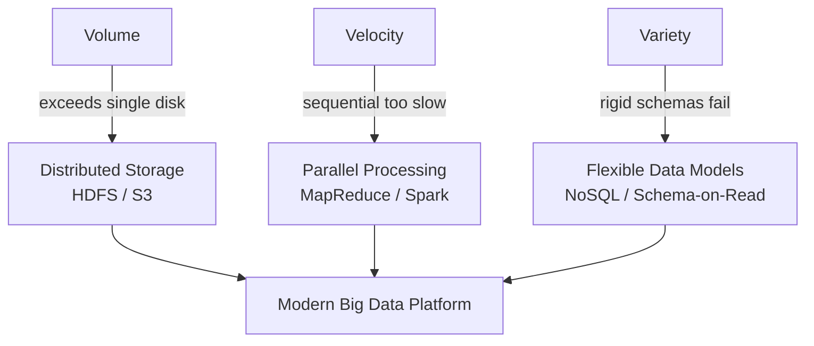

# How the Three Vs Reshape System Architecture

## The "So What" of Big Data

Knowing that volume, velocity, and variety exist is insufficient — each V forces a **specific architectural shift** away from traditional single-machine, single-database designs. These three shifts form the foundation of every big data platform.

---

## 1. Volume → Distributed Storage

### The Physical Limit

A single hard drive has finite capacity. When data grows from gigabytes to petabytes, buying a bigger drive stops working. At Netflix scale, storing all video on one server creates a catastrophic single point of failure — one fire destroys the entire catalog.

### The Architectural Shift

**Centralized storage** → **Distributed storage**

Instead of one giant vault, data is split into **shards** (pieces) spread across thousands of standard disks in a network.

### Example: Netflix

Petabytes of video content distributed across thousands of commodity disks. No single machine holds the full catalog. Replication (typically 3×) ensures availability even when individual disks fail.

**Impact**: HDFS, S3, and object stores replace monolithic storage appliances.

---

## 2. Velocity → Parallel Processing

### The Throughput Limit

One processor analyzing one million records sequentially might take an hour. One thousand processors working simultaneously can finish in seconds — if the problem decomposes cleanly.

### The Architectural Shift

**Sequential processing** → **Parallel processing**

Work is split into independent tasks executed concurrently across cluster nodes.

### Example: Uber Dynamic Pricing

Calculating ride price requires real-time inputs: traffic, driver locations, weather. A central supercomputer processing requests one at a time cannot respond in milliseconds. Uber uses platforms like **Apache Spark** to split the computation across thousands of workers solving micro-problems in parallel.

**Impact**: MapReduce, Spark, and stream processors replace single-threaded batch scripts.

---

## 3. Variety → Flexible Data Models

### The Schema Limit

Traditional relational databases enforce rigid schemas — every row must fit predefined columns, like ice cube trays requiring identical shapes. A video file, a tweet, and a sensor reading cannot be forced into the same table structure without losing information.

### The Architectural Shift

**Fixed schemas (schema-on-write)** → **Flexible models (schema-on-read)**

Data is stored in raw form; structure is applied only when reading/querying.

| Approach | When Schema Defined | Best For |
|----------|---------------------|----------|
| Schema-on-write (RDBMS) | At ingestion | Stable, structured transactions |
| Schema-on-read (Data Lake) | At query time | Mixed, evolving, unstructured data |

### Example: Instagram

A single post contains:
- Photo (unstructured binary)
- Caption (text)
- GPS location (structured coordinates)
- Like counts (numeric aggregates)

Instagram stores raw post objects rather than forcing everything into rigid relational tables. Structure is imposed when serving feeds, running analytics, or training recommendation models.

**Impact**: NoSQL databases (document, key-value, column-family), data lakes, and schema-on-read pipelines.

---

## Unified Architecture Map

| Three V | Old Approach | New Approach | Representative Technology |
|---------|--------------|--------------|---------------------------|
| Volume | Bigger disk / SAN | Sharded distributed files | HDFS, Amazon S3 |
| Velocity | Single-threaded batch | Parallel / streaming | MapReduce, Spark, Flink |
| Variety | Relational tables only | Raw storage + query-time schema | MongoDB, Cassandra, Delta Lake |

---

## Why These Shifts Are Foundational

Every tool studied later in this course — Hadoop, Spark, Kafka, partitioning strategies — exists because one or more of these architectural pressures cannot be ignored:

- **HDFS block replication** solves volume + failure tolerance
- **MapReduce data locality** solves velocity + network cost
- **NoSQL eventual consistency** solves variety + scale (traded against strict ACID)

Understanding the three architectural shifts prevents treating big data tools as arbitrary technology choices. Each is a **response to a specific constraint**.

---

## Common Pitfalls / Exam Traps

- Mapping only **volume** to distributed storage — velocity also demands distributed *compute*, not just distributed *storage*
- Confusing **parallel processing** with **distributed storage** — they solve different Vs (velocity vs volume)
- Believing schema-on-read means **no schema** — structure is deferred, not eliminated; query performance still depends on thoughtful design
- Assuming Instagram-style flexibility works for **banking transactions** — financial data still requires ACID guarantees (Module 2)
- Stating "the three Vs cause big data" without naming the **three architectural responses** — exam questions often require the pairing

---

## Quick Revision Summary

- Volume → distributed storage (HDFS/S3); Netflix shards petabytes across thousands of nodes
- Velocity → parallel processing; Uber/Spark splits real-time pricing across workers
- Variety → flexible data models / schema-on-read; Instagram stores mixed post formats raw
- Three shifts: centralized→distributed, sequential→parallel, fixed schema→flexible
- These shifts are the foundation for all subsequent big data platforms
- Each V maps to a distinct architectural pressure — know the pairing for exams
