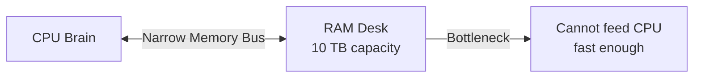
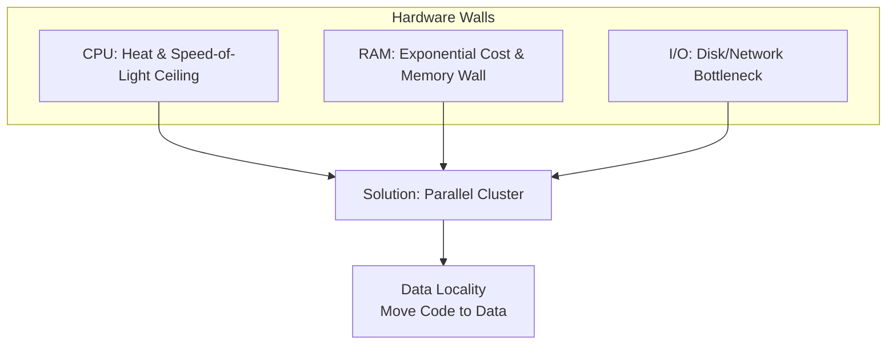

# Hardware Constraints: CPU, RAM, and I/O

## Why Buying the Best Machine Still Fails

The instinct to solve data growth by purchasing the most powerful single computer is logical for small workloads. For big data, three hardware subsystems — CPU, RAM, and I/O — each hit **physical and economic walls** that no price tag can permanently overcome.

---

## 1. CPU — The Processing Brain

### Intuition

The CPU executes computation. For decades, clock speeds increased yearly (Moore's Law). Around **2005**, single-core speed gains stalled due to fundamental physics.

### Why CPU Speed Plateaued

| Limit | Mechanism | Consequence |
|-------|-----------|-------------|
| **Heat / power density** | Packing transistors closer generates more heat; chips would melt beyond a threshold | Cannot indefinitely increase clock frequency |
| **Speed of light** | Electrical signals traverse a chip in finite time | Physical ceiling on signal propagation speed |

### Industry Response: Parallelism Over Faster Cores

High-frequency trading firms once paid millions for CPUs 0.1% faster. Today they deploy **many cores working in parallel** instead of chasing marginal single-core gains.

**Analogy**: One person reads a book at a fixed maximum speed; 100 people read 100 pages simultaneously.

**Implication for big data**: Scale **out** (more CPUs across nodes), not **up** (one impossibly fast CPU).

---

## 2. RAM — The Working Desk

### Intuition

RAM is fast, volatile working memory — the desk where active data sits while the CPU processes it. Adding RAM seems like the obvious fix for larger datasets.

### Two RAM Walls

**1. Exponential cost**

| Capacity | Relative Cost Behavior |
|----------|------------------------|
| 512 GB → 1 TB | More than 2× price increase |
| Standard → high-performance ECC RAM | Premium pricing at each tier |

Cost does not scale linearly. Doubling RAM on one machine can cost **quadruple** the price at enterprise tiers.

**2. Memory wall (bandwidth bottleneck)**

Even with 10 TB of RAM installed, the **path between CPU and RAM** is a narrow one-lane road. The CPU cannot fetch data from RAM faster than the memory bus allows — regardless of how much data sits on the desk.

**Implication**: More RAM helps only if the working set fits and the memory bandwidth suffices. Beyond that, distribute data across nodes with local RAM per node.

---

## 3. I/O — Input/Output (The Slowest Subsystem)

### Intuition

I/O measures how fast data moves between storage (disk, network) and the CPU. I/O is almost always the **slowest** part of any system — orders of magnitude slower than CPU or RAM access.

### The Library Analogy

| Component | Analogy | Speed Characteristic |
|-----------|---------|---------------------|
| Hard drive | Massive library | Huge capacity, slow access |
| I/O port | Tiny checkout window | One book per minute |
| CPU | World's fastest reader | Idle, waiting for books |

Even the fastest CPU starves if the I/O channel cannot supply data fast enough.

### Relative Latency (Approximate Orders of Magnitude)

| Access Type | Relative Latency |
|-------------|------------------|
| L1 CPU cache | 1× (baseline) |
| RAM | ~10–100× slower |
| SSD | ~1,000× slower |
| HDD / Network | ~10,000–100,000× slower |

**Implication for big data**: Minimize disk and network I/O. This is why distributed systems emphasize **data locality** — run computation on the node that already holds the data, rather than shipping petabytes across the network.

---

## How the Three Constraints Interact

| Subsystem | Wall Type | Big Data Response |
|-----------|-----------|-------------------|
| CPU | Physical speed limit | Horizontal scaling; parallel tasks |
| RAM | Cost + bandwidth | Partition data across node-local memory |
| I/O | Latency | Data locality; minimize shuffle/network transfer |

---

## Common Pitfalls / Exam Traps

- Believing **more RAM always solves big data** — the memory wall (bandwidth) and cost curve limit single-node RAM scaling
- Confusing **CPU core count** with **CPU speed** — big data benefits from more cores across nodes, not marginally faster single cores
- Underestimating **I/O as the bottleneck** — exam questions often ask which subsystem is slowest (answer: I/O/disk/network)
- Assuming SSDs eliminate the I/O problem — SSDs are faster than HDDs but still orders of magnitude slower than RAM
- Ignoring that these walls drove the entire industry shift to **MapReduce data locality** and later **Spark in-memory caching** (to reduce disk I/O)

---

## Quick Revision Summary

- CPU speed plateaued ~2005 due to heat density and speed-of-light limits
- Industry shifted to parallel cores across many machines, not faster single cores
- RAM cost grows exponentially; memory bus bandwidth creates a "memory wall"
- I/O (disk/network) is the slowest subsystem — the fundamental bottleneck
- Big data response: clusters + data locality (move computation to data)
- These hardware walls explain why vertical scaling fails and horizontal scaling wins
