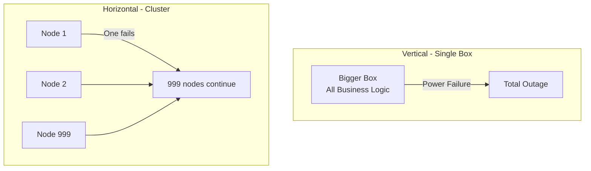

# Why Bigger Boxes Eventually Fail

## The Non-Linear Economics of Power

Scaling up by buying increasingly powerful single machines follows a **non-linear cost curve** — doubling performance can cost 5× or more. Beyond economics, bigger boxes introduce catastrophic reliability risks and hard physical ceilings. This is why cloud providers run millions of cheap servers instead of a few supercomputers.

---

## 1. The Power-Price Curve

| Server Tier | Relative Power | Relative Cost | Cost per Unit Power |
|-------------|----------------|---------------|---------------------|
| Standard | 1× | $5,000 | Baseline |
| 2× power | 2× | ~$25,000 | 2.5× worse |
| 4× power | 4× | ~$150,000 | 7.5× worse |

The relationship between power and price is a **curve**, not a straight line. Each incremental performance gain costs disproportionately more.

### Why Cloud Providers Use Commodity Clusters

AWS, Google Cloud, and Azure operate millions of standard servers because:

$\text{Cost of 100 normal servers} \ll \text{Cost of 1 monster server with equal total power}$

This shift from **specialized proprietary hardware** to **commodity hardware** is foundational to modern cloud economics.

---

## 2. Single Point of Failure

### The Risk

One massive, expensive server running the entire database means one failed power supply, one motherboard short circuit, or one cooling failure **stops the entire business**.

### Real-World Example: Airline Booking Systems

If Delta or Emirates ran their reservation system on one super-server and it crashed during a holiday weekend, thousands of flights would be grounded. In big data, a **cluster** tolerates individual node failure — lose 1 of 1,000 machines and 999 continue operating.

**Resilience property**: Failure of one component degrades capacity but does not halt the system.

---

## 3. The Hardware Ceiling

A motherboard has finite slots for CPUs, RAM modules, and storage controllers. Once every slot is occupied, vertical scaling **stops**. The only option is to discard the entire machine and purchase an even larger (exponentially more expensive) replacement.

| Scaling Model | Ceiling | Growth Path |
|---------------|---------|-------------|
| Vertical | Motherboard slot limits | Buy bigger machine (expensive, disruptive) |
| Horizontal | Effectively none | Add another standard node (cheap, incremental) |

**Analogy**: A bigger box is a locker with fixed compartments. Horizontal scaling is adding another locker to the network whenever storage or compute is needed.

---

## 4. Comparative Summary

| Factor | Bigger Box (Vertical) | Cluster (Horizontal) |
|--------|----------------------|----------------------|
| Cost curve | Exponential | Linear |
| Failure impact | Total outage | Partial degradation |
| Growth ceiling | Physical slot limits | Add nodes indefinitely |
| Hardware type | Specialized, proprietary | Commodity, standardized |
| Replacement time | Custom parts, weeks | Swap identical unit, hours |

---

## When Bigger Boxes Still Make Sense

Vertical scaling is not universally wrong:

- Small businesses with bounded data and tolerance for downtime
- Datasets that fit comfortably in single-node memory
- Short-term capacity fixes before cluster migration
- Specialized workloads requiring single-node low-latency (some HPC)

The trap is using vertical scaling as the **long-term strategy** for unbounded data growth.

---

## Common Pitfalls / Exam Traps

- Assuming **linear cost for linear power** on single machines — the power-price curve is exponential
- Confusing **commodity hardware** with unreliable hardware — commodity means standardized and cheap, not low quality; software provides reliability
- Believing clusters eliminate failure — they **tolerate** failure; failed tasks must be reassigned (covered in MapReduce/Spark modules)
- Stating vertical scaling has "no ceiling" — motherboard slots are a hard physical limit
- Forgetting the **single point of failure** argument — this is the primary reliability argument against vertical scaling

---

## Quick Revision Summary

- Power-price relationship is a curve: 2× power may cost 5×; 4× power may cost 30×
- Cloud providers use millions of cheap servers because 100 normal machines cost less than 1 monster machine
- Bigger box = single point of failure; one crash stops the entire business
- Motherboard slot limits create a hard ceiling for vertical scaling
- Horizontal scaling: add nodes indefinitely with linear cost
- Vertical scaling works for small/bounded workloads; fails for infinite-growth enterprises
