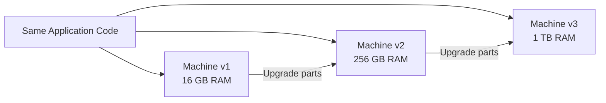
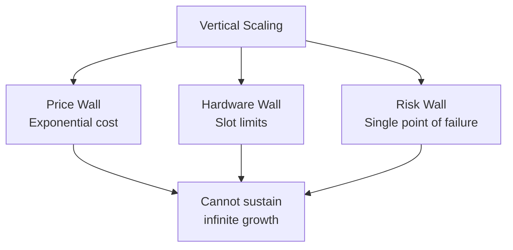

# Vertical Scaling (Scale Up): Deep Dive

## What Vertical Scaling Means

Vertical scaling — also called **scaling up** — means making a single existing machine more powerful by upgrading its components: more RAM, faster CPU, larger disk. The software stack remains unchanged; the same application runs on the same box, just with better hardware underneath.

---

## The Delivery Driver Analogy

| Business Growth | Vertical Scaling Response |
|-----------------|--------------------------|
| Scooter can't carry packages | Buy a van |
| Van insufficient | Buy a truck |
| Truck insufficient | Buy an even larger truck |

One driver, one vehicle — progressively more powerful, but still a single unit.

---

## Technical Implementation

Vertical scaling involves hardware upgrades on the **same machine**:

- Increase RAM capacity (e.g., 16 GB → 256 GB → 1 TB)
- Upgrade CPU (faster clock, more cores on same motherboard)
- Expand storage (larger or additional disks in same chassis)
- No changes to application code, network topology, or deployment architecture

---

## Advantages of Vertical Scaling

| Advantage | Explanation |
|-----------|-------------|
| **Simplicity** | No code changes; application sees one computer |
| **Low maintenance** | One OS, one security policy, one machine to patch |
| **Fast to implement** | Order bigger hardware, migrate data, done |
| **Predictable behavior** | No distributed coordination, no network partitions |

For a startup with 50 GB of data and no strict uptime SLA, vertical scaling is often the **best initial choice**.

---

## The Three Walls That Stop Vertical Scaling

### 1. Price Wall

| RAM Upgrade | Approximate Cost Behavior |
|-------------|--------------------------|
| 16 GB → 32 GB | Modest increase (~$20/month cloud) |
| 1 TB → 2 TB high-performance | ~$20,000+ |

Cost does not scale linearly. Specialized high-performance RAM and enterprise CPUs follow **exponential pricing**.

### 2. Hardware Wall

Motherboards have finite slots for CPU sockets and RAM DIMMs. Once every slot is filled, no more capacity can be added without replacing the entire machine — and the next tier is disproportionately expensive.

### 3. Risk Wall (Single Point of Failure)

One super-server, one power supply, one business. If the truck breaks, deliveries stop. For companies like Netflix, Uber, or Google where downtime costs millions per hour, this risk is unacceptable.

---

## When to Use Vertical Scaling

| Scenario | Vertical Scaling Fit |
|----------|---------------------|
| Small business, bounded data | Excellent |
| Dataset fits in single-node memory | Excellent |
| Short-term capacity fix | Good (temporary) |
| Low availability requirements | Acceptable |
| Petabyte-scale, always-on enterprise | Poor — must scale out |
| Unbounded data growth | Poor — hits all three walls |

**Industry practice**: Use vertical scaling as a **short-term fix** or for specialized single-node tasks. Enterprises with infinite growth requirements eventually must shift to horizontal scaling.

---

## Vertical vs Horizontal: Decision Framework

| Criterion | Scale Up (Vertical) | Scale Out (Horizontal) |
|-----------|----------------------|------------------------|
| Code changes | None | Distributed logic required |
| Cost at scale | Exponential | Linear |
| Failure mode | Total outage | Graceful degradation |
| Growth limit | Motherboard ceiling | Cluster expansion |
| Best for | Small/medium bounded workloads | Big data, high availability |

---

## Common Pitfalls / Exam Traps

- Describing vertical scaling as "wrong" — it is the **correct choice** for many small-scale workloads
- Forgetting that vertical scaling requires **zero code changes** — a key advantage often tested
- Confusing **more CPU cores on one machine** (vertical) with **more machines** (horizontal) — adding cores to one box is vertical; adding boxes is horizontal
- Missing the **price wall** nuance — cost explodes at high-end tiers, not at entry levels
- Stating vertical scaling has no use cases — exam traps may present it as universally bad; acknowledge valid use cases

---

## Quick Revision Summary

- Vertical scaling = upgrade same machine (RAM, CPU, disk); no code changes
- Advantages: simple, low maintenance, one OS, fast to deploy
- Three walls: price (exponential cost), hardware (slot limits), risk (single point of failure)
- Best for: small businesses, bounded data, short-term fixes
- Fails for: Netflix/Uber/Google-scale infinite growth
- Industry uses vertical scaling as short-term fix; horizontal scaling for long-term big data
