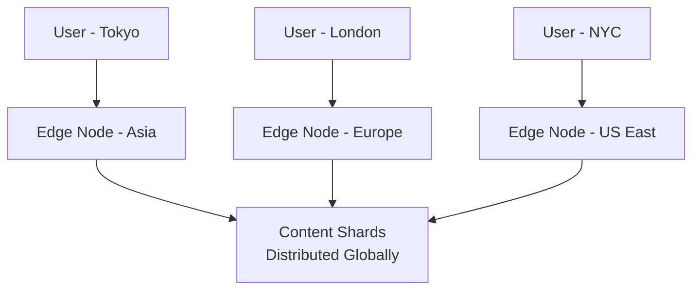
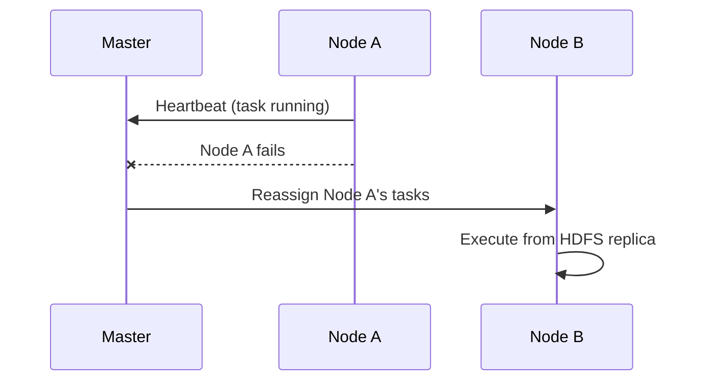

# Horizontal Scaling (Scale Out): Deep Dive

## The Architectural Revolution

Horizontal scaling — also called **scaling out** — adds more standard machines (nodes) to a group (cluster) rather than upgrading a single machine. This model enabled Google, Amazon, and Netflix to handle global-scale workloads on affordable infrastructure.

---

## The Fleet Analogy

| Strategy | Analogy | System Design |
|----------|---------|---------------|
| Vertical (scale up) | Buy a bigger and bigger truck | One powerful server |
| Horizontal (scale out) | Hire 10 more drivers with 10 smaller vans | Cluster of standard nodes |

The system grows by adding **units**, not by inflating a single unit.

---

## Core Concepts

- **Node**: An individual server in the cluster
- **Cluster**: A group of interconnected nodes acting as one cohesive system
- **Commodity hardware**: Standard, off-the-shelf servers — widely available, interchangeable, linearly priced
- **Fault tolerance**: System continues operating when individual nodes fail

---

## Real-World Example: Netflix Friday Night

On a Friday evening, millions of users stream a new release simultaneously. No single computer — regardless of RAM — can serve 200 million concurrent HD streams through one network pipe.

**Solution**: Distribute load across thousands of standard servers globally. When a user hits play, they connect to the **nearest node** (CDN edge server), not a central super-server in California.

**Key property**: Near-infinite growth by adding more nodes to the fleet.

---

## Economic Advantage: Linear Cost

| Scaling Model | Cost Behavior | Example |
|---------------|---------------|---------|
| Vertical | Exponential | 1 TB high-end RAM costs $20,000+ |
| Horizontal | Linear | 5 × $2,000 standard servers = $10,000 |

When data doubles, cost roughly doubles — not explodes. This is how startups grow into giants without upfront supercomputer investment.

$\text{Total cluster cost} \approx n \times \text{cost per commodity node}$

---

## Fault Tolerance

| Event | Vertical System | Horizontal System |
|-------|-----------------|-------------------|
| One component fails | Entire business stops | 99 of 100 nodes continue |
| User experience | Outage | Uninterrupted (if designed correctly) |

In Hadoop and Spark, the framework detects a dead node and **automatically reassigns** its work to surviving nodes. The customer watching a movie never notices a glitch.

---

## The Complexity Tax

Horizontal scaling is not free. Trade-offs include:

- **Network management** — nodes must communicate reliably
- **Coordination overhead** — master-worker models, consensus protocols
- **Distributed software** — CAP theorem trade-offs (Module 2)
- **Data consistency** — replicas must stay synchronized

The hardware problem becomes a **software coordination problem**.

---

## Comparison Table

| Aspect | Vertical Scaling | Horizontal Scaling |
|--------|------------------|-------------------|
| Growth mechanism | Bigger machine | More machines |
| Cost curve | Exponential | Linear |
| Failure impact | Total outage | Partial degradation |
| Code complexity | Low (single node) | High (distributed) |
| Hardware type | Specialized | Commodity |
| Growth ceiling | Motherboard slots | Effectively unlimited |
| Example | Enterprise DB on one server | Hadoop/Spark cluster |

---

## Common Pitfalls / Exam Traps

- Assuming horizontal scaling is "simpler" because hardware is cheaper — the **software complexity tax** is significant
- Confusing **horizontal scaling** with **load balancing alone** — scaling out implies distributed storage and compute, not just multiple web servers behind a balancer
- Believing fault tolerance is automatic — it requires **framework support** (HDFS replication, Spark lineage) and deliberate design
- Stating commodity hardware means low quality — it means **standardized and replaceable**
- Forgetting the **network tax** — coordinating 1,000 nodes requires careful attention to data locality and minimizing cross-network traffic

---

## Quick Revision Summary

- Horizontal scaling = add more standard nodes to a cluster
- Netflix model: distribute streaming across global edge nodes, not one super-server
- Cost is linear: 5 × $2,000 nodes vs one $50,000 upgrade
- Fault tolerance: 1 of 100 fails → 99 continue; frameworks reassign work
- Complexity tax: network management, coordination, distributed consistency
- Foundation of Hadoop, Spark, and all modern big data platforms
- Enabled Google, Amazon, Netflix to scale on commodity hardware
