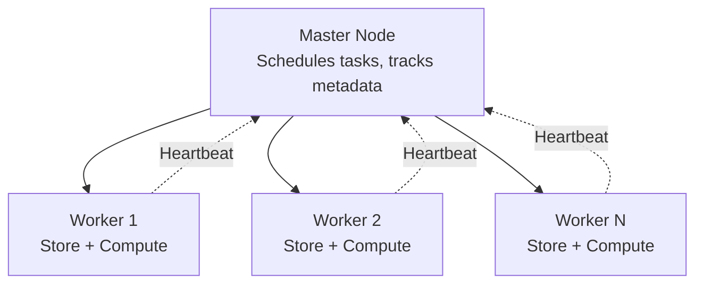
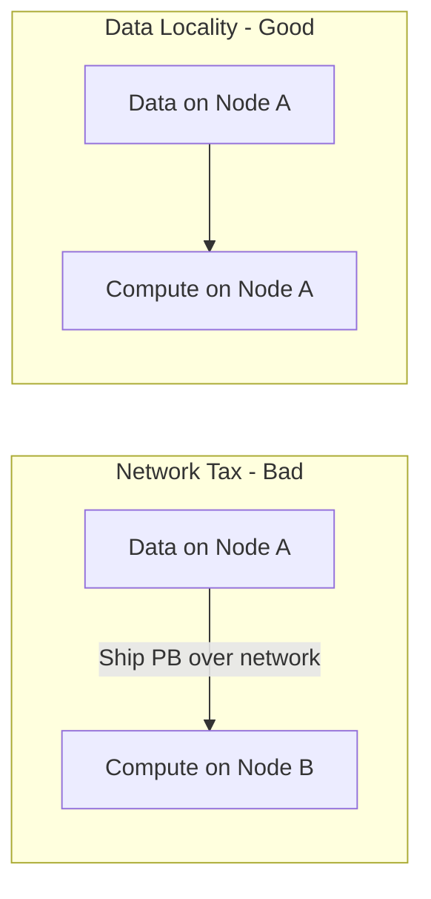

# Introduction to Cluster Computing

## From Single Machine to Coordinated Fleet

Cluster computing is the practical realization of horizontal scaling: a collection of interconnected, independent computers (nodes) that cooperate to function as a single cohesive system. If vertical scaling strengthens the individual, cluster computing harnesses the power of **teamwork**.

---

## 1. Commodity Hardware Clusters

### What "Commodity" Means

Commodity hardware does **not** mean cheap or poor quality. It means **standardized infrastructure** — high-quality, off-the-shelf servers available in every data center, identical and interchangeable.

| Property | Benefit |
|----------|---------|
| Standardized | Any node can replace any other |
| Widely available | No custom procurement delays |
| Linear pricing | Predictable cost per node |
| Rapid replacement | Swap failed unit in hours, not weeks |

### Two Business Advantages

1. **Cost efficiency** — best performance per dollar by using many standard units instead of one proprietary supercomputer
2. **Rapid replacement** — failed node swapped for an identical unit; no waiting for custom parts

---

## 2. Master-Worker Architecture

Managing 100–1,000 separate computers requires a **division of labor**:

| Role | Function | Analogy |
|------|----------|---------|
| **Master node** | Task scheduling, metadata management, coordination | Brain / project manager |
| **Worker nodes** | Actual data storage and computation | Muscle / laborers |

**Key insight**: The master knows where everything is but does not do heavy lifting. Workers process data in **parallel**, achieving speeds impossible on a single machine.

This pattern appears in:
- **Hadoop**: NameNode (master) + DataNodes (workers)
- **Spark**: Driver (master) + Executors (workers)
- **Kubernetes**: Control plane + worker nodes

---

## 3. Two Critical Challenges

### Challenge 1: Reliability

Hardware **will** fail. Clusters assume failure is normal, not exceptional.

**Response**: Build self-healing resilience into software:
- **Data replication** — typically 3× copies across different nodes
- **Task reassignment** — master detects failed worker, reassigns work to healthy nodes
- **Automatic recovery** — frameworks restart failed tasks from replicated data

### Challenge 2: The Network

Moving massive data across a slow network — the **network tax** — is the primary performance killer.

**Response**: **Data locality** — move the processing logic to the node that already holds the data, rather than shipping petabytes to a central processor.

| Strategy | Data Movement | Compute Movement | Network Load |
|----------|---------------|------------------|--------------|
| Move data to compute | High (petabytes) | Low | Massive |
| Move compute to data | Low | High (code bytes) | Minimal |

---

## Cluster Computing Summary

| Concept | Definition | Why It Matters |
|---------|------------|----------------|
| Cluster | Group of cooperating nodes | Horizontal scaling in practice |
| Commodity hardware | Standardized, interchangeable servers | Linear cost, rapid replacement |
| Master-worker | Coordinator + executors | Manages chaos of 1000 machines |
| Replication (3×) | Data copied across nodes | Survives hardware failure |
| Data locality | Compute where data lives | Avoids network bottleneck |

---

## Common Pitfalls / Exam Traps

- Defining commodity hardware as "cheap junk" — it means **standardized, high-quality, off-the-shelf**
- Confusing master node's role — it **coordinates**, not computes heavy workloads
- Believing replication eliminates all failure scenarios — it protects **data**; **compute tasks** still need reassignment on failure
- Ignoring data locality — exam questions often ask how to minimize network tax (answer: move code to data)
- Assuming 3× replication means 3× storage cost only — it also affects **write throughput** (3× write penalty in MapReduce)

---

## Quick Revision Summary

- Cluster = interconnected nodes acting as one system; foundation of horizontal scaling
- Commodity hardware = standardized, interchangeable, not low quality
- Master-worker: master schedules/coordinates; workers store and compute
- Reliability via 3× replication and automatic task reassignment
- Data locality: move computation to data, not data to computation
- Network tax is the primary performance enemy in clusters
